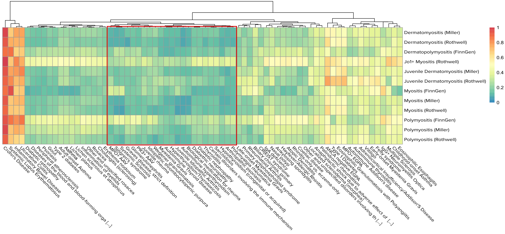

----

# Background

We want to learn more about myositis and its subtypes in the light of other IMD. For that we'll take a closer look at myositis projections from two studies (Miller et al., 2015 and Rothwell et al. 2022) together with our other 


```{r include=FALSE, warning=FALSE, message=F}

# Load packages
library(data.table)
library(magrittr)
library(rmeta)
library(ggplot2)
library(cowplot)
library(pheatmap)
library(reshape2)
library(knitr)
library(kableExtra)
library(ggrepel)

# Load files

m <- fread("../data/Metadata_20230503-v1.tsv")
m <- m[, .(Trait, First_Author, Reference, Trait_ID_2.0, Trait_long, Trait_class, N0, N1, N, Population, Public)]

q <- fread("../data/QC_IMD_basis_20230503-v1.tsv")
q <- merge(q, m, by="Trait")

p <- fread("../data/Projection_IMD_basis_20230503-v1.tsv")
p[, Var.Delta:=as.numeric(Var.Delta)]
b <- p[1:169] # Basis traits
p <- p[179:nrow(p)] # projection table without basis traits
p[, z:=NULL]


```


# 1. Exploratory data analysis

Next we analysed our myositis datasets in the context of meta-analyses and the rest of projections, with a focus on IMD. We applied our routine quality control to our collection of projections, applied an FDR procedure to keep datasets that are (1) significantly different from zero overall (FDR < 1%) and (2) by PC (FDR < 1% [●] or FDR < 5% [○]). 


```{r include=FALSE}
#
# This chunk includes a lot of stuff we won't be showing, but I keep the code here because it might be useful

# Now it's time to do our proper EDA on the projections. This will involve:
#
# (1) Apply usual QC, including dataset removal
# (2) Get some basic statistics from the basis
# (3) Learn about myositis (and subtypes) location onto the basis

### (1) QC
SNP.manifest <- cupcake::SNP.manifest

# Checking missing projections
summary(q)
q[is.na(q$overall_p)] 
# MDD_Wray_2, Major depression disorder, that failed to project by low SNP match.
# T2D_Gaulton 
q <- q[!is.na(q$overall_p)] # Remove datasets with missing overall p-values


# Check SNP match
c(lessthan95 = nrow(q[q$nSNP < nrow(SNP.manifest)*.95,]), lessthan80 = nrow(q[q$nSNP < nrow(SNP.manifest)*.8,]), lessthan50 = nrow(q[q$nSNP < nrow(SNP.manifest)*.5,]))
c(lessthan95 = nrow(q[q$nSNP < nrow(SNP.manifest)*.95,])/nrow(q), lessthan80 = nrow(q[q$nSNP < nrow(SNP.manifest)*.8,])/nrow(q), lessthan50 = nrow(q[q$nSNP < nrow(SNP.manifest)*.5,])/nrow(q))
# 4% of datasets (248) have <80% SNP match

# Dataset filtering

# This is a crucial point.
# As we have many datasets, many of them redundant or not so interesting for our purposes, and the set of datasets included in the adjustment will influence the resulting set of overall significant datasets, so we must choose carefully which datasets we remove *before* performing the FDR adjustment on the next step.
# 
# At this step, we'll:
# 
# 1. Focus on files that came from a Genome-wide array (ie. not Immunochip), and have at least **80%** of matching SNPs, so we can have confidence in our observations.
# 2. Remove basis datasets
# 3. Remove Neale, as we already have PanUKBBR2
# 4. Apply FDR procedure

# 1. Remove datasets with <80% SNP match. This will include datasets using targeted arrays only (ie. ImmunoChip). Keep Deakin's JDM for its interest
qf <- q[nSNP >= max(nSNP) * 0.8 ]

# 2. Remove basis datasets
basis.datasets <- c("CD_DeLange_28067908_1", "PSC_Ji_27992413_1", "UC_DeLange_28067908_1", "SLE_Bentham_26502338_1", "PBC_Cordell_26394269_1", "IGAN_Kiryluk_25305756_1", "CEL_Dubois_20190752_1", "MS_IMSGC_21833088_1", "AST_Demenais_29273806_1", "VIT_Jin_27723757_1", "RA_Okada_24390342_1", "LADA_Cousminer_30254083_1", "T1D_Cooper_doi101101120022_1")
#Also, remove datasets used to build the IMD basis, which are overfitted
qf <- qf[!Trait %in% basis.datasets]

# 3. Remove Neale, as we already have PanUKBBR2
qf <- qf[First_Author != "Neale"]


# Check traits by class
table(qf$Trait_class)
# Create filtered projection table too
pf <- merge(p, qf[,c("First_Author","Trait", "Trait_ID_2.0", "Trait_long","Trait_class", "Population")], by = "Trait")


# 4. Apply FDR procedure

# Apply 1% FDR correction to overall p for all remaining datasets
qf[, FDR.overall := p.adjust(overall_p, method = "BH"), by="Trait_class"]

tsig <- copy(qf)
tsig[, sig.overall:=ifelse(FDR.overall < 0.01, "Y", "N")]
table(tsig$sig.overall)
#    N     Y 
#  4800  858

qs <- qf[FDR.overall < 0.01]
nrow(qs) / nrow(qf)
# 15% significant
table(qs$Trait_class) / nrow(qs)
# 16.5% Blood cells
# 35.9% IMD

table(qs$Trait_class)
#  BC BMK CAN IMD INF OTH PSD 
# 142  72  17 308  35 282   2 

# Which myositis datasets didn't make the cut?
qf[grepl("myositis", Trait_long, ignore.case = TRUE) & !Trait %in% qs$Trait]
# 6 datasets. These include:
#    First_Author       Trait_ID_2.0                                 Trait_long 
# 1:      PanUKBB         20002_1322                   Myositis/Myopathy (UKBB) 
# 2:     Rothwell                IBM                    Inclusion Body Myositis 
# 3:      FinnGen   M13_DERMATOMYOTH            Other dermatomyositis (FinnGen) 
# 4:      FinnGen M13_DERMATOPOLYNAS Dermatopolymyositis, unspecified (FinnGen) 
# 5:       Sakaue                 PM                               Polymyositis 
# 6:      PanUKBB              ph770    Myalgia and myositis unspecified (UKBB) 

# Apply 5% FDR correction by trait and PC to projections, then filter by overall significant traits
# NOTE: Here we'll do something different. As meta-analyses and PAPS don't come with overall_p, 
# we'll consider them significant overall, for their interest.

pf[, FDR.PC:=p.adjust(P, method = "BH"), by = c("PC", "Trait_class")][, stars:=ifelse(!is.na(FDR.PC) & FDR.PC<0.05,"○","")][ FDR.PC < 0.01 , stars:="●"]
# Filter pf by overall significant traits
ps <- pf[Trait %in% qs$Trait ]
ps[, PC:=factor(PC, levels = paste0("PC", 1:13))]


### (2) Get some basic statistics from the basis in the light of new projections

# Let's create a plot akin to figure 2 of the blood cell basis paper

tfp <- c(BC = "#CF000F", BMK = "#2E8856", IMD = "#1460AA", INF = "#B8860B", CAN = "#E65722", OTH ="#1C2833", PSD="#708090")

tcf <- ggplot(data = qf, aes(x=Trait_class, fill = Trait_class)) +
    geom_bar()+
    scale_y_continuous(breaks = seq(0, 5000, 500))+
    scale_fill_manual(values = tfp)+
    scale_x_discrete(labels=c("BC" = "Blood Cells", "BMK" = "Biomarkers", "CAN" = "Cancer", "IMD" = "IMD", "INF" = "Infectious", "OTH"= "Other", "PSD" = "Psych"))+
    theme_classic(base_size = 11)+
    ylab("Datasets") +
    theme(axis.ticks = element_blank(), axis.line = element_blank(), panel.grid.major.y = element_line(colour = "lightgray", size =  0.3),axis.text.x = element_text(angle = 270, hjust = 0, vjust = 0.5),legend.position = "none",axis.title.x = element_blank())


# A little modification to include OR values in the RHS plot (see how values are computed below)

qcsigOR <- merge(qf[, .(count.filt=.N), by=Trait_class], qs[, .(count.sig=.N), by=Trait_class], all.x = TRUE)
qcsigOR[,prop:=count.sig/count.filt][, `OR vs Other`:= (count.sig/(count.filt - count.sig)) / qcsigOR[Trait_class == "OTH", count.sig/(count.filt - count.sig)]]
qcsigOR[, ORvalue:=format(`OR vs Other`, digits=2)]

tcsigOR <- ggplot(data = qcsigOR, aes(x=Trait_class, y=count.sig, fill = Trait_class)) +
  geom_bar(stat = "identity")+
  scale_y_continuous(breaks = seq(0, 300, 50), limits = c(0, 340))+
  scale_fill_manual(values =tfp)+
  scale_x_discrete(labels=c("BC" = "Blood Cells", "BMK" = "Biomarkers", "CAN" = "Cancer", "IMD" = "IMD", "INF" = "Infectious", "OTH"= "Other", "PSD" = "Psych"))+
  geom_text(aes(label = ORvalue), vjust = -0.8, hjust = 0.55, size=4)+
  theme_classic(base_size = 11)+
  theme(axis.ticks = element_blank(), axis.line = element_blank(), panel.grid.major.y = element_line(colour = "lightgray", size =  0.3),axis.text.x = element_text(angle=270, hjust = 0, vjust = 0.5),legend.position = "none",axis.title.x = element_blank(), axis.title.y = element_blank())

# Note, this ps will include meta-analysis and PAPS
sigct <- ps[ FDR.PC < 0.01 , .(count = .N), by=c("PC", "Trait_class")][, PC:=factor(PC, levels = paste0("PC", 1:13))]

sig.per.pc <- ggplot(sigct, aes(fill=Trait_class, y=count, x=PC))+
              geom_bar(position="stack", stat="identity")+
              scale_y_continuous(breaks = seq(0, 400, 50), limits = c(0, 450))+
              scale_fill_manual(values =tfp)+
              theme_classic(base_size = 11)+
              theme(axis.ticks = element_blank(), axis.line = element_blank(), panel.grid.major.y = element_line(colour = "lightgray", size =  0.3),axis.text.x = element_text(angle=270, hjust = 0, vjust = 0.5),legend.position = "none",axis.title.x = element_blank(), axis.title.y = element_blank())

top <- plot_grid(tcf, # Before FDR, should be the same traits for all bases. For comparison purposes
                 tcsigOR, nrow = 1, labels = "AUTO")
bottom <- plot_grid(sig.per.pc, nrow = 1, labels = "C")
plot_grid(top, bottom, nrow = 2)

# ggsave("../figures/IMDbasis_distribution.png", width = 8, height = 6.5, bg = "white")


# (3) Learn about myositis position onto the basis

ps[grepl("myositis", Trait_long, ignore.case = TRUE) & FDR.PC < 0.01, .(PC, First_Author, Trait_long, FDR.PC, stars)][order(PC)]
# We have some significant Myositis for PC1, 2, 3, 9, 12, and 13

# Let's try to remove redundant datasets in a less manual way
qs2 <- copy(qs)
qs2 <- qs2[Trait_class == "IMD"] # Interested in IMDs for now
qs2[,Label:=Trait_long] %>% .[!grepl("myositis", Trait_long, ignore.case = TRUE), Label:=gsub(" \\(UKBB\\)", "", Label)] %>% .[!grepl("myositis", Trait_long, ignore.case = TRUE) , Label:=gsub(" \\(FinnGen\\)", "", Label)] %>% .[, Label:=gsub(" \\(FG\\)", "", Label)] # Remove UKBB/FinnGen stuff save for myositis datasets


# There are a number of duplicated diseases that we can revisit
# CD
qs2[grepl("Crohn|Chron", Label)][order(N1, decreasing = TRUE)]
tr <- c(setdiff(qs2[grepl("Crohn|Chron", Label), Trait], "CD_Liu_26192919_1")) # We select CD Liu, exclude the rest

# UC
qs2[grepl("colitis|UC |Ulcerative", Label, ignore.case = TRUE)][order(N1, decreasing = TRUE)]
tr <- c(tr, setdiff(qs2[grepl("colitis|UC |Ulcerative", Label), Trait], "UC_Liu_26192919_1")) # We select UC Liu, exclude the rest

# IBD
qs2[grepl("bowel|IBD ", Label, ignore.case = TRUE)][order(N1, decreasing = TRUE)]
tr <- c(tr, setdiff(qs2[grepl("bowel|IBD ", Label, ignore.case = TRUE), Trait], "IBD_Liu_26192919_1")) #  There's a larger, DeLange IBD, but we stick with Liu for consistency

# T1D
qs2[grepl("Type 1 diabetes|Type1", Label, ignore.case = TRUE)][order(N1, decreasing = TRUE)]
tr <- c(tr, setdiff(qs2[grepl("Type 1 diabetes|Type1", Label, ignore.case = TRUE), Trait], "T1D_Chiou_34012112_1"))

# Asthma
qs2[grepl("Asthma", Label, ignore.case = TRUE)][order(N1, decreasing = TRUE)]
tr <- c(tr, setdiff(qs2[grepl("Asthma", Label, ignore.case = TRUE), Trait], c("ph495_PanUKBB_PanUKBBR2_1", "ASTAO_Ferreira_30929738_1", "ASTCO_Ferreira_30929738_1")))

# COPD
qs2[grepl("COPD|chronic obstructive", Label, ignore.case = TRUE)][order(N1, decreasing = TRUE)]
tr <- c(tr, setdiff(qs2[grepl("COPD|chronic obstructive", Label, ignore.case = TRUE), Trait], "J10_COPD"))

# (Rheumatoid) Arthritis
qs2[grepl("Arthritis", Label, ignore.case = TRUE)][order(N1, decreasing = TRUE)]
tr <- c(tr, setdiff(qs2[grepl("Arthritis", Label, ignore.case = TRUE), Trait], c("RA_Ishigaki_36333501_3", "JIA_LopezIsac_33106285_1")))

# Hypothyroidism
qs2[grepl("Hypothyroidism", Label, ignore.case = TRUE)][order(N1, decreasing = TRUE)]
tr <- c(tr, setdiff(qs2[grepl("Hypothyroidism", Label, ignore.case = TRUE), Trait], c("HYPOTHYROIDISM_FinnGen_FinnGenR7_1")))

# Psoriasis
qs2[grepl("Psoria", Label, ignore.case = TRUE)][order(N1, decreasing = TRUE)]
tr <- c(tr, setdiff(qs2[grepl("Psoria", Label, ignore.case = TRUE), Trait], c("L12_PSORIASIS_FinnGen_FinnGenR7_1", "L12_PSORI_ARTHRO_FinnGen_FinnGenR7_1")))

# Graves' disease
qs2[grepl("Graves", Label, ignore.case = TRUE)][order(N1, decreasing = TRUE)]
tr <- c(tr, setdiff(qs2[grepl("Graves", Label, ignore.case = TRUE), Trait], c("E4_GRAVES_STRICT_FinnGen_FinnGenR7_1")))

# Diabetic related stuff
qs2[grepl("Diabetic|Diabetes[, ]", Label, ignore.case = TRUE)][order(N1, decreasing = TRUE)]
tr <- c(tr, setdiff(qs2[grepl("Diabetic|Diabetes[, ]", Label, ignore.case = TRUE), Trait], c("DM_RETINOPATHY_FinnGen_FinnGenR7_1", "DM_NEPHROPATHY_FinnGen_FinnGenR7_1")))

# Dermatitis
qs2[grepl("Dermatitis", Label, ignore.case = TRUE)][order(N1, decreasing = TRUE)]
tr <- c(tr, setdiff(qs2[grepl("Dermatitis", Label, ignore.case = TRUE), Trait], c("ATD_Paternoster_26482879_1")))

# Sjogren
qs2[grepl("Sjogren|Sjögren|Sicca", Label, ignore.case = TRUE)][order(N1, decreasing = TRUE)]
tr <- c(tr, setdiff(qs2[grepl("Sjogren|Sjögren|Sicca", Label, ignore.case = TRUE), Trait], c("SJOS_Lessard_up_1")))

# Lupus
qs2[grepl("Lupus|SLE", Label, ignore.case = TRUE)][order(N1, decreasing = TRUE)]
tr <- c(tr, setdiff(qs2[grepl("Lupus|SLE", Label, ignore.case = TRUE), Trait], c("SLE_Julia_29848360_1")))

# Allergic
qs2[grepl("allerg", Label, ignore.case = TRUE)][order(N1, decreasing = TRUE)]
tr <- c(tr, setdiff(qs2[grepl("allerg", Label, ignore.case = TRUE), Trait], c("20002_1387_PanUKBB_PanUKBBR2_1")))

# Multiple sclerosis
qs2[grepl("multiple sclerosis", Label, ignore.case = TRUE)][order(N1, decreasing = TRUE)]
tr <- c(tr, setdiff(qs2[grepl("multiple sclerosis", Label, ignore.case = TRUE), Trait], c("G6_MS_FinnGen_FinnGenR7_1"))) # largest, non-IMSGC dataset


# Nasal polyps
qs2[grepl("polyp", Label, ignore.case = TRUE)][order(N1, decreasing = TRUE)]
tr <- c(tr, setdiff(qs2[grepl("polyp", Label, ignore.case = TRUE), Trait], c("J10_NASALPOLYP_FinnGen_FinnGenR7_1")))

# PBC
qs2[grepl("biliary", Label, ignore.case = TRUE)][order(N1, decreasing = TRUE)]
tr <- c(tr, setdiff(qs2[grepl("biliary", Label, ignore.case = TRUE), Trait], c("CHIRBIL_PRIM_FinnGen_FinnGenR7_1")))

# PSC
qs2[grepl("sclerosing", Label, ignore.case = TRUE)][order(N1, decreasing = TRUE)]
tr <- c(tr, setdiff(qs2[grepl("sclerosing", Label, ignore.case = TRUE), Trait], c("K11_CHOLANGI_FinnGen_FinnGenR7_1")))

# Systemic sclerosis
qs2[grepl("systemic sclerosis", Label, ignore.case = TRUE)][order(N1, decreasing = TRUE)]
tr <- c(tr, setdiff(qs2[grepl("systemic sclerosis", Label, ignore.case = TRUE), Trait], c("SSC_LopezIsac_31672989_1")))

# Autoimmune disorders
tr <- c(tr, qs2[grepl("autoimmune dis", Label, ignore.case = TRUE), Trait]) 

# Celiac disease
qs2[grepl("celiac|coeliac", Label, ignore.case = TRUE)][order(N1, decreasing = TRUE)]
tr <- c(tr, setdiff(qs2[grepl("celiac|coeliac", Label, ignore.case = TRUE), Trait], c("K11_COELIAC_FinnGen_FinnGenR7_1")))

# Gout and ankylosing
qs2[grepl("gout|ankylosing", Label, ignore.case = TRUE)][order(N1, decreasing = TRUE)]
tr <- c(tr, setdiff(qs2[grepl("gout|ankylosing", Label, ignore.case = TRUE), Trait], c("GOUT_FinnGen_FinnGenR7_1", "M13_ANKYLOSPON_FinnGen_FinnGenR7_1")))

# Vitiligo
qs2[grepl("vitiligo", Label, ignore.case = TRUE)][order(N1, decreasing = TRUE)]
tr <- c(tr, setdiff(qs2[grepl("vitiligo", Label, ignore.case = TRUE), Trait], c("L12_VITILIGO_FinnGen_FinnGenR7_1")))

# Myastenia gravis
qs2[Label == "Myastenia Gravis"][order(N1, decreasing = TRUE)]
tr <- c(tr, setdiff(qs2[Label == "Myastenia Gravis" , Trait], c("MYG_Chia_35074870_1")))

# Thyroiditis
qs2[Label == "Thyroiditis"][order(N1, decreasing = TRUE)]
tr <- c(tr, setdiff(qs2[Label == "Thyroiditis" , Trait], c("THYROIDITIS_FinnGen_FinnGenR7_1")))

# There was an extra DMPMYO by FinnGen, we'll remove it
tr <- c(tr, "DERMATOPOLY_FG_FinnGen_FinnGenR7_1")

qs2 <- qs2[!Trait %in% tr] # First pass
length(unique(qs2$Label))
# 82

# Check for duplicates, if there are still
dp <- qs2[duplicated(Label), unique(Label)]
qsdup <- qs2[Label %in% dp]

# Rename Rothwell myositis to fit the rest
qs2[ First_Author == "Rothwell", Label:=gsub("Idiopathic Inflammatory Myopathies \\(IIM, Myositis\\)", "Myositis", Label)]

# Show authors for myositis
qs2[First_Author %in% c("Rothwell", "Miller"), Label:=paste0(Label, " (", First_Author, ")")] # Now there shouldn't be any duplicates
qs2[Label == "MS-disease \\/ Multiple Sclerosis \\(FinnGen\\)"] # 
qs2[grepl("MS", Label), Label:="Multiple Sclerosis"] # Fix weird FinnGen MS label

# Check for duplicates, if there are still
dp <- qs2[duplicated(Label), unique(Label)]
qsdup <- qs2[Label %in% dp]

# Apply this to projections as well
ttk2 <- qs2$Trait # Traits to keep
ps2 <- ps[Trait %in% ttk2]
# Incorporate labels
ps2 <- merge(ps2, qs2[, .(Trait, Label)], by="Trait")
ps2[, PC:=factor(PC, levels = paste0("PC", 1:13))]


```


## Clustering Myositis


First, we clustered myositis and its subtypes, to update the data we already had. We'll do this using a complete linkage hierarchical clustering method. Myositis and its subtypes tend to cluster by source, rather than by subtypes. This might be due to the nature of the clustering method, which only takes into account the estimates, but not the uncertainty around them, combined with very low power.


```{r message=FALSE, echo=FALSE, fig.width = 5, fig.height = 2, dpi=200, dev.args = list(png = list(type = "cairo"))}
# Let's cluster with meta-analyses only
# qs2[grepl("myositis", Label, ignore.case = TRUE)]
pspm <- ps2[grepl("myositis", Label, ignore.case = TRUE)]

PCorder <- paste0("PC", 1:13)
hmcol <- rev(colorRampPalette(c("#67001F", "#B2182B", "#D6604D", "#F4A582", "#FDDBC7", "#F7F7F7", "#D1E5F0", "#92C5DE", "#4393C3", "#2166AC", "#053061"))(100))
Mmp <- acast(pspm[,c("PC", "Label", "Delta")], Label ~ PC) # PC, Trait, and Delta columns only
Mmp.stars <- acast(pspm[,c("PC","Label","stars")], Label ~ PC)
Mmp <- Mmp[,PCorder]
Mmp.stars <- Mmp.stars[,PCorder]
range <- max(abs(Mmp))

# Create heatmap
Mphm <- pheatmap(Mmp,  breaks = seq(-range, range, length.out = 100), 
                cluster_cols = FALSE, display_numbers = Mmp.stars,
                fontsize_row = 8.4, fontsize_number = 11, color = hmcol, 
                annotation_names_row = FALSE, annotation_legend = TRUE)
Mphm
#ggsave("../figures/Myositis_allsources_heatmap.png", Mphm, width = 7, height = 5, bg="white")

```


## Clustering with the rest of IMD

We'll now take a look at myositis in a broader context of IMD, again using complete linkage hierarchical clustering method. Note that we included IMD only in this visualisation, but we also have other trait classes, like cytokines, blood cell counts, etc. that we could use for further exploration. To improve visualisation, we removed all redundant datasets, while keeping enough to cover a broad array of IMD.


```{r echo=FALSE, message=FALSE, fig.width = 9, fig.height = 14, dpi=300, dev.args = list(png = list(type = "cairo"))}

# Let's look at it in more context
# Remove all  datasets without at least one FDR 1% significant PC, save for PAPS
a1s <- ps2[FDR.PC < 0.05 | grepl("myositis", Label, ignore.case = TRUE), Trait] %>% unique 
# "HYPERTHY_Sakaue_doi1011012020102320213652_1" to be removed for this reason

ps2s <- ps2[Trait %in% a1s]

Map <- acast(ps2s[,c("PC", "Label", "Delta")], Label ~ PC) # PC, Trait, and Delta columns only
Map.stars <- acast(ps2s[,c("PC","Label","stars")], Label ~ PC)
Map <- Map[,PCorder]
Map.stars <- Map.stars[,PCorder]
range <- max(abs(Map))

# We have many datasets, so let's highlight PAPS
# From https://github.com/raivokolde/pheatmap/issues/48
# use this function to make row or column names bold
# parameters:
#   mat: the matrix passed to pheatmap
#   rc_fun: either rownames or colnames
#   rc_names: vector of names that should appear in boldface
make_bold_names <- function(mat, rc_fun, rc_names) {
  bold_names <- rc_fun(mat)
  ids <- rc_names %>% match(rc_fun(mat))
  ids %>%
    purrr::walk(
      function(i)
        bold_names[i] <<-
        bquote(bold(.(rc_fun(mat)[i]))) %>%
        as.expression()
    )
  bold_names
}

papsb <- grep("myositis", rownames(Map), value = TRUE, ignore.case = TRUE)

# Create heatmap
Mahm <- pheatmap(Map,  breaks = seq(-range, range, length.out = 100), 
                cluster_cols = FALSE, display_numbers = Map.stars,
                fontsize_row = 8.4, fontsize_number = 11, color = hmcol, 
                annotation_names_row = FALSE, annotation_legend = TRUE,
                labels_row = make_bold_names(Map, rownames, papsb))

Mahm
#ggsave("../figures/Myositis_IMD_heatmap.png", Mahm, width = 10, height = 14, bg="white")

```

We don't observe a clear clustering of myositis datasets, with the exception of Miller's and Rothwell's Juvenile dermatomyositis and dermatomyositis. Polymyositis from each source appear far away from each other and from other myositis subtypes. Anti-Jo1+ myositis appears on its own as well.

These results can be explained in two ways: (1) as before, the signal from most datasets is not too strong, so it can be lost when considering all other IMD at the same time; and (2) the hierarchical clustering method only considers the projections, without considering the uncertainty around the estimates, which is relevant, especially for smaller datasets. In addition, hierarchical clustering can become very unstable (ie. heavily dependent on the input data), especially when considering many dimensions.


## Compute Mahalanobis distance for Myositis subtypes

Considering the reasons above, we decided to apply a different approach and looked at distances between myositis subtypes and each of the other IMD specifically, using the Mahalanobis distance.

The Mahalanobis distance measures the distance between a point (the IMDs), and the mean or center of a distribution, while taking into account the correlations of the dataset (derived from the LD among the SNPs in the features). We put every myositis projection at the center of the distribution and computed the Mahalanobis distance to every other IMD.

Below we show the top 20 closest IMD by Mahalanobis distance, together with their respective sample (cases) size. **Please see below for a heatmap showing all distances together, including FinnGen myositis datasets.** 


```{r echo=FALSE}
v <- cupcake::shrinkage * cupcake::rot.pca
var.proj  <- t(v) %*% cupcake::LD %*% v
```


```{r echo=FALSE}

# Map[grep("myositis", rownames(Map), ignore.case = TRUE),]

# A little function to prepare the tables for us
mahal.f <- function(i, var.proj, ref){
  mah <- data.table(Trait = row.names(i), mahal =  mahalanobis(i, i[which(rownames(i) == ref),], cov = var.proj))
  mah <- merge(mah, qs2[, .(N1,N0, Label)], all.x = TRUE, by.x = "Trait", by.y = "Label")
  mah <- mah[order(mahal)]
  mah[, Rank:=0:(nrow(mah)-1)]      
}

# General myositis
Mah.myoR <- mahal.f(i=Map, var.proj = var.proj, ref="Myositis (Rothwell)")
Mah.myoM <- mahal.f(i=Map, var.proj = var.proj, ref="Myositis (Miller)")
Mah.myoF <- mahal.f(i=Map, var.proj = var.proj, ref="Myositis (FinnGen)")

# JDM
Mah.jdmR <- mahal.f(i=Map, var.proj = var.proj, ref="Juvenile Dermatomyositis (Rothwell)")
Mah.jdmM <- mahal.f(i=Map, var.proj = var.proj, ref="Juvenile Dermatomyositis (Miller)")
# Mah.jdmD <- mahal.f(i=Map, var.proj = var.proj, ref="Juvenile Dermatomyositis (Deakin)")

# PM  
Mah.pmR <- mahal.f(i=Map, var.proj = var.proj, ref="Polymyositis (Rothwell)")
Mah.pmM <- mahal.f(i=Map, var.proj = var.proj, ref="Polymyositis (Miller)")
Mah.pmF <- mahal.f(i=Map, var.proj = var.proj, ref="Polymyositis (FinnGen)")

# DM
Mah.dmR <- mahal.f(i=Map, var.proj = var.proj, ref="Dermatomyositis (Rothwell)")
Mah.dmM <- mahal.f(i=Map, var.proj = var.proj, ref="Dermatomyositis (Miller)")


# Note we don't show the tables below, but they'll be in the picture
Mah.jo1 <- mahal.f(i=Map, var.proj = var.proj, ref="Jo1+ Myositis (Rothwell)")
Mah.dmpmF <- mahal.f(i=Map, var.proj = var.proj, ref="Dermatopolymyositis (FinnGen)")

```


## General Myositis

### Rothwell

```{r echo=FALSE}
kable(Mah.myoR[1:21, .(Rank, Trait, mahal, N1)]) %>% kable_styling()
```

### Miller

```{r echo=FALSE}
kable(Mah.myoM[1:21, .(Rank, Trait, mahal, N1)]) %>% kable_styling()
```


## Juvenile Dermatomyositis

### Rothwell

```{r echo=FALSE}
kable(Mah.jdmR[1:21, .(Rank, Trait, mahal, N1)]) %>% kable_styling()
```

### Miller

```{r echo=FALSE}
kable(Mah.jdmM[1:21, .(Rank, Trait, mahal, N1)]) %>% kable_styling()
```


## Polymyositis


### Rothwell

```{r echo=FALSE}
kable(Mah.pmR[1:21, .(Rank, Trait, mahal, N1)]) %>% kable_styling()
```

### Miller

```{r echo=FALSE}
kable(Mah.pmM[1:21, .(Rank, Trait, mahal, N1)]) %>% kable_styling()
```


## Dermatomyositis

### Rothwell

```{r echo=FALSE}
kable(Mah.dmR[1:21, .(Rank, Trait, mahal, N1)]) %>% kable_styling()
```

### Miller

```{r echo=FALSE}
kable(Mah.dmM[1:21, .(Rank, Trait, mahal, N1)]) %>% kable_styling()
```


## Looking at everything together

We want a better view of these distances, so we'll put everything together. 

The heatmap below shows the distance between the myositis projections (rows) and the rest of IMD (columns). The Mahalanobis distance is heavily right-skewed, so we'll show log(1 + mahalanobis) instead, which will help us distinguish colours. Hence, here blue means close, and red means far. We have removed the distances among the myositis projections for clarity.


```{r include=FALSE, echo=FALSE, fig.width=14, fig.height=6.5, dev.args = list(type = "cairo-png")}
tlis <- copy(mget(ls(pattern="Mah\\.")))
tlis <- lapply(tlis, function(x){
          x[, Focus:=Trait[1]]
          x[, TraitL:=stringr::str_trunc(Trait, 50, ellipsis = " [...]")]
          x[, c("N0", "N1", "Rank"):=NULL][, logmahal:=log(1+mahal)]
          x <- x[!grepl("Deakin", TraitL)]
          x
})
tlis <- rbindlist(tlis)
# Remove myositis from the x axis
mlb <- unique(tlis$Focus)
tlis <- tlis[!TraitL %in% mlb]
tlis.map <- acast(tlis, Focus~TraitL, value.var = "logmahal")

mahalcolp <- rev(colorRampPalette(RColorBrewer::brewer.pal(n = 9, name = "Spectral"))(100))
#"#D53E4F" "#F46D43" "#FDAE61" "#FEE08B" "#FFFFBF" "#E6F598" "#ABDDA4" "#66C2A5" "#3288BD"

#mahalcolp <- wesanderson::wes_palette("Zissou1", n=50, "continuous")

# Create heatmap
tlis.ph <- pheatmap(tlis.map,  breaks = seq(0, 1, length.out = 100), 
                cluster_cols = T, cluster_rows = F,
                fontsize = 9, color = mahalcolp, angle_col = "315",
                annotation_names_row = FALSE, annotation_legend = TRUE)

tlis.ph
ggsave("../figures/Myositis_mahalanobis_heatmap.svg", tlis.ph, width = 14, height = 6.5, bg="white")


```

{out.width="100%"}

We observe a block of IMD (highlighted within the red square) that closer to most myositis subtypes with two exceptions: Polymyositis (FinnGen), and anti-Jo1+. 
Among the closest IMD across most myositis we find several forms of vasculitis (eg. MPO+ AAV, PR3+AAV, Wegener granulomatosis), some arthritis-related IMD (Juvenile idiopathic arthritis, juvenile rheuma), and both hyper- (Graves' disease) and hypothyroidism. We also find other IMD affecting muscles, like myastenia gravis and polymyalgya rheumatica. 

We find some IMD that seem to be closer to particular myositis subtypes. For example, MPO+ AAV, Sjögren's syndrome, Systemic sclerosis, Graves' disease/autoimmune hyperthyroidism are closer to Dermatomyositis than to other subtypes. Juvenile dermatomyositis (Miller) projection highlights arthropatic psoriasis as a close IMD.
Noteworthy, dermatomyositis and juvenile dermatomyositis appear to be further away than other subtypes from IMD with eosinophil involvement, like Eosinophilic granulomatosis with polyangiitis (EGPA and its subtypes MPO+ EGPA and ANCA-negative EGPA), and type 1 diabetes. This is reflected by particularly weak signals these subtypes on PC13, characterised by eosinphil levels (see myositis-only heatmap above).

Regarding Polymyositis, the closest IMD seem to be JIA, Systemic sclerosis, and Wegener granulomatosis.

Primary antiphospholipid syndrome (or PAPS) seems to be closer to polymyositis and dermatomyositis, but further from the juvenile form.


The figure looks small due to html limitations, but you can download it and see it full size.

# DPMUnc clustering

```{r echo=FALSE, eval=FALSE}
# At this point, we prepare the data for DPMUnc using significant PCs for PAPS only
ps2s[grepl("myositis", Label, ignore.case = TRUE) & FDR.PC < 0.01, .(PC, Label, stars)][, .N, by = PC]

dpmunc.ds <- ps2s[PC %in% paste0("PC", c(1,2,3,8,9,12,13)), .(PC, Delta, Var.Delta, Label)]
dpmunc.delta <- reshape(dpmunc.ds[, .(PC, Delta, Label)], idvar="Label", timevar = "PC", direction = "wide")
dpmunc.var   <- reshape(dpmunc.ds[, .(PC, Var.Delta, Label)], idvar="Label", timevar = "PC", direction = "wide")

# fwrite(dpmunc.delta, "../data/Myo_7PC_Delta.tsv", sep = "\t")
# fwrite(dpmunc.var, "../data/Myo_7PC_Var.tsv", sep = "\t")

```

We decided to apply a novel method developed by our group, DPMUnc (Dirichlet Process Mixtures with uncertainty, [Nicholls et al., 2022](https://www.biorxiv.org/content/10.1101/2022.12.07.519476v1)), which can cluster the projections while taking uncertainty into account. Since our focus is Myositis and its subtypes, we clustered using the features any Myositis dataset was significant at 1%: PC1, PC2, PC3, PC8, PC9, PC12, and PC13. We considered all IMD showed above, regardless of significance for any of the 7 PCs.

DPMUnc finds 10 clusters across 7 features. All myositis datasets fall on the same cluster (1) except for FinnGen's general myositis (cluster 3). This is likely due to the different composition of the FinnGen myositis set, comprising a majority of unclassified myositis cases, while Miller and Rothwell general myositis feature meta-analyses of classified myositis subtypes.

Other IMD group with myositis, namely

* Arthritis and arthritis-related phenotypes
    - Biological medication for rheuma
    - Juvenile Idiopathic Arthritis
    - Juvenile rheuma
    - Palindromic rheumatism
    - Felty syndrome

* Thyroid-related conditions
    - Autoimmune Thyroid disease
    - Autoimmune hyperthyroidism
    - Autoimmune thyroiditis
    - Hyperthyroidism/Thyrotoxicosis
    - Hypothyroidism (congenital or acquired)

* Sclerosis
    - CR(E)ST syndrome
    - Systemic Sclerosis

* Vasculitis
    - MPO+ AAV
    - PR3+ AAV
    - Wegener granulomatosis

* Muscle-affecting conditions
    - Early-onset Myastenia Gravis
    - Late-onset Myastenia Gravis
    - Myastenia Gravis

- Biliary chirrosis, primary
- IgG+ Neuromyelitis Optica
- Idiopathic thrombocytopenic purpura
- Sjögren's syndrome
- Primary antiphospholipid syndrome
                                    


```{r echo=FALSE}

resdpmunc <- readRDS("../data/Myo_7PC_psm_data.rds")
resdpmunc <- data.table(Label = names(resdpmunc$calls$cl), DPMUnc.cl = resdpmunc$calls$cl)

p7 <- ps2s[ PC %in% paste0("PC", c(1,2,3,8,9,12,13)), .(Trait, Label, PC, Delta, Trait_long, Trait_class, stars)]
p7 <- data.table::dcast(p7, Label + Trait + Trait_class  + Trait_long ~ PC, value.var = c("Delta", "stars"))
p7 <- merge(p7, resdpmunc, by=c("Label"), all.x = TRUE)
p7[, DPMUnc.cl:=factor(DPMUnc.cl, levels = 1:10)]
#kable(p7[DPMUnc.cl == 1 & !grepl("myositis", Label, ignore.case = T), .(Label)]) %>% kable_styling()

```


Below we show the clustering results in the two first PCs. Note that the clustering was made using 5 more PCs, so some clusters overlap upon 2D visualisation. 

```{r echo=FALSE, fig.height= 8, fig.width=8}

palette <- c("#77AADD", "#000000", "#9E0142", "#D53E4F", "#FDAE61",  "#66C2A5", "#ABDDA4", "#F46D43",  "#3288BD", "#5E4FA2",  "#FEE08B", "#E6F598", "#771155", "#AA4488", "#CC99BB", "#114477", "#774411", "#EEEEEE", "#117777", "#117744", "#44AA77", "#88CCAA", "#777711", "#44AAAA", "#AAAA44", "#77CCCC", "#DDDD77", "#AA7744", "#DDAA77", "#771122", "#AA4455", "#DD7788") # Colours for clusters  
colp <- palette[as.numeric(levels(p7$DPMUnc.cl))]


pcbiplot <-  ggplot(p7, aes(x = Delta_PC1, y = Delta_PC2, colour = DPMUnc.cl, label=Label))+
    geom_hline(yintercept = 0)+
    geom_vline(xintercept = 0)+
    ggforce::geom_mark_ellipse(aes(fill=DPMUnc.cl , label=NULL), alpha=0.2 , show.legend = FALSE )+
    geom_point(size=3)+
    scale_colour_manual(values = colp)+
    scale_fill_manual(values = colp)+
    geom_label_repel(size = 4, seed = 15, force = 20, max.overlaps = 20, data = p7[grepl("myositis", Label, ignore.case = TRUE)], show.legend = FALSE) +
  #| grepl("myastenia", Label, ignore.case = T)
    xlab("Delta PC1")+
    ylab("Delta PC2")+
    theme_minimal()+
    theme(legend.title = element_blank(), legend.position = "none", axis.title = element_text(size =15))
  pcbiplot

```

Let's look at PC12 and 13 as well.


```{r echo=FALSE, fig.height= 8, fig.width=8}
pcbiplot_112 <-  ggplot(p7, aes(x = Delta_PC1, y = Delta_PC12, colour = DPMUnc.cl, label=Label))+
    geom_hline(yintercept = 0)+
    geom_vline(xintercept = 0)+
    ggforce::geom_mark_ellipse(aes(fill=DPMUnc.cl , label=NULL), alpha=0.2 , show.legend = FALSE )+
    geom_point(size=3)+
    scale_colour_manual(values = colp)+
    scale_fill_manual(values = colp)+
    geom_label_repel(size = 4, seed = 15, force = 20, max.overlaps = 20, data = p7[grepl("myositis", Label, ignore.case = TRUE)], show.legend = FALSE) +
  #| grepl("myastenia", Label, ignore.case = T)
    xlab("Delta PC1")+
    ylab("Delta PC12")+
    theme_minimal()+
    theme(legend.title = element_blank(), legend.position = "none", axis.title = element_text(size =15))
  pcbiplot_112

```


```{r echo=FALSE, fig.height= 8, fig.width=8}
pcbiplot_113 <-  ggplot(p7, aes(x = Delta_PC1, y = Delta_PC13, colour = DPMUnc.cl, label=Label))+
    geom_hline(yintercept = 0)+
    geom_vline(xintercept = 0)+
    ggforce::geom_mark_ellipse(aes(fill=DPMUnc.cl , label=NULL), alpha=0.2 , show.legend = FALSE )+
    geom_point(size=3)+
    scale_colour_manual(values = colp)+
    scale_fill_manual(values = colp)+
    geom_label_repel(size = 4, seed = 15, force = 20, max.overlaps = 20, data = p7[grepl("myositis", Label, ignore.case = TRUE) | Delta_PC13 > 0.07], show.legend = FALSE) +
  #| grepl("myastenia", Label, ignore.case = T)
    xlab("Delta PC1")+
    ylab("Delta PC13")+
    theme_minimal()+
    theme(legend.title = element_blank(), legend.position = "none", axis.title = element_text(size =15))
  pcbiplot_113

```


# Discussion

TO DO.


