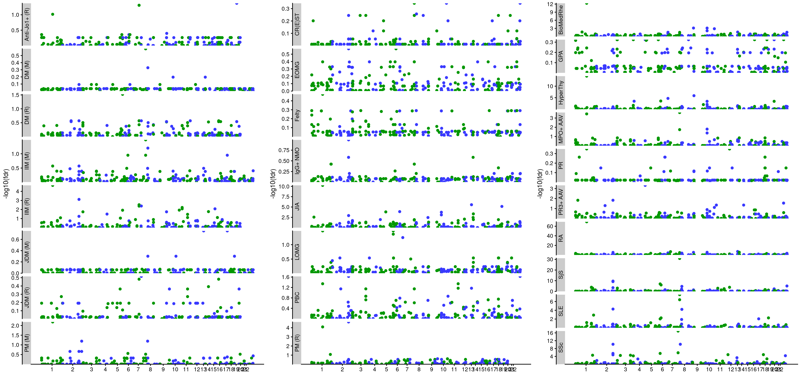

----

# Background

We want to learn more about myositis and its subtypes in the light of other IMD. For that we'll take a closer look at myositis datasets from two studies ([Miller et al., 2015](https://pubmed.ncbi.nlm.nih.gov/26291516/) and [Rothwell et al. 2022](https://onlinelibrary.wiley.com/doi/full/10.1002/art.42434)) projected onto our IMD-trained features together with projections from our curated collection of IMD summary statistics from multiple sources. We'll cluster these projections, compute genetic similarity, and follow-up on key SNPs underlying the observed patterns, using a FDR for shared GWAS signals, followed by colocalisation. 


```{r include=FALSE, warning=FALSE, message=F}

# Load packages
library(data.table)
library(magrittr)
library(rmeta)
library(ggplot2)
library(cowplot)
library(pheatmap)
library(reshape2)
library(knitr)
library(kableExtra)
library(ggrepel)
library(GGally)
library(fpc)
library(cupcake)

```


# 1. Exploratory data analysis

Next we analysed our myositis datasets in the context of meta-analyses and the rest of projections, with a focus on IMD. We applied our routine quality control to our collection of projections, applied an FDR procedure to keep datasets that are (1) significantly different from zero overall (FDR < 1%) and (2) by PC (FDR < 1% [●] or FDR < 5% [○]). 


```{r include=FALSE}

# Load files

# We'll need the SNP manifest
SNP.manifest <- cupcake::SNP.manifest

# Meta-data table, containing information about the datasets
m <- fread("../data/Metadata_20230905-v1.tsv")
m <- m[, .(Trait, First_Author, Reference, Trait_ID_2.0, Trait_long, Trait_class, N0, N1, N, Population, Public)]

# Projection QC table, containing information about the projections and their quality
q <- fread("../data/QC_IMD_basis_20230503-v1.tsv")
q <- merge(q, m, by="Trait") # Get metadata together

# Take the chance now to update some references in the q table
q[ First_Author == "Rothwell", Reference:="36580032"]
q[ First_Author == "Lessard", c("First_Author", "Reference"):=list("Khatri", "35896530")][ First_Author == "Wong", Reference:="doi:10.17863/CAM.51022"]


# Projection table
p <- fread("../data/Projection_IMD_basis_20230503-v1.tsv")
p[, Var.Delta:=as.numeric(Var.Delta)]
b <- p[1:169] # Basis traits
p <- p[179:nrow(p)] # projection table without basis traits
p[, z:=NULL]


#######################################################

# Now it's time to do our proper EDA on the projections. This will involve:
#
# (1) Remove projections with low SNP match, Immunochip (ex. Rothwell), unauthorised (PAPS) and Neale. Keep IMD only
# (2) Prepare proper labels for selected datasets
# (3) Apply FDR procedure and remove datasets with FDR overall > 1%
# (4) Remove redundant datasets for visualisation and further analyses


### (1) Remove projections with low SNP match, Immunochip (ex. Rothwell), unauthorised (PAPS) and Neale. Keep IMD only.


# Remove unauthorised projection (PAPS)
p <- p[Trait != "PAPS_Casares_up_1"]
q <- q[Trait != "PAPS_Casares_up_1"] # Remove PAPS


# Remove datasets with missing overall p-values
summary(q)
q[is.na(q$overall_p)] 
# MDD_Wray_2, Major depression disorder, that failed to project by low SNP match.
# T2D_Gaulton 
q <- q[!is.na(q$overall_p)] 


# Remove datasets with <80% SNP match. This will include datasets using targeted arrays only (ie. ImmunoChip).
# Check SNP match
c(lessthan95 = nrow(q[q$nSNP < nrow(SNP.manifest)*.95,]), lessthan80 = nrow(q[q$nSNP < nrow(SNP.manifest)*.8,]), lessthan50 = nrow(q[q$nSNP < nrow(SNP.manifest)*.5,]))
c(lessthan95 = nrow(q[q$nSNP < nrow(SNP.manifest)*.95,])/nrow(q), lessthan80 = nrow(q[q$nSNP < nrow(SNP.manifest)*.8,])/nrow(q), lessthan50 = nrow(q[q$nSNP < nrow(SNP.manifest)*.5,])/nrow(q))
# 4% of datasets (248) have <80% SNP match

qf <- q[nSNP >= max(nSNP) * 0.8 ]

# Remove datasets used to build the IMD basis, which are overfitted
basis.datasets <- c("CD_DeLange_28067908_1", "PSC_Ji_27992413_1", "UC_DeLange_28067908_1", "SLE_Bentham_26502338_1", "PBC_Cordell_26394269_1", "IGAN_Kiryluk_25305756_1", "CEL_Dubois_20190752_1", "MS_IMSGC_21833088_1", "AST_Demenais_29273806_1", "VIT_Jin_27723757_1", "RA_Okada_24390342_1", "LADA_Cousminer_30254083_1", "T1D_Cooper_doi101101120022_1")

qf <- qf[!Trait %in% basis.datasets]

# Remove Neale, as we already have PanUKBBR2
qf <- qf[First_Author != "Neale"]

# Keep IMD traits only
qf <- qf[Trait_class == "IMD"] # Interested in IMDs for now

# Check traits by class. In this case we have only one class
table(qf$Trait_class)
# IMD 
# 521 


########################################


# (2) Prepare proper labels for selected datasets

qf[,Label:=Trait_long] %>% .[!grepl("myositis", Trait_long, ignore.case = TRUE), Label:=gsub(" \\(UKBB\\)", "", Label)] %>% .[!grepl("myositis", Trait_long, ignore.case = TRUE) , Label:=gsub(" \\(FinnGen\\)", "", Label)] %>% .[, Label:=gsub(" \\(FG\\)", "", Label)] # Remove UKBB/FinnGen stuff save for myositis datasets
# Relabel some Myositis datasets -- this is the place to modify the labels
qf[ First_Author == "Rothwell", Label:=gsub("Idiopathic Inflammatory Myopathies \\(IIM, Myositis\\)", "IIM", Label)]
qf[ First_Author == "Miller", Label:=gsub("Myositis", "IIM", Label, fixed = TRUE)]
qf[ First_Author %in% c("Rothwell", "Miller"), Label:=paste0(Label, " (", First_Author, ")")]
# Rename PBC and PSC
qf[grepl("sclerosing", Label), Label:= "Primary sclerosing cholangitis"]
qf[grepl("chirrosis", Label), Label:= "Primary biliary cholangitis"]
qf[grepl("MS-disease", Label), Label:="Multiple Sclerosis"] # Fix weird FinnGen MS label


# Create a filtered projection table with new labels too

pf <- merge(p, qf[,c("First_Author","Trait", "Trait_ID_2.0", "Trait_long","Trait_class", "Population", "Label")], by = "Trait")


###########################################

### (3) Apply FDR procedure and remove datasets with FDR overall > 1%

# Apply 1% FDR correction to overall p for all remaining datasets
qf[, FDR.overall := p.adjust(overall_p, method = "BH"), by="Trait_class"] # Only IMD, so trait class shouldn't matter

# Apply FDR.PC to projections
pf[, FDR.PC:=p.adjust(P, method = "BH"), by = c("PC", "Trait_class")][, stars:=ifelse(!is.na(FDR.PC) & FDR.PC<0.05,"○","")][ FDR.PC < 0.01 , stars:="●"]
# Filter pf by overall significant traits


####

## Now we have added the FDR information to the filtered (qf, pf) tables, we can extract them to create Supplementary tables

# At this point, prepare Supplementary Table with coloc info
qmyo <- qf[ First_Author %in% c("Miller", "Rothwell")]
qmyo <- qmyo[, .(Label, First_Author, Reference, N0, N1, N, FDR.overall )][order(First_Author, Label)]
qmyo
# fwrite(qmyo, "../tables/ST_Myo_info.tsv", sep="\t")

####

## Create significant-only datasets

# Keep significant datasets only in qs
qs <- qf[FDR.overall < 0.01]
nrow(qs) / nrow(qf)
# 58.3% significant

# Do the same for ps
ps <- pf[Trait %in% qs$Trait ]
ps[, PC:=factor(PC, levels = paste0("PC", 1:13))]

####

## Now we can explore the datasets a little bit 

# Check how many are significant
tsig <- copy(qf)
tsig[, sig.overall:=ifelse(FDR.overall < 0.01, "Y", "N")]
table(tsig$sig.overall)
#   N   Y 
# 217 304 

# Which myositis datasets didn't make the cut?
qf[grepl("myositis", Trait_long, ignore.case = TRUE) & !Trait %in% qs$Trait, .(First_Author, Trait_ID_2.0, Trait_long)]
# 6 datasets. These include:
#    First_Author       Trait_ID_2.0                                 Trait_long 
# 1:      PanUKBB         20002_1322                   Myositis/Myopathy (UKBB) 
# 2:     Rothwell                IBM                    Inclusion Body Myositis 
# 3:      FinnGen   M13_DERMATOMYOTH            Other dermatomyositis (FinnGen) 
# 4:      FinnGen M13_DERMATOPOLYNAS Dermatopolymyositis, unspecified (FinnGen) 
# 5:       Sakaue                 PM                               Polymyositis 
# 6:      PanUKBB              ph770    Myalgia and myositis unspecified (UKBB) 


# Which features are relevant for myositis?
ps[grepl("myositis", Trait_long, ignore.case = TRUE) & FDR.PC < 0.01, .(PC, First_Author, Trait_long, FDR.PC, stars)][order(PC)]
# We have some significant Myositis for PC1, 2, 3, 8, 9, 12, and 13

####

###########################################

# (4) Remove redundant datasets for visualisation and further analyses

# Let's try to remove redundant datasets in a less manual way
qs2 <- copy(qs)

# There are a number of duplicated diseases that we can revisit
# CD
qs2[grepl("Crohn|Chron's", Label)][order(N1, decreasing = TRUE)]
tr <- c(setdiff(qs2[grepl("Crohn|Chron's", Label), Trait], "CD_Liu_26192919_1")) # We select CD Liu, exclude the rest

# UC
qs2[grepl("colitis|UC |Ulcerative", Label, ignore.case = TRUE)][order(N1, decreasing = TRUE)]
tr <- c(tr, setdiff(qs2[grepl("colitis|UC |Ulcerative", Label), Trait], "UC_Liu_26192919_1")) # We select UC Liu, exclude the rest

# IBD
qs2[grepl("bowel|IBD ", Label, ignore.case = TRUE)][order(N1, decreasing = TRUE)]
tr <- c(tr, setdiff(qs2[grepl("bowel|IBD ", Label, ignore.case = TRUE), Trait], "IBD_Liu_26192919_1")) 

# T1D
qs2[grepl("Type 1 diabetes|Type1", Label, ignore.case = TRUE)][order(N1, decreasing = TRUE)]
tr <- c(tr, setdiff(qs2[grepl("Type 1 diabetes|Type1", Label, ignore.case = TRUE), Trait], "E4_DM1_FinnGen_FinnGenR7_1")) 

# Asthma
qs2[grepl("Asthma", Label, ignore.case = TRUE)][order(N1, decreasing = TRUE)]
tr <- c(tr, setdiff(qs2[grepl("Asthma", Label, ignore.case = TRUE), Trait], c("ph495_PanUKBB_PanUKBBR2_1", "ASTAO_Ferreira_30929738_1", "ASTCO_Ferreira_30929738_1")))

# Celiac disease
qs2[grepl("celiac|coeliac", Label, ignore.case = TRUE)][order(N1, decreasing = TRUE)]
tr <- c(tr, setdiff(qs2[grepl("celiac|coeliac", Label, ignore.case = TRUE), Trait], c("K11_COELIAC_FinnGen_FinnGenR7_1")))

# (Rheumatoid) Arthritis
qs2[grepl("Arthritis", Label, ignore.case = TRUE)][order(N1, decreasing = TRUE)]
tr <- c(tr, setdiff(qs2[grepl("Arthritis", Label, ignore.case = TRUE), Trait], c("M13_RHEUMA_FinnGen_FinnGenR7_1", "JIA_LopezIsac_33106285_1"))) 

# Multiple sclerosis
qs2[grepl("multiple sclerosis", Label, ignore.case = TRUE)][order(N1, decreasing = TRUE)]
tr <- c(tr, setdiff(qs2[grepl("multiple sclerosis", Label, ignore.case = TRUE), Trait], c("G6_MS_FinnGen_FinnGenR7_1"))) # largest, non-IMSGC dataset

# PBC
qs2[grepl("biliary", Label, ignore.case = TRUE)][order(N1, decreasing = TRUE)]
tr <- c(tr, setdiff(qs2[grepl("biliary", Label, ignore.case = TRUE), Trait], c("CHIRBIL_PRIM_FinnGen_FinnGenR7_1")))

# PSC
qs2[grepl("sclerosing", Label, ignore.case = TRUE)][order(N1, decreasing = TRUE)]
tr <- c(tr, setdiff(qs2[grepl("sclerosing", Label, ignore.case = TRUE), Trait], c("K11_CHOLANGI_FinnGen_FinnGenR7_1")))

# Lupus
qs2[grepl("Lupus|SLE", Label, ignore.case = TRUE)][order(N1, decreasing = TRUE)]
  tr <- c(tr, setdiff(qs2[grepl("Lupus|SLE", Label, ignore.case = TRUE), Trait], c("M13_SLE_FinnGen_FinnGenR7_1"))) # Replace by FinnGen

# Vitiligo
qs2[grepl("vitiligo", Label, ignore.case = TRUE)][order(N1, decreasing = TRUE)]
tr <- c(tr, setdiff(qs2[grepl("vitiligo", Label, ignore.case = TRUE), Trait], c("L12_VITILIGO_FinnGen_FinnGenR7_1")))

# COPD
qs2[grepl("COPD|chronic obstructive", Label, ignore.case = TRUE)][order(N1, decreasing = TRUE)]
tr <- c(tr, setdiff(qs2[grepl("COPD|chronic obstructive", Label, ignore.case = TRUE), Trait], "J10_COPD"))

# Hypothyroidism
qs2[grepl("Hypothyroidism", Label, ignore.case = TRUE)][order(N1, decreasing = TRUE)]
tr <- c(tr, setdiff(qs2[grepl("Hypothyroidism", Label, ignore.case = TRUE), Trait], c("HYPOTHYROIDISM_FinnGen_FinnGenR7_1")))

# Hyperthyroidism
qs2[grepl("hyperthyroidism|graves", Label, ignore.case = TRUE)][order(N1, decreasing = TRUE)]
tr <- c(tr, setdiff(qs2[grepl("hyperthyroidism|graves", Label, ignore.case = TRUE), Trait], c("20002_1225_PanUKBB_PanUKBBR2_1")))

# Thyroiditis
qs2[grepl("thyroiditis", Label, ignore.case = TRUE)][order(N1, decreasing = TRUE)]
tr <- c(tr, setdiff(qs2[grepl("thyroiditis", Label, ignore.case = TRUE) , Trait], c("E4_THYROIDITAUTOIM_FinnGen_FinnGenR7_1")))

# Psoriasis
qs2[grepl("Psoria", Label, ignore.case = TRUE)][order(N1, decreasing = TRUE)]
tr <- c(tr, setdiff(qs2[grepl("Psoria", Label, ignore.case = TRUE), Trait], c("L12_PSORIASIS_FinnGen_FinnGenR7_1", "L12_PSORI_ARTHRO_FinnGen_FinnGenR7_1")))

# Graves' disease
qs2[grepl("Graves", Label, ignore.case = TRUE)][order(N1, decreasing = TRUE)]
tr <- c(tr, setdiff(qs2[grepl("Graves", Label, ignore.case = TRUE), Trait], c("E4_GRAVES_STRICT_FinnGen_FinnGenR7_1")))

# Rhinitis
qs2[grepl("rhinitis", Label, ignore.case = TRUE)][order(N1, decreasing = TRUE)]
tr <- c(tr, setdiff(qs2[grepl("rhinitis", Label, ignore.case = TRUE), Trait], c("20002_1387_PanUKBB_PanUKBBR2_1")))

# Diabetic related stuff
qs2[grepl("Diabetic|Diabetes[, ]", Label, ignore.case = TRUE)][order(N1, decreasing = TRUE)]
tr <- c(tr, setdiff(qs2[grepl("Diabetic|Diabetes[, ]", Label, ignore.case = TRUE), Trait], c("DM_RETINOPATHY_FinnGen_FinnGenR7_1", "DM_NEPHROPATHY_FinnGen_FinnGenR7_1")))

# Dermatitis
qs2[grepl("Dermatitis", Label, ignore.case = TRUE)][order(N1, decreasing = TRUE)]
tr <- c(tr, setdiff(qs2[grepl("Dermatitis", Label, ignore.case = TRUE), Trait], c("ATD_Paternoster_26482879_1")))

# Sjogren
qs2[grepl("Sjogren|Sjögren|Sicca", Label, ignore.case = TRUE)][order(N1, decreasing = TRUE)]
tr <- c(tr, setdiff(qs2[grepl("Sjogren|Sjögren|Sicca", Label, ignore.case = TRUE), Trait], c("SJOS_Lessard_up_1")))

# Allergic
qs2[grepl("allerg", Label, ignore.case = TRUE)][order(N1, decreasing = TRUE)]
tr <- c(tr, setdiff(qs2[grepl("allerg", Label, ignore.case = TRUE), Trait], c("20002_1387_PanUKBB_PanUKBBR2_1")))

# Nasal polyps
qs2[grepl("polyp", Label, ignore.case = TRUE)][order(N1, decreasing = TRUE)]
tr <- c(tr, setdiff(qs2[grepl("polyp", Label, ignore.case = TRUE), Trait], c("J10_NASALPOLYP_FinnGen_FinnGenR7_1")))

# Systemic sclerosis
qs2[grepl("systemic sclerosis", Label, ignore.case = TRUE)][order(N1, decreasing = TRUE)]
tr <- c(tr, setdiff(qs2[grepl("systemic sclerosis", Label, ignore.case = TRUE), Trait], c("SSC_LopezIsac_31672989_1")))

# Autoimmune disorders
tr <- c(tr, qs2[grepl("autoimmune dis", Label, ignore.case = TRUE), Trait]) 


# Gout and ankylosing
qs2[grepl("gout|ankylosing", Label, ignore.case = TRUE)][order(N1, decreasing = TRUE)]
tr <- c(tr, setdiff(qs2[grepl("gout|ankylosing", Label, ignore.case = TRUE), Trait], c("GOUT_FinnGen_FinnGenR7_1", "M13_ANKYLOSPON_FinnGen_FinnGenR7_1")))

# Myastenia gravis
qs2[Label == "Myastenia Gravis"][order(N1, decreasing = TRUE)]
tr <- c(tr, setdiff(qs2[Label == "Myastenia Gravis" , Trait], c("MYG_Chia_35074870_1")))

# Rosacea
qs2[grepl("rosacea", Label, ignore.case = TRUE)][order(N1, decreasing = TRUE)]
tr <- c(tr, setdiff(qs2[grepl("rosacea", Label, ignore.case = TRUE) , Trait], c("L12_ROSACEA_FinnGen_FinnGenR7_1")))

# Addison's disease
qs2[grepl("addison", Label, ignore.case = TRUE)][order(N1, decreasing = TRUE)]
tr <- c(tr, setdiff(qs2[grepl("addison", Label, ignore.case = TRUE) , Trait], c("AAD_Eriksson_33574239_1")))

# We'll also remove all myositis from FinnGen, as they're not informative
tr <- c(tr, "DERMATOPOLY_FG_FinnGen_FinnGenR7_1", "M13_MYOSITIS_FinnGen_FinnGenR7_1", "M13_POLYMYO_FinnGen_FinnGenR7_1", "M13_DERMATOPOLY_FinnGen_FinnGenR7_1")

tr <- c(tr, "M13_JUVERHEU_FinnGen_FinnGenR7_1") #  Remove juvenile rheuma, as it's essentially the same as JIA

qs2 <- qs2[!Trait %in% tr] # First pass
length(unique(qs2$Label))
# 73

# Check for duplicates, if there are still
dp <- qs2[duplicated(Label), unique(Label)]
qsdup <- qs2[Label %in% dp]
qsdup # No duplicates

# Apply this to projections as well
ttk2 <- qs2$Trait # Traits to keep
ps2 <- ps[Trait %in% ttk2]

ps2[, PC:=factor(PC, levels = paste0("PC", 1:13))]

# fwrite(ps2, "../data/ps2.tsv", sep="\t")
# fwrite(qs2, "../data/qs2.tsv", sep="\t")

# Prepare supplementary tables for ALL datasets and projections

# Save filtered datasets - not sure if we'll show these

aq <- copy(qf)
ap <- copy(pf)

aq[, sig.overall:=ifelse(Trait %in% qs$Trait, "Yes", "No")][, in.selection:=ifelse(Trait %in% qs2$Trait, "Yes", "No")]
ap[, sig.overall:=ifelse(Trait %in% qs$Trait, "Yes", "No")][, in.selection:=ifelse(Trait %in% qs2$Trait, "Yes", "No")]

aq <- aq[,.(Trait, Label, First_Author, Reference, N0, N1,N, Population, nSNP, mscomp, overall_p, FDR.overall, sig.overall, in.selection)]
ap <- ap[,.(Trait, Label, First_Author, Population, PC, Delta, Var.Delta, P, FDR.PC, stars, sig.overall, in.selection)]

# fwrite(aq, "../tables/ST_all_datasets.tsv", sep ="\t")
# fwrite(ap, "../tables/ST_all_projections.tsv", sep ="\t")


```


## Clustering Myositis


First, we clustered myositis and its subtypes, to update the data we already had. We have myositis data from FinnGen, too, so we'll include in the clustering to check whether clustering is supported by multiple source datasets. We'll clustered the datasets using a complete linkage hierarchical clustering method. Myositis and its subtypes tend to cluster by source, rather than by subtypes. This might be due to the nature of the clustering method, which only takes into account the estimates, but not the uncertainty around them, combined with very low power.


```{r message=FALSE, echo=FALSE, fig.width = 5, fig.height = 2, dpi=200, dev.args = list(png = list(type = "cairo"))}
# Let's cluster with meta-analyses only
# qs2[grepl("myositis", Label, ignore.case = TRUE)]
pspm <- ps2[grepl("Miller|Rothwell", Label, ignore.case = TRUE)]

PCorder <- paste0("PC", 1:13)
hmcol <- rev(colorRampPalette(c("#67001F", "#B2182B", "#D6604D", "#F4A582", "#FDDBC7", "#F7F7F7", "#D1E5F0", "#92C5DE", "#4393C3", "#2166AC", "#053061"))(100))
Mmp <- acast(pspm[,c("PC", "Label", "Delta")], Label ~ PC) # PC, Trait, and Delta columns only
Mmp.stars <- acast(pspm[,c("PC","Label","stars")], Label ~ PC)
Mmp <- Mmp[,PCorder]
Mmp.stars <- Mmp.stars[,PCorder]
range <- max(abs(Mmp))

# Create heatmap
Mphm <- pheatmap(Mmp,  breaks = seq(-range, range, length.out = 100), 
                cluster_cols = FALSE, cluster_rows = FALSE, display_numbers = Mmp.stars,
                fontsize_row = 8.4, fontsize_number = 11, color = hmcol, 
                annotation_names_row = FALSE, annotation_legend = TRUE)
Mphm

# Figure 1
#ggsave("../figures/Myositis_allsources_heatmap.png", Mphm, width = 6, height = 2.5, bg="white")

```


## Clustering with the rest of IMD

We'll now take a look at myositis in a broader context of IMD, again using complete linkage hierarchical clustering method. Note that we included IMD only in this visualisation, but we also have other trait classes, like cytokines, blood cell counts, etc. that we could use for further exploration. To improve visualisation, we removed all redundant datasets, while keeping enough to cover a broad array of IMD.


```{r echo=FALSE, message=FALSE, fig.width = 9, fig.height = 14, dpi=300, dev.args = list(png = list(type = "cairo"))}

# Let's look at it in more context
# Remove all  datasets without at least one FDR 1% significant PC
a1s <- ps2[FDR.PC < 0.05 | grepl("myositis|IIM", Label, ignore.case = TRUE), Trait] %>% unique 
# "HYPERTHY_Sakaue_doi1011012020102320213652_1" to be removed for this reason

ps2s <- ps2[Trait %in% a1s]

Map <- acast(ps2s[,c("PC", "Label", "Delta")], Label ~ PC) # PC, Trait, and Delta columns only
Map.stars <- acast(ps2s[,c("PC","Label","stars")], Label ~ PC)
Map <- Map[,PCorder]
Map.stars <- Map.stars[,PCorder]
range <- max(abs(Map))

# We have many datasets, so let's highlight myositis
# From https://github.com/raivokolde/pheatmap/issues/48
# use this function to make row or column names bold
# parameters:
#   mat: the matrix passed to pheatmap
#   rc_fun: either rownames or colnames
#   rc_names: vector of names that should appear in boldface
make_bold_names <- function(mat, rc_fun, rc_names) {
  bold_names <- rc_fun(mat)
  ids <- rc_names %>% match(rc_fun(mat))
  ids %>%
    purrr::walk(
      function(i)
        bold_names[i] <<-
        bquote(bold(.(rc_fun(mat)[i]))) %>%
        as.expression()
    )
  bold_names
}

papsb <- grep("myositis|IIM", rownames(Map), value = TRUE, ignore.case = TRUE)

# Create heatmap
Mahm <- pheatmap(Map,  breaks = seq(-range, range, length.out = 100), 
                cluster_cols = FALSE, display_numbers = Map.stars,
                fontsize_row = 8.4, fontsize_number = 11, color = hmcol, 
                annotation_names_row = FALSE, annotation_legend = TRUE,
                labels_row = make_bold_names(Map, rownames, papsb))

Mahm
# ggsave("../figures/Myositis_IMD_heatmap.png", Mahm, width = 10, height = 14, bg="white")

```

We don't observe a clear clustering of myositis datasets, with the exception of Miller's and Rothwell's Juvenile dermatomyositis and dermatomyositis. Polymyositis from each source appear far away from each other and from other myositis subtypes. Anti-Jo1+ myositis appears on its own as well.

These results can be explained in two ways: (1) as before, the signal from most datasets is not too strong, so it can be lost when considering all other IMD at the same time; and (2) the hierarchical clustering method only considers the projections, without considering the uncertainty around the estimates, which is relevant, especially for smaller datasets. In addition, hierarchical clustering can become very unstable (ie. heavily dependent on the input data), especially when considering many dimensions.


## Delta plot of myositis datasets

Let's create a delta plot to see the myositis datasets (significant or not) across the 7 PCs

```{r echo = FALSE}


myoc <- c(`PM (R)` = "#CF000F", `PM (M)` = "#CF000F", `PM (FG)` = "#CF000F", `DM (R)` = "#2E8856", `DM (M)` = "#2E8856", `IIM (R)` = "#1460AA", `IIM (M)` = "#1460AA", `JDM (M)` = "#B8860B", `JDM (R)` = "#B8860B", `IBM (R)` = "#E65722", `Anti-Jo1+ (R)` ="#1C2833", `DPM (FG)` = "#053061")

pmyo <- pf[(First_Author %in% c("Miller", "Rothwell") | Trait_ID_2.0 %in% c("M13_DERMATOPOLY", "M13_POLYMYO")) & PC %in% paste0("PC", c(1:3, 8:9, 12:13))][, PC:=factor(PC, levels = paste0("PC", c(1:3, 8:9, 12:13)))]
pmyo[, Label:=gsub("Inclusion Body Myositis", "IBM", Label)][, Label:=gsub("Juvenile Dermatomyositis", "JDM", Label)][, Label:=gsub("Dermatomyositis", "DM", Label)][, Label:=gsub("Polymyositis", "PM", Label)][, Label:=gsub("Jo1\\+ Myositis", "Anti-Jo1+", Label)][, Label:=gsub("Miller", "M", Label)][, Label:=gsub("Rothwell", "R", Label)][, Label:=gsub("FinnGen", "FG", Label)][, Label:=gsub("Dermatopolymyositis", "DPM", Label)]
pmyo[, ci:=sqrt(Var.Delta) * 1.96]

dpm <- ggplot(pmyo, aes(x = Delta, y = Label, xmin=Delta-ci, xmax=Delta+ci, colour = Label))+
  geom_pointrange()+
  geom_vline(xintercept = 0, col="red", lty=2)+
  scale_colour_manual(values = myoc)+
  xlab("Delta")+
  facet_grid(PC~.,  scales = "free", space = "free", switch = "y")+
  theme_cowplot(11)+
  theme(legend.position = "none", strip.text.y.left = element_text(angle = 0), axis.title.y = element_blank())

# ggsave("../figures/deltaplot_myo.png", dpm, height = 10, width = 6, bg = "white")

####


```


## Compute Bhattacharyyan distance for Myositis subtypes

As an alternative, we'll use the Bhattacharyyan distance to do the same as we tried with Mahalanobis. Bhattacharyyan distance takes uncertainty around the estimates into account.

```{r}
# At this point, we need to run compute-bhattacharyyan-distance.R in the HPC

bhd <- fread("../data/bh_dist.tsv")
bhd[, logbhat:=log(1 + bhat.dist)]
bhd[, T1:=stringr::str_trunc(T1, 50, ellipsis = " [...]")][, T2:=stringr::str_trunc(T2, 50, ellipsis = " [...]")]

# We keep the initial matrices for make_bold_names(), since I don't have the time to adapt it now
bh.cl <- acast(bhd, T1~T2, value.var = "bhat.dist") %>% as.dist %>% hclust # Cluster by raw
bhatta.d <-  acast(bhd, T1~T2, value.var = "logbhat") # Show log

bh.ph <- pheatmap(bhatta.d,
                cluster_cols = bh.cl, 
                cluster_rows = bh.cl,
                annotation_names_row = FALSE,
                show_colnames = FALSE,
                annotation_legend = FALSE,
                clustering_method = "average",
                cutree_rows = 9,
                treeheight_col=0,
                fontsize_row=8)

# Call clusters for Bhattacharyya
tbh <- bh.ph$tree_row
tbhc <- cutree(tbh, k=17) # manually adjusted to capture visually-selected IMD
bhatta.sel <- names(tbhc[tbhc ==9]) # Myositis cluster is 9
bhatta.sel
bht <- data.table(Label = names(tbhc), Bhattacharyya = tbhc)
#fwrite(bht, "../data/bhattacharyya_clustering.tsv", sep="\t")


# We'll show DPMUnc annotations as well. Note, this file is generated later, but we recover it now
resdpmunc <- readRDS("../data/Myo_7PC_psm_data.rds")
resdpmunc <- data.table(Label = names(resdpmunc$calls$cl), DPMUnc = resdpmunc$calls$cl)
resdpmunc[, Label:=stringr::str_trunc(Label, 50, ellipsis = " [...]")]


### Full palette from DPMUnc code. We'll use an adapted one (below)
# palette <- c("#77AADD", "#000000", "#9E0142", "#D53E4F", "#FDAE61", "#66C2A5", "#ABDDA4", "#F46D43", "#3288BD", "#5E4FA2",
#              "#FEE08B", "#E6F598", "#771155", "#AA4488", "#CC99BB", "#114477", "#774411", "#EEEEEE", "#117777", "#117744", 
#              "#44AA77", "#88CCAA", "#777711", "#44AAAA", "#AAAA44", "#77CCCC", "#DDDD77", "#AA7744", "#DDAA77", "#771122", "#AA4455", "#DD7788") # Colours for clusters  

# Set colours, this palette is adapted from the DPMUnc code, but removing one colour
palette1 <- c("#77AADD", "#000000", "#9E0142", "#D53E4F", "#F46D43", "#FEE08B", "#ABDDA4", "#66C2A5",            "#5E4FA2", 
              "#FDAE61", "#E6F598", "#771155", "#AA4488", "#CC99BB", "#114477", "#774411", "#EEEEEE", "#117777", "#117744", 
              "#44AA77", "#88CCAA", "#777711", "#44AAAA", "#AAAA44", "#77CCCC", "#DDDD77", "#AA7744", "#DDAA77", "#771122", "#AA4455", "#DD7788")


bhattacolp <- rev(colorRampPalette(RColorBrewer::brewer.pal(n = 9, name = "Spectral"))(100))

# Prepare annotation object

ann <- merge(bht, resdpmunc, by = "Label")
ann <- data.frame(ann[, 2:3], row.names = ann$Label) # Format

dpcol <- palette1[1:max(ann$DPMUnc)]
names(dpcol)  <- as.character(1:max(ann$DPMUnc))
bhcol <- palette1[1:max(ann$Bhattacharyya)]
names(bhcol)  <- as.character(1:max(ann$Bhattacharyya))

annotations <- list(ann = ann, colors = list( Bhattacharyya = bhcol,DPMUnc = dpcol))

bh.ph <- pheatmap(bhatta.d,
                cluster_cols = bh.cl, 
                cluster_rows = bh.cl,
                annotation_names_row = FALSE,
                annotation_legend = FALSE,
                treeheight_col=0,
                fontsize_row=8,
                annotation_row = annotations$ann,
                annotation_col = annotations$ann,
                annotation_colors = annotations$colors,
                color = bhattacolp, 
                show_colnames = FALSE, 
                labels_row = make_bold_names(bhatta.d, rownames, papsb))

#ggsave("../figures/Myositis_bhattacharyya_heatmap_v3.svg", bh.ph, width = 9, height = 9.5, bg="white")

# Trick: If modifying the text (like font, etc.), sometimes the text is fixed within a box, and adding anything will make it
# squeeze in the box, which is not ideal. TO avoid this behavior, apply the following one-liner below to the file:
# sed -i "s/ textLength='[^']*'//" Myositis_bhattacharyya_heatmap_v3.svg
# This will remove the fixed textLength from the XML.


```


# DPMUnc clustering

```{r echo=FALSE, eval=FALSE}
# At this point, we prepare the data for DPMUnc using significant PCs for myositis 
ps2s[grepl("myositis|IIM", Label, ignore.case = TRUE) & FDR.PC < 0.01, .(PC, Label, stars)][, .N, by = PC]

dpmunc.ds <- ps2s[PC %in% paste0("PC", c(1,2,3,8,9,12,13)), .(PC, Delta, Var.Delta, Label)]
dpmunc.delta <- reshape(dpmunc.ds[, .(PC, Delta, Label)], idvar="Label", timevar = "PC", direction = "wide")
dpmunc.var   <- reshape(dpmunc.ds[, .(PC, Var.Delta, Label)], idvar="Label", timevar = "PC", direction = "wide")

# fwrite(dpmunc.delta, "../data/Myo_7PC_Delta.tsv", sep = "\t")
# fwrite(dpmunc.var, "../data/Myo_7PC_Var.tsv", sep = "\t")

```


```{r echo=FALSE, eval=FALSE}

#######################
### TEST WITH 13PCs ###
#######################

# This chunk is intended to generate DPMUnc files using all 13 PCs instead of the key 7 ones

ps2s[grepl("myositis|IIM", Label, ignore.case = TRUE) & FDR.PC < 0.01, .(PC, Label, stars)][, .N, by = PC]

dpmunc.ds <- ps2s[, .(PC, Delta, Var.Delta, Label)]
dpmunc.delta <- reshape(dpmunc.ds[, .(PC, Delta, Label)], idvar="Label", timevar = "PC", direction = "wide")
dpmunc.var   <- reshape(dpmunc.ds[, .(PC, Var.Delta, Label)], idvar="Label", timevar = "PC", direction = "wide")
# 
# fwrite(dpmunc.delta, "../data/Myo_13PC_Delta.tsv", sep = "\t")
# fwrite(dpmunc.var, "../data/Myo_13PC_Var.tsv", sep = "\t")

```


```{r include=FALSE, echo=FALSE}

# resdpmunc <- readRDS("../data/Myo_7PC_psm_data.rds")
# resdpmunc <- data.table(Label = names(resdpmunc$calls$cl), DPMUnc.cl = resdpmunc$calls$cl)

p7 <- ps2s[ PC %in% paste0("PC", c(1,2,3,8,9,12,13)), .(Trait, Label, PC, Delta, Trait_long, Trait_class, stars)]
p7[, Label:=stringr::str_trunc(Label, 50, ellipsis = " [...]")] # Update labels to match those of resdpmunc that we modified above
p7 <- data.table::dcast(p7, Label + Trait + Trait_class  + Trait_long ~ PC, value.var = c("Delta", "stars"))
p7 <- merge(p7, resdpmunc, by=c("Label"), all.x = TRUE)
p7[, DPMUnc:=factor(DPMUnc, levels = 1:10)]
#kable(p7[DPMUnc.cl == 1 & !grepl("myositis", Label, ignore.case = T), .(Label)]) %>% kable_styling()

p7[grepl("myositis", Label, ignore.case = TRUE), .(Label, DPMUnc)]
p7[DPMUnc == 1, .(Label)] # Other IMD in the same cluster as myositis
dpimd <- p7[DPMUnc == 1 & !grepl("myositis|IIM", Label, ignore.case = T), Label] # List non-myositis IMD in the same cluster
# fwrite(p7, "../data/DPMUnc_res_v3.tsv", sep = "\t")

```

We decided to apply a novel method developed by our group, DPMUnc (Dirichlet Process Mixtures with uncertainty, [Nicholls et al., 2022](https://www.biorxiv.org/content/10.1101/2022.12.07.519476v1)), which can cluster the projections while taking uncertainty into account. Since our focus is Myositis and its subtypes, we clustered using the features any Myositis dataset was significant at 1%: PC1, PC2, PC3, PC8, PC9, PC12, and PC13. We considered all IMD showed above, regardless of significance for any of the 7 PCs.

DPMUnc finds 11 clusters across 7 features. All myositis datasets fall on the same cluster (1) except for FinnGen's myositis (cluster 2). This is likely due to the different composition of the FinnGen myositis set, comprising a majority of unclassified myositis cases, while Miller and Rothwell general myositis feature meta-analyses of classified myositis subtypes.

Other IMD group with myositis, namely

* Arthritis and arthritis-related phenotypes
    - Biological medication for rheuma
    - Juvenile Idiopathic Arthritis
    - Juvenile rheuma
    - Palindromic rheumatism
    - Felty syndrome

* Thyroid-related conditions
    - Autoimmune Thyroid disease
    - Autoimmune thyroiditis
    - Hyperthyroidism/Thyrotoxicosis
    - Hypothyroidism (congenital or acquired)

* Sclerosis
    - CR(E)ST syndrome
    - Systemic Sclerosis

* Vasculitis
    - MPO+ AAV
    - PR3+ AAV
    - Wegener granulomatosis

* Muscle-affecting conditions
    - Early-onset Myastenia Gravis
    - Late-onset Myastenia Gravis
    - Myastenia Gravis
    
* Blood-affecting conditions
    - Idiopathic thrombocytopenic purpura
    
* Other conditions
    - Primary Biliary Cholangitis
    - IgG+ Neuromyelitis Optica
    - Sjögren's syndrome


# Comparing both clusterings

Let's take a look at how Bhattacharyya distance and DPMUnc differ in their clustering

```{r echo = FALSE}
library(ggalluvial)

# Recover annotation object
rescl <- ann %>% data.table(keep.rownames = TRUE)

clsum=rescl[,.(y=.N),by=c("DPMUnc","Bhattacharyya")]


# Plot Relationship between disease clusterings
sdiag <- ggplot(clsum, aes(y=y, axis1=DPMUnc,axis2=Bhattacharyya)) + geom_alluvium(aes(fill=factor(DPMUnc))) +
            geom_stratum(width = 1/5,  fill="white", color = "black") +
            #geom_label(stat = "stratum", aes(label = after_stat(stratum))) +
            geom_text(stat = "stratum", aes(label = after_stat(stratum)))+
            scale_x_discrete(limits = c("DPMUnc","Bhattacharyya"), expand = c(.05, .05)) +
            scale_fill_manual(values = palette1[1:10])+
            scale_y_continuous("Count") +
            theme_minimal()+
            theme(axis.text.y = element_blank(), axis.ticks.y = element_blank(), 
                  axis.title.y = element_blank(), panel.grid = element_blank(), 
                 legend.position = "none", axis.text.x = element_text(size = 13))
sdiag
# ggsave("../figures/sdiag_Bh_DP_v3.png", sdiag, height = 9, width = 8, bg = "white")
# ggsave("../figures/sdiag_Bh_DP_v3.svg", sdiag, height = 9, width = 8, bg = "white")

# Trick: If modifying the text (like font, etc.), sometimes the text is fixed within a box, and adding anything will make it 
# squeeze in the box, which is not ideal. TO avoid this behavior, apply the following one-liner below to the file:
# sed -i "s/ textLength='[^']*'//" sdiag_Bh_DP_v3.svg
# This will remove the fixed textLength from the XML.

```


## EXTRA: Clustering with all 13 PCs

```{r echo = FALSE}


bhd13 <- fread("../data/bh_dist_13PC.tsv")
bhd13[, logbhat:=log(1 + bhat.dist)]
bhd13[, T1:=stringr::str_trunc(T1, 50, ellipsis = " [...]")][, T2:=stringr::str_trunc(T2, 50, ellipsis = " [...]")]

# We keep the initial matrices for make_bold_names(), since I don't have the time to adapt it now
bh13.cl <- acast(bhd13, T1~T2, value.var = "bhat.dist") %>% as.dist %>% hclust # Cluster by raw
bhatta13.d <-  acast(bhd13, T1~T2, value.var = "logbhat") # Show log

bh13.ph <- pheatmap(bhatta13.d,
                cluster_cols = bh13.cl, 
                cluster_rows = bh13.cl,
                annotation_names_row = FALSE,
                show_colnames = FALSE,
                annotation_legend = FALSE,
                cutree_rows = 15,
                treeheight_col=0,
                fontsize_row=8)
bh13.ph

# Call clusters for Bhattacharyya
tbh13 <- bh13.ph$tree_row
tbhc13 <- cutree(tbh13, k=15) # manually adjusted to capture visually-selected IMD
bhatta13.sel <- names(tbhc13[tbhc13 ==8]) # Myositis cluster is 8
bhatta13.sel
bht13 <- data.table(Label = names(tbhc13), Bhattacharyya = tbhc13)

# We'll show DPMUnc annotations as well. Note, this file is generated later, but we recover it now
resdpmunc13 <- readRDS("../data/Myo_13PC_psm_data.rds")
resdpmunc13 <- data.table(Label = names(resdpmunc13$calls$cl), DPMUnc = resdpmunc13$calls$cl)
resdpmunc13[, Label:=stringr::str_trunc(Label, 50, ellipsis = " [...]")]


ann13 <- merge(bht13, resdpmunc13, by = "Label")
ann13 <- data.frame(ann13[, 2:3], row.names = ann13$Label) # Format

dpcol13 <- palette1[1:max(ann13$DPMUnc)]
names(dpcol13)  <- as.character(1:max(ann13$DPMUnc))
bhcol13 <- palette1[1:max(ann13$Bhattacharyya)]
names(bhcol13)  <- as.character(1:max(ann13$Bhattacharyya))

annotations13 <- list(ann = ann13, colors = list( Bhattacharyya = bhcol13, DPMUnc = dpcol13))

bh13.ph <- pheatmap(bhatta13.d,
                cluster_cols = bh13.cl, 
                cluster_rows = bh13.cl,
                annotation_names_row = FALSE,
                annotation_legend = FALSE,
                treeheight_col=0,
                fontsize_row=8,
                annotation_row = annotations13$ann,
                annotation_col = annotations13$ann,
                annotation_colors = annotations13$colors,
                color = bhattacolp, 
                show_colnames = FALSE, 
                labels_row = make_bold_names(bhatta13.d, rownames, papsb))
# ggsave("../figures/Intfig_Myositis_bhattacharyya_heatmap13.png", bh13.ph, width = 9, height = 9.5, bg="white")

```


# Investigating driver SNPs underlying myositis signals

## Computing the joint probability of SNPs to be significant

Next, we wanted to investigate the SNPs that underlie the shared signal between myositis subtypes and other IMD. When training the features, many of the entries in the rotation matrix (which provides the weights assigned to each SNP for each feature) were very close to zero. To be more computationally efficient and to identify which SNPs are relevant for each feature, we searched for a minimal set of SNPs that could replicate the signals observed with dense-SNP data with high correlation (0.999) for each feature, obtaining a sparse rotation matrix containing non-zero entries for those SNPs that provide support for each feature. We refer to this set of variants as **driver SNPs**, as they directly influence the projections on each feature. Note that driver SNPs may be limited to a single feature, or be drivers for more than one feature.

For this step, we selected nine myositis datasets, including all significant overall datasets for both Miller and Rothwell:

* Dermatomyositis - Miller (dmy.m)
* Dermatomyositis - Rothwell (dmy.r)
* Juvenile Dermatomyositis - Miller (jdm.m)
* Juvenile Dermatomyositis - Rothwell (jdm.r)
* Jo1+ myositis - Rothwell (jo1m.r)
* Myositis - Miller (myo.m)
* Myositis - Rothwell (myo.r)
* Polymyositis - Miller (pm.m)
* Polymyositis - Rothwell (pm.r)

And 14 other IMD that were shown to be close to myositis by the methods above or are of special interest:

* Idiopathic thrombocytopenic purpura (itp)
* Neuromyelitis optica (nmo)
* Primary biliary cirrhosis/cholangitis (pbc)
* Juvenile idiopathic arthritis (jia)
* CR(E)ST syndrome (crest)
* Myastenia gravis (myag)
* Felty syndrome (felty)
* Sjögren's syndrome (sjos)
* Systemic sclerosis (ssc)
* Wegener granulomatosis (wegen)
* MPO+ ANCA-associated vasculitis (mpoaav)
* PR3+ ANCA-associated vasculitis (pr3aav)
* Hyperthyroidism/Thyrotoxicosis (hyperthy)
* Hypothyroidism, congenital or acquired (hypothy)


{out.width="100%"}


**Internal note:** In this figure some of the datasets have gaps, which causes chromosomes mismatch. Need to find a way to fix this before sending around.


We selected key driver SNPs to focus on by calculating the probability that they're significant for any of the myositis datasets and another trait of interest, using an FDR-based approach. In a nutshell, we computed FDR on the P-values on 255 driver SNPs for either of the features carrying myositis signal: PC1, PC2,PC3, PC8, PC9, PC12 and PC13. A brief explanation of the procedure:

$$ FDR = P(H_0\ true\ |\ p<\alpha) \\
1 - FDR = P(H_1\ true\  |\ p< \alpha)$$

We can extend this for two IMD, computing a pairwise FDR:

$$ P(H_1\ true\ for\ myositis\ \&\ IMD\ |\ p_{myositis}<\alpha,\ p_{IMD}<\alpha) = (1 -FDR_{myositis})(1-FDR_{IMD})\\
Pairwise\ FDR=P(H_0\ true\ for\ myositis\ or\ IMD\ |\ p_{myositis}<\alpha,\ p_{IMD}<\alpha) = 1-(1 -FDR_{myositis})(1-FDR_{IMD}) $$

We're interested in the first expression (probability of significant for both diseases), so we'll focus on SNPs with pairwise FDR < 0.5. 

Note that here we assume the traits are independent, which might not always be the case. If we allow for dependence, then

$$P(H_1\ true\ for\ myositis\ \&\ IMD\ |\ p_{myositis}<\alpha,\ p_{IMD}<\alpha) \\= P(H_1\ true\ for\ myositis\ | H_1\ true\ for\ IMD) * P(H_1\ true\ for\ IMD) \geq P(H_1\ true\ for\ myositis) * P(H_1\ true for IMD) \\= (1 -FDR_{myositis})(1-FDR_{IMD})$$

which means that, if datasets were positively dependent, the resulting probability for association with both traits would be higher, so assuming independence make our estimates are more conservative. The rationale is that, if we know the probability of association of a variant for one dataset, the probability of the variant to be significant for a dependent dataset either increases or remains the same compared to both datasets being independent. 

We computed the pairwise FDR for all myositis-IMD pairs resulting in 58 myositis-IMD significant pairs comprising 15 driver SNPs and 11 clusters or independent, non-overlapping regions. None of the 14 SNPs with shared associations are genomewide significant ($P < 5 \times 10^{-8}$) in their individual GWAS (see `pdriver.myos` in the table below).


```{r echo=FALSE}
# This bit is run after having run
# * run-coloc-driver-snps-v3.R
# * extract-SNPs-to-map.R
# * visualise-coloc-manplots-v3.R
# * mapping-genes.py

coloc <- fread("../data/coloc_results_dfilt-v3.tsv", na.strings = "")

# Import mapped genes 
mg <- fread("../data/mapped.genes_v2.tsv") %>% unique
mg <- mg[,.(SNPID, pid, nearestGene)]

# Add some info to the coloc table, and extract rsids to map

coloc <- merge(coloc, mg, by="pid") # First on driver SNPs
setnames(coloc, c("SNPID", "nearestGene"), c("driver.rsid", "driver.nearestgene"))
coloc <- merge(coloc, mg, by.x="bestsnp", by.y = "pid", all.x = TRUE) # Then on candidate snps. Bear in mind that we only mapped candidate SNPs with H4 > 0.5
setnames(coloc, c("SNPID", "nearestGene"), c("bestsnp.rsid", "bestsnp.nearestgene"))

# Fix inappropriate mappings
coloc[ driver.rsid == "rs2476601", driver.nearestgene:="PTPN22"]
coloc[ bestsnp.rsid == "rs2476601", bestsnp.nearestgene:="PTPN22"]
coloc[ driver.rsid == "rs991817", driver.nearestgene:="SH2B3"]
coloc[ bestsnp.rsid == "rs991817", bestsnp.nearestgene:="SH2B3"]

# Add novelty on bestsnps
coloc[H4 > 0.5 & pbest.myos.region > 5e-8, bestsnp.novel:="Yes"][is.na(bestsnp.novel), bestsnp.novel:="No"] # Add novelty
# Add gene/ driver SNP label
coloc[, dlabel:=paste( driver.nearestgene, driver.rsid, sep=" / ")]

#fwrite(coloc, "../tables/ST_full_coloc_results.tsv", sep="\t")

```


```{r}
ddm <- unique(c(bhatta.sel, dpimd))
fc <- data.table(Label =   c("Idiopathic thrombocytopenic purpura","IgG+ Neuromyelitis Optica","Primary biliary cholangitis","Juvenile Idiopathic Arthritis","CR(E)ST syndrome","Myastenia Gravis","Felty syndrome","Sjögren's syndrome","Systemic Sclerosis","Wegener granulomatosis","MPO+ AAV","PR3+ AAV","Hyperthyroidism/Thyrotoxicosis","Hypothyroidism (congenital or acquired)", "Palindromic rheumatism", "Biological medication for rheuma"),
fig.label = c("ITP", "IgG+ NMO", "PBC", "JIA", "CR(E)ST", "MG", "Felty", "SjS", "SSc", "GPA", "MPO+ AAV", "PR3+ AAV", "HyperThy", "HypoThy", "PR", "BioMedRhe"))
ddmt <- p7[ Label %in% ddm, Trait]
cdis <- qs2[ First_Author %in% c("Miller", "Rothwell") | Trait %in% ddmt, .(Label, First_Author, Reference)]
cdis <- merge(cdis, fc, by="Label", all.x=TRUE)
cdis[First_Author %in% c("Miller", "Rothwell") | Label %in% bhatta.sel, Bhattacharyya:="Yes"][First_Author %in% c("Miller", "Rothwell") | Label %in% dpimd, DPMUnc:="Yes"][First_Author %in% c("Miller", "Rothwell") | !is.na(fig.label), coloc:="Yes"][is.na(Bhattacharyya), Bhattacharyya:="No"][is.na(Bhattacharyya), Bhattacharyya:="No"][is.na(coloc), coloc:="No"]
cdis <- cdis[, .(Label, First_Author, Reference, Bhattacharyya, DPMUnc, coloc, fig.label)]
#fwrite(cdis, "../tables/ST_coloc_diseases.tsv", sep = "\t")

```


```{r echo = FALSE}
# Create a main summary table for coloc results
cts <- coloc[H4 > 0.5, .(pid, driver.rsid, driver.nearestgene, bestsnp.rsid, trait.myos, trait.other, pairwise_fdr, H4, pbest.myos, pbest.myos.region, bestsnp.novel )][order(driver.nearestgene, bestsnp.rsid)]
cts[, .(H4 = max(H4), bestsnp.rsid), by=driver.rsid]
cts <- cts[, .(pid,driver.rsid, driver.nearestgene, bestsnp.rsid, bestsnp.novel, pbest.myos, trait.myos,trait.other, pairwise_fdr, H4)][order(driver.nearestgene, trait.myos, trait.other)]

#fwrite(cts, "../tables/MT_coloc_results-v2.tsv", sep = "\t")

```


```{r echo=FALSE}
options(knitr.kable.NA = '')

coloc[ pairwise_fdr < 0.05, .(pid, driver.rsid, trait.myos, trait.other, pairwise_fdr, pdriver.myos)][order(pid)] %>% kable %>% kable_styling(full_width = FALSE)

```


In this table we show the myositis-IMD pairs in more details. The `pid` column denote the driver SNP genomic position, in hg38. `trait.myos` denote the myositis dataset, `trait.other` denote the IMD with shared association with the myositis trait at the SNP. `pairwise_fdr` denote the FDR for the driver SNP to be associated with both traits (the lower, the better). Finally, `pdriver.myos` is the P-value for the driver SNP in the myositis (`trait.myos`) individual GWAS.


## Colocalising key driver SNPs

While the previous approach is useful to identify which driver SNPs are relevant for both myositis and other IMD, driver SNPs are a tiny selection of variants across the genome, and they might capture signals from true causal SNPs in LD with them. Also, true causal variants in LD with a given driver SNP may differ between diseases. To address this, we next used coloc ([Giambartolomei et al., 2014](https://journals.plos.org/plosgenetics/article?id=10.1371/journal.pgen.1004383)), an established and commonly-used statistical method to formally investigate whether a putatively causal variant is shared between two traits. In essence, coloc uses SNP-dense summary statistics to test the posterior probability of 5 hyphotheses:


* $H_0$: No variant association with either trait.
* $H_1$: Association with trait 1, not with trait 2.
* $H_2$: Association with trait 2, not with trait 1.
* $H_3$: Association with trait 1 and trait 2, two independent SNPs.
* $H_4$: Association with trait 1 and trait 2, one shared SNP -- This is the probability we are interested in.

These hypotheses are assigned posterior probabilities by coloc that sum one.

To increase our discovery possibilities in the next step, we relaxed the `pairwise_fdr` threshold to < 0.5 (meaning that a variant is more likely to be associated with both diseases than not). This resulted in 614 myositis-IMD pairs and 84 unique driver SNPs. To get a fuller picture, when a driver SNP was significant for a myositis-IMD pair (ie. pairwise FDR < 0.5 for a given SNP and IMD), we also considered every IMD-myositis pair for that given SNP and IMD, regardless of significant. For example, JIA-Myositis (Rothwell) had rs2476601 (1:113834946) associated with both; then we considered every JIA-myositis pair (ie. including every myositis dataset) at rs2476601 for the next step.

We found 250 driver SNP-IMD combinations, comprising 2169 myositis-IMD pairs and 84 unique driver SNPs. However, many of these SNPs are in close proximity (ie. < 1Mb) and may represent redundant signals. To avoid this, we clustered the 84 driver SNPs by distance, considering SNPs closer than 1Mb to be in the same cluster. For clusters with more than one driver SNP, we kept the one with the lowest pairwise FDR for any myositis-IMD pair, and dropped the rest.

After this step, we kept 64 unique driver SNPs and 1548 myositis-IMD pairs for coloc analysis.

Next, we applied coloc to each myositis-IMD pair regions surrounding each driver SNP associated to the pair, using a 1Mb window around and assuming a single causal variant. 

This resulted in 33 myositis-IMD pairs and 8 driver SNPs with $P(H4) >0.5$ (ie. highest probability for a shared variant for both IMD in the region). 

Below we show a summary figure of the results, where driver SNPs and their nearest genes are presented in rows, myositis-IMD pairs are presented in panels, with IMD labels at the bottom. Tested associations are coloured by their H4 value (the lighter, the higher). High confidence associations (ie H4 > 0.8) are highlighted in green, and medium-confidence (ie. H4 > 0.5) in yellow.


```{r echo=FALSE, dpi=200, fig.width=12, fig.height=5, dev.args = list(png = list(type = "cairo"))}

keypids <- coloc[ H4 > 0.5, unique(pid)]

sumc <- coloc[pid %in% keypids, .(dlabel, trait.myos,  trait.other, H4)]
sumc <- sumc %>% tidyr::complete(dlabel, trait.myos, trait.other ) %>% as.data.table()
sumc[, dlabel:=factor(dlabel, levels = rev(unique(dlabel)))]
sumc[, trait.other:=factor(trait.other, levels = rev(unique(trait.other)))]
sumc[,flag:=ifelse(H4>.8, "High", ifelse(H4>.5, "Med", "Low"))]
sumc <- sumc[, .(dlabel, trait.myos, trait.other, H4, flag)]


gp1 <-  ggplot(sumc[ grepl(pattern = "^DM|JDM \\(M\\)", trait.myos) ], aes(x =  trait.other, y = dlabel, colour=flag, fill = H4)) +
              geom_tile( color = "black",
                        lwd = 0.2,
                        linetype = 1) +
              scale_fill_gradient(limits = c(0,1), na.value = "white")+
              geom_tile(aes( colour = flag),
                          lwd=1, linetype = 1, data = sumc[grepl(pattern = "^DM|JDM \\(M\\)", trait.myos) & H4 > 0.25]) + # Little trick to keep tiles in place
              scale_colour_manual(values=c(High="green",Med="yellow", Low ="#FFFFFF00"), guide=guide_none()) + # And make rectangles under 0.5 transparent
              
              #scale_x_discrete(position = "top")+
              theme_minimal() +
              theme(panel.grid.major = element_blank(),
                    axis.title = element_blank(),
                    axis.text.x = element_blank(),
                    legend.position = "none",
                    plot.margin = unit(c(0, 0.2, 0, 0.3), "cm")
                    )+
              facet_grid(cols = vars(trait.myos), scales = "free", space = "free",switch = "y")+
              labs(fill = "PP")

gp2 <-  ggplot(sumc[ grepl(pattern = "PM|JDM \\(R\\)", trait.myos) ], aes(x =  trait.other, y = dlabel, colour=flag, fill = H4)) +
              geom_tile( color = "black",
                        lwd = 0.2,
                        linetype = 1) +
              scale_fill_gradient(limits = c(0,1), na.value = "white")+
              geom_tile(aes( colour = flag),
                          lwd=1, linetype = 1, data = sumc[grepl(pattern = "PM|JDM \\(R\\)", trait.myos) & H4 > 0.25]) + # Little trick to keep tiles in place
              scale_colour_manual(values=c(High="green",Med="yellow", Low ="#FFFFFF00"), guide=guide_none()) + # And make rectangles under 0.5 transparent
              
              #scale_x_discrete(position = "top")+
              theme_minimal() +
              theme(panel.grid.major = element_blank(),
                    axis.title = element_blank(),
                    axis.text.x = element_blank(),
                    legend.position = "none",
                    plot.margin = unit(c(0, 0.2, 0, 0.3), "cm")
                    )+
              facet_grid(cols = vars(trait.myos), scales = "free", space = "free",switch = "y")+
              labs(fill = "PP")

gp3 <-  ggplot(sumc[ grepl(pattern = "IIM|Jo1", trait.myos) ], aes(x =  trait.other, y = dlabel, colour=flag, fill = H4)) +
              geom_tile( color = "black",
                        lwd = 0.2,
                        linetype = 1) +
              scale_fill_gradient(limits = c(0,1), na.value = "white")+
              geom_tile(aes( colour = flag),
                          lwd=1, linetype = 1, data = sumc[grepl(pattern = "IIM|Jo1", trait.myos) & H4 > .5]) +
              scale_colour_manual(values=c(High="green",Med="yellow"), guide=guide_none()) +
              #scale_x_discrete(position = "top")+
              theme_minimal() +
              theme(panel.grid.major = element_blank(),
                    axis.title = element_blank(),
                    axis.text.x = element_text(angle = 270, hjust=0, vjust = 0.5, size = 11),
                    legend.position = "bottom",
                    plot.margin = unit(c(0, 0.2, 0, 0.3), "cm")
                    )+
              guides(fill = guide_colorbar(title.vjust = 0.8))+
              facet_grid(cols = vars(trait.myos), scales = "free", space = "free",switch = "y")+
              labs(fill = "PP")

gp <- plot_grid(gp1, gp2, gp3, nrow = 3, rel_heights = c(0.75,0.75,1.4))
#ggsave("../figures/driverSNP_H4_v2.png", gp, height =7 , width = 8, bg="white")

```


```{r include=FALSE, dpi=200, fig.width=12, fig.height=5, dev.args = list(png = list(type = "cairo"))}

keypids <- coloc[ H4 > 0.5, unique(pid)]

sumc3 <- coloc[pid %in% keypids, .(dlabel, trait.myos,  trait.other, H3)]
sumc3 <- sumc3 %>% tidyr::complete(dlabel, trait.myos, trait.other ) %>% as.data.table()
sumc3[, dlabel:=factor(dlabel, levels = rev(unique(dlabel)))]
sumc3[, trait.other:=factor(trait.other, levels = rev(unique(trait.other)))]
sumc3[,flag:=ifelse(H3>.8, "High", ifelse(H3>.5, "Med", "Low"))]
sumc3 <- sumc3[, .(dlabel, trait.myos, trait.other, H3, flag)]


gph3.1 <-  ggplot(sumc3[ grepl(pattern = "^DM|JDM \\(M\\)", trait.myos) ], aes(x =  trait.other, y = dlabel, colour=flag, fill = H3)) +
              geom_tile( color = "black",
                        lwd = 0.2,
                        linetype = 1) +
              scale_fill_gradient(limits = c(0,1), na.value = "white")+
              geom_tile(aes( colour = flag),
                          lwd=1, linetype = 1, data = sumc3[grepl(pattern = "^DM|JDM \\(M\\)", trait.myos) & H3 > 0.25]) + # Little trick to keep tiles in place
              scale_colour_manual(values=c(High="green",Med="yellow", Low ="#FFFFFF00"), guide=guide_none()) + # And make rectangles under 0.5 transparent
              
              #scale_x_discrete(position = "top")+
              theme_minimal() +
              theme(panel.grid.major = element_blank(),
                    axis.title = element_blank(),
                    axis.text.x = element_blank(),
                    legend.position = "none",
                    plot.margin = unit(c(0, 0.2, 0, 0.3), "cm")
                    )+
              facet_grid(cols = vars(trait.myos), scales = "free", space = "free",switch = "y")+
              labs(fill = "PP")

gph3.2 <-  ggplot(sumc3[ grepl(pattern = "PM|JDM \\(R\\)", trait.myos) ], aes(x =  trait.other, y = dlabel, colour=flag, fill = H3)) +
              geom_tile( color = "black",
                        lwd = 0.2,
                        linetype = 1) +
              scale_fill_gradient(limits = c(0,1), na.value = "white")+
              geom_tile(aes( colour = flag),
                          lwd=1, linetype = 1, data = sumc3[grepl(pattern = "PM|JDM \\(R\\)", trait.myos) & H3 > 0.25]) + # Little trick to keep tiles in place
              scale_colour_manual(values=c(High="green",Med="yellow", Low ="#FFFFFF00"), guide=guide_none()) + # And make rectangles under 0.5 transparent
              
              #scale_x_discrete(position = "top")+
              theme_minimal() +
              theme(panel.grid.major = element_blank(),
                    axis.title = element_blank(),
                    axis.text.x = element_blank(),
                    legend.position = "none",
                    plot.margin = unit(c(0, 0.2, 0, 0.3), "cm")
                    )+
              facet_grid(cols = vars(trait.myos), scales = "free", space = "free",switch = "y")+
              labs(fill = "PP")

gph3.3 <-  ggplot(sumc3[ grepl(pattern = "IIM|Jo1", trait.myos) ], aes(x =  trait.other, y = dlabel, colour=flag, fill = H3)) +
              geom_tile( color = "black",
                        lwd = 0.2,
                        linetype = 1) +
              scale_fill_gradient(limits = c(0,1), na.value = "white")+
              geom_tile(aes( colour = flag),
                          lwd=1, linetype = 1, data = sumc3[grepl(pattern = "IIM|Jo1", trait.myos) & H3 > .5]) +
              scale_colour_manual(values=c(High="green",Med="yellow"), guide=guide_none()) +
              #scale_x_discrete(position = "top")+
              theme_minimal() +
              theme(panel.grid.major = element_blank(),
                    axis.title = element_blank(),
                    axis.text.x = element_text(angle = 270, hjust=0, vjust = 0.5, size = 11),
                    legend.position = "bottom",
                    plot.margin = unit(c(0, 0.2, 0, 0.3), "cm")
                    )+
              guides(fill = guide_colorbar(title.vjust = 0.8))+
              facet_grid(cols = vars(trait.myos), scales = "free", space = "free",switch = "y")+
              labs(fill = "PP")

gph3 <- plot_grid(gph3.1, gph3.2, gph3.3, nrow = 3, rel_heights = c(0.8,0.8,1.3))

#ggsave("../figures/driverSNP_H3_v2.png", gph3, height = 7, width = 8, bg="white")

```


As mentioned earlier, the driver SNP might not be the causal one, but be in LD with the causal variant instead. Thus, we also report SNP with the highest posterior probability of being the shared causal variant in each region (which we'll call "candidate" or "best" SNPs). In addition, we'll call **novel associations** those candidate SNPs that (1) have high posterior to be shared (H4 > 0.5) between a given myositis and an IMD, (2) are not genome-wide significant (ie. $P > 5 \times 10^{-8}$) in the myositis GWAS, and (3) the top hit (ie. the one with the lowest P-value) in the 1Mb region defined for coloc is not genome-wide significant.


```{r include=FALSE}
coloc[H4 > 0.5] # 34
length(coloc[H4 > 0.5, unique(pid)]) # 8 
coloc[H4 > 0.5, .(bestsnp.rsid, bestsnp.novel)] %>% unique # 13

```


At the H4 > 0.5 level, we found 33 associations across 8 driver SNPs, and 13 candidate SNPs, 12 of them novel for myositis and its subtypes. These associations included polymyositis with hyperthyroidism, JIA, MPO+AAV, and myastenia gravis, and pooled myositis with hypo- and hyperthyroidism, JIA, MPO+AAV, myastenia gravis, PBC, Sjögren's syndrome and systemic sclerosis. 

Most high-confidence hits are found at rs2476601 (1:113834946), a missense variant of *PTPN22* with a well known involvement in IMD. Pooled myositis (Rothwell) and Polymyositis accumulate most high confidence hits, although for Polymyositis all hits are associated to rs2476601. We found no H4 > 0.5 hits for DM.


Below we show a summary table containing the key findings (ie. H4 > 0.8 and novel candidate SNPs only). Here `pid` correspond to the genomic position of the driver SNP, `bestsnp` is the SNP with the highest posterior probability to be shared in the region (which may not match the driver SNP), `bestsnp.pp` is the posterior probability of the best candidate SNP. We also report the genes the candidate SNP has been mapped.


```{r echo=FALSE}

coloc[ H4 > 0.8 & bestsnp.novel == "Yes", .(mlabel, trait.other, pid, driver.rsid, driver.nearestgene, H4, bestsnp, bestsnp.rsid, bestsnp.pp, bestsnp.nearestgene, bestsnp.novel)][order(bestsnp, mlabel, trait.other)] %>% kable(digits = 32) %>% kable_styling

```


```{r echo=FALSE}

coloc[ H4 > 0.8 & bestsnp.novel == "Yes", .(mlabel, trait.other, driver.rsid, driver.nearestgene, H4, bestsnp.rsid, bestsnp.pp, bestsnp.nearestgene, bestsnp.novel)][order(driver.rsid, mlabel, trait.other)] %>% kbl(format = "html", digits = 32) %>% collapse_rows(columns = 1, valign = "top") %>% kable_styling()

```


Now, we'll look at each driver SNP region in turn, and provide more details about the candidate SNPs for each region.


### 1:113834946 region (rs2476601 / PTPN22)


```{r echo=FALSE}
coloc[ pid == "1:113834946" & (H4 > 0.8), .(pid, driver.rsid, mlabel, trait.other, pairwise_fdr, H3, H4, bestsnp,  bestsnp.rsid, bestsnp.nearestgene, pbest.myos, bestsnp.pp, bestsnp.novel)] %>% kable(digits = 32) %>% kable_styling
```


This 1:113834946 region contains multiple associations, so we'll focus on those with H4 > 0.8 (ie. high confidence of shared association). Considering these threshold, we observe five hits for Myositis (Rothwell), and five for PM (Rothwell) and four for PM (Miller).
For the five myositis (Rothwell)-IMD pairs, coloc identifies two best SNPs: 1:113834946 (hyperthyroidism, hypothyroidism, myastenia gravis), and 1:113761186 (PBC, JIA, and MPO+AAV).

For polymyositis, coloc find the same associations for both Miller and Rothwell: hyperthyroidism, hypothyroidism, JIA, MPO+AAV, and myastenia gravis. In this case, coloc gives 1:113834946 the highest posterior probability to be the shared SNP except for PM (Rothwell) and JIA.

[1:113834946](https://genetics.opentargets.org/variant/1_113834946_A_G) corresponds to rs2476601 missense variant located in the **PTPN22** gene, associated with numerous IMD, such as RA, type 1 diabetes, SLE, and others.
[1:113761186](https://genetics.opentargets.org/variant/1_113761186_C_A) corresponds to rs6679677,an upstream gene variant mapped to gene **PHTF1**, and previously associated with other IMD like RA and type 1 diabetes. 

None of these SNPs are genomewide significant for either Myositis (Rothwell) or Polymyositis (Rothwell or Miller). 1:113834946 (rs2476601) is a novel association for pooled myositis, and 1:113761186 (rs6679677) is a novel association for polymyositis.


### 2:100215693 region (rs11692867 / AFF3 )


```{r echo=FALSE}
coloc[ pid == "2:100215693" & (H4 > 0.5), .(pid, driver.rsid, mlabel, trait.other, pairwise_fdr, H3, H4, bestsnp,  bestsnp.rsid, bestsnp.nearestgene, pbest.myos, bestsnp.pp, bestsnp.novel)] %>% kable(digits = 32) %>% kable_styling
```


Coloc finds a shared association in this 2:100215693 (rs11692867) region for Myositis (IIM, Rothwell) and JIA, which 2:100143015 as the SNP with the highest posterior probability to be the shared SNP (albeit slightly below the conventional H4 > 0.8 threshold for high-confidence association). [2:100143015](https://genetics.opentargets.org/Variant/2_100143015_G_A/associations),  rs11692867, is an usptream variant mapped to **AFF3**, a tissue-restricted nuclear transcriptional activator preferentially expressed in lymphoid tissue. This variant has been associated with multiple blood measurements, such as mean platelet volume and blood cell count. This is a novel association for myositis.


### 2:190670850 region (rs2286896 / NAB1)


```{r echo=FALSE}
coloc[ pid == "2:190670850" & (H4 > 0.5), .(pid, driver.rsid, mlabel, trait.other, pairwise_fdr, H3, H4, bestsnp,  bestsnp.rsid, bestsnp.nearestgene, pbest.myos, bestsnp.pp, bestsnp.novel)] %>% kable(digits = 32) %>% kable_styling
```


We find one strong (H4 > 0.956) associations in this region between Myositis (Rothwell) and systemic sclerosis. The SNP with the highest posterior probability to be the shared SNP is [2:191038032](https://genetics.opentargets.org/Variant/2_191038032_G_A/associations), rs3821236, an intron variant of **STAT1** not genomewide significant for myositis (Rothwell) but associated with other IMD, such as SLE. This is also a novel association for myositis.


### 3:28029953 region (rs669607 / CMC1)


```{r echo=FALSE}
coloc[ pid == "3:28029953" & (H4 > 0.5), .(pid, driver.rsid, mlabel, trait.other, pairwise_fdr, H3, H4, bestsnp,  bestsnp.rsid, bestsnp.nearestgene, pbest.myos, bestsnp.pp, bestsnp.novel)] %>% kable(digits = 32) %>% kable_styling
```


We find one (weak, H4 ~ 0.53) association in this region. This corresponds to Myositis (Rothwell) with systemic sclerosis. Coloc find two different candidate SNPs for these associations: 3:28033394 and 3:28033679, respectively. The candidate SNP is a novel association for myositis.

The candidate SNP, [3:28033679](https://genetics.opentargets.org/Variant/3_28033679_G_T/associations) (rs819991) is an intergenic variant mapped to the same genes above, and associated with Multiple Sclerosis.


### 7:128954129 (rs10488631 / IRF5) region 


```{r echo=FALSE}
coloc[ pid == "7:128954129" & (H4 > 0.5), .(pid, driver.rsid, mlabel, trait.other, pairwise_fdr, H3, H4, bestsnp,  bestsnp.rsid, bestsnp.nearestgene, pbest.myos, bestsnp.pp, bestsnp.novel)] %>% kable(digits = 32) %>% kable_styling
```


We find associations among four myositis datasets (Myositis [Miller and Rothwell], and Jo1+ myositis [Rothwell]) and three IMD (Sjögren's, Systemic sclerosis, MPO+ AAV). The strongest associations (H4 > 0.8) are those among myositis (Rothwell) and MPO+ AAV, Sjögren's, and systemic sclerosis.

These have four associated candidate SNPs with high probability, that we'll discuss in turn:

* [7:128936032](https://genetics.opentargets.org/variant/7_128936032_T_C) (dermatomyositis [Miller] and myositis [Miller + Rothwell] with Sjögren's syndrome) - rs3757387, an upstream **IRF5** variant linked to SLE. 
* [7:129011468](https://genetics.opentargets.org/variant/7_129011468_C_T) (Myositis [Miller], Dermatomyositis [Miller], and Jo1+ with Systemic sclerosis) -  rs36073657, an intron variant of **TNPO3**.
* [7:129061277](https://genetics.opentargets.org/Variant/7_129061277_T_C/associations) (DM [Miller], Jo1+, and Myositis [Rothwell] with MPO+AAV) - rs13246321, an intergenic variant mapped to **TNPO3**.
* [7:129023119](https://genetics.opentargets.org/Variant/7_129023119_T_G/associations) (Myositis [Rothwell] with Systemic sclerosis) - rs13236009, an intron variant of **TNPO3**.

All these candidate SNPs are novel for their respective myositis.


### 8:11491677 (rs13277113 / BLK) region 


```{r echo=FALSE}
coloc[ pid =="8:11491677" & (H4 > 0.5), .(pid, driver.rsid, mlabel, trait.other, pairwise_fdr, H3, H4, bestsnp,  bestsnp.rsid, bestsnp.nearestgene, pbest.myos, bestsnp.pp, bestsnp.novel)] %>% kable(digits = 32) %>% kable_styling
```


We find multiple associations in this region, including Myositis, Juvenile dermatomyositis (Rothwell) with Systemic sclerosis and Sjögren's syndrome. The strongest associations are found between myositis (Rothwell and Miller) with Systemic sclerosis.

There are two candidate SNPs that we'll discuss in turn:

* [8:11480078](https://genetics.opentargets.org/Variant/8_11480078_T_C/associations) (Myositis [Rothwell] with Sjögren's syndrome) - rs2409780, a regulatory region variant mapped to **FAM167A**. Note that H4 is weak for this association (H4 ~ 0.6).
* [8:11486464](https://genetics.opentargets.org/Variant/8_11486464_C_T/associations) (JDM [Rothwell], and Myositis [Miller + Rothwell] with Systemic sclerosis) - rs2736340, an intergenic variant mapped to **BLK**. Note that the JDM-SSC association is weak (H4 ~ 0.52).

Both candidate SNPs are novel for myositis, and 8:11486464 is also novel for juvenile dermatomyositis.


### 12:110972733 (rs991817 / SH2B3) region 


```{r echo=FALSE}
coloc[ pid == "12:110972733" & (H4 > 0.5), .(pid, driver.rsid, mlabel, trait.other, pairwise_fdr, H3, H4, bestsnp,  bestsnp.rsid, bestsnp.nearestgene, pbest.myos, bestsnp.pp, bestsnp.novel)] %>% kable(digits = 32) %>% kable_styling
```


We find one medium-strength association (H4 ~ 0.76) between Myositis (Rothwell) and hypothyroidism. The candidate SNP is [12:111535554](https://genetics.opentargets.org/Variant/12_111535554_A_G/associations), rs597808, an intron variant of gene **ATXN2**, in the proximity to gene **SH2B3**. This variant has been associated with multiple blood cell measurements, and it represents a novel association for myositis.


### 12:112468611 (rs11066320 / RPL6) region 


```{r echo=FALSE}
coloc[ pid == "12:112468611" & (H4 > 0.5),  .(pid, driver.rsid, mlabel, trait.other, pairwise_fdr, H3, H4, bestsnp,  bestsnp.rsid, bestsnp.nearestgene, pbest.myos, bestsnp.pp, bestsnp.novel)] %>% kable(digits = 32) %>% kable_styling
```


In chromosome 12, we find two strong (H4 > 0.8) associations of myositis (Rothwell) hypothyroidism (Candidate SNP 12:111535554) and JIA (12:111472415).

* [12:111472415](https://genetics.opentargets.org/Variant/12_111472415_A_G/associations) - rs10774625, an intron variant of **SH2B3**, also associated with blood measurements.   
* [12:111535554](https://genetics.opentargets.org/variant/12_111535554_A_G/associations) - rs597808, an intron variant of **ATXN2**, also in the proximity of **SH2B3**, associated with multiple blood measurements, including eosinophil, lymphocyte, and platelet counts
 
Both candidate SNPs are also novel associations for myositis.


# Discussion


We have analysed myositis projections (including pooled and myositis subtype datasets from both Miller and Rothwell studies) of IMD from our collection. Many projected traits from our collection had very small projections, either because they contain no detectable signal by the features or because they are underpowered (eg. because of low sample size). To focus on traits with relevant signals, we selected IMDs that were significantly different from a null GWAS projection across all features, and then removed redundant projections for better visualisation. 

We applied two clustering methods and one distance method to investigate which IMD are more genetically similar to those of myositis. These methods have different advantages and shortcomings, so we don't expect them to fully agree on their results. In summary, both hierarchical clustering and Mahalanobis distance use full projection information (ie. all PCs), but the hierarchical clustering can get unstable when considering many dimensions and the same time. Mahalanobis offers a more stable metric, but both methods have the shortcoming of not taking uncertainty around projections into account. To address this, we used a novel clustering method, DPMUnc, which clusters projections while accounting for uncertainty. We used projections from seven features (1, 2, and 13) for which PAPS is significant, and thus we considered relevant.

Despite these differences, all three methods agree that IgG+ NMO is closely related to PAPS. Other closely related IMD according by Mahalanobis and DPMUnc (but not hierarchical clustering) include systemic sclerosis, Sjögren's syndrome, CRE(S)T syndrome, and PBC. 

Most Myositis and subtypes (ie. dermatomyositis, juvenile dermatomyositis, and polymyositis) form a cluster with JIA, early-onset myastenia gravis, Felty syndrome, and RA according to DPMUnc. These are supported by both hierarchical clustering and Mahalanobis method as close to PAPS, but form a sepatate cluster according to DPMUnc. Both these clusters have similar locations when considering PC1 and PC13 (encoding autoimmunity and eosinophil counts, respectively) but the myositis/arthritis cluster has weaker PC2 signal (SLE-associated) than the PAPS cluster. This suggests genetic similarity in terms of their autoimmune and eosinophilic components among these diseases, even though they differ in PC2 signal strengths.

Regarding meta-analyses, both hierarchical clustering and Mahalanobis agree that the SLE meta-anayses is the closest to PAPS of the three. DPMUnc does not cluster PAPS with any meta-analysis, and SLE seems to be further apart than the other two meta-analyses. This is likely due to the extreme signal SLE has for PC1 and PC2. Both MS and vasculitis meta-analyses are assigned by DPMUnc to the null cluster. While both meta-analyses have relatively large sample sizes (>3,000 cases), their signal for the selected PAPS PCs is weak.

Taking into account the information provided by the three different methods, their advantages and shortcomings, we can consider the follwing IMD as the closest to PAPS with high confidence:

* IgG+ NMO
* Systemic sclerosis 
* Sjögren's syndrome
* CRE(S)T Syndrome
* Primary biliary cirrhosis/cholangitis
* Juvenile idiopathic arthritis
* Myositis and its subtypes
* Felty syndrome


We applied an FDR approach to select candidate driver SNPs with shared association between PAPS and nine selected IMD that were either close to PAPS according to the above mentioned clustering methods or had a special interest. We then applied coloc, an established and commonly-used statistical method to formally test whether two traits share a common variant (ie. colocalisation) to 51 PAPS-IMD pairs with probable shared SNP association according to the FDR method. 

We found two novel SNPs for PAPS: [7:129011468](https://genetics.opentargets.org/Variant/7_129011468_C_T/associations), an intronic variant of TNPO3, shared with systemic sclerosis, and [8:11486464](https://genetics.opentargets.org/Variant/8_11486464_C_T/associations), an intergenic variant close to BLK and FAM167A, shared with both Sjögren's syndrome and systemic sclerosis. In both instances, coloc assigns a high posterior probability (>0.8) for a shared causal variant between the PAPS-IMD pairs at the given regions, a threshold that has been used in the past for similar discoveries. These two variants are also linked to GWAS lead variants for SLE and SLE and Kawasaki disease, respectively.


```{r}
sessionInfo()
```


