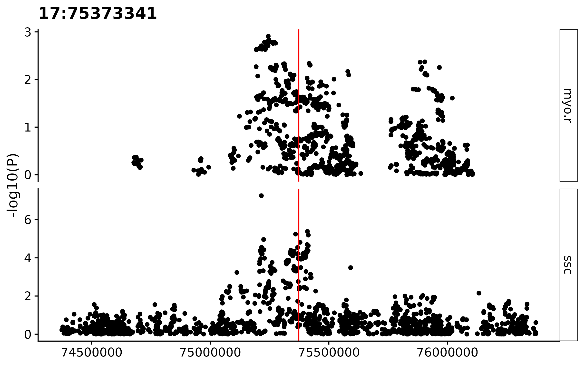

----

# Background

We want to learn more about myositis and its subtypes in the light of other IMD. For that we'll take a closer look at myositis datasets from two studies ([Miller et al., 2015](https://pubmed.ncbi.nlm.nih.gov/26291516/) and [Rothwell et al. 2022](https://onlinelibrary.wiley.com/doi/full/10.1002/art.42434)) projected onto our IMD-trained features together with projections from our curated collection of IMD summary statistics from multiple sources. We'll cluster these projections, compute genetic similarity, and follow-up on key SNPs underlying the observed patterns, using a FDR for shared GWAS signals, followed by colocalisation. 


```{r include=FALSE, warning=FALSE, message=F}

# Load packages
library(data.table)
library(magrittr)
library(rmeta)
library(ggplot2)
library(cowplot)
library(pheatmap)
library(reshape2)
library(knitr)
library(kableExtra)
library(ggrepel)
library(GGally)

# Load files

m <- fread("../data/Metadata_20230608-v1.tsv")
m <- m[, .(Trait, First_Author, Reference, Trait_ID_2.0, Trait_long, Trait_class, N0, N1, N, Population, Public)]

q <- fread("../data/QC_IMD_basis_20230503-v1.tsv")
q <- merge(q, m, by="Trait")

p <- fread("../data/Projection_IMD_basis_20230503-v1.tsv")
p[, Var.Delta:=as.numeric(Var.Delta)]
b <- p[1:169] # Basis traits
p <- p[179:nrow(p)] # projection table without basis traits
p[, z:=NULL]


```


# 1. Exploratory data analysis

Next we analysed our myositis datasets in the context of meta-analyses and the rest of projections, with a focus on IMD. We applied our routine quality control to our collection of projections, applied an FDR procedure to keep datasets that are (1) significantly different from zero overall (FDR < 1%) and (2) by PC (FDR < 1% [●] or FDR < 5% [○]). 


```{r include=FALSE}
#
# This chunk includes a lot of stuff we won't be showing, but I keep the code here because it might be useful

# Now it's time to do our proper EDA on the projections. This will involve:
#
# (1) Apply usual QC, including dataset removal
# (2) Get some basic statistics from the basis
# (3) Learn about myositis (and subtypes) location onto the basis

### (1) QC
SNP.manifest <- cupcake::SNP.manifest

# Checking missing projections
summary(q)
q[is.na(q$overall_p)] 
# MDD_Wray_2, Major depression disorder, that failed to project by low SNP match.
# T2D_Gaulton 
q <- q[!is.na(q$overall_p)] # Remove datasets with missing overall p-values


# Check SNP match
c(lessthan95 = nrow(q[q$nSNP < nrow(SNP.manifest)*.95,]), lessthan80 = nrow(q[q$nSNP < nrow(SNP.manifest)*.8,]), lessthan50 = nrow(q[q$nSNP < nrow(SNP.manifest)*.5,]))
c(lessthan95 = nrow(q[q$nSNP < nrow(SNP.manifest)*.95,])/nrow(q), lessthan80 = nrow(q[q$nSNP < nrow(SNP.manifest)*.8,])/nrow(q), lessthan50 = nrow(q[q$nSNP < nrow(SNP.manifest)*.5,])/nrow(q))
# 4% of datasets (248) have <80% SNP match

# Dataset filtering

# This is a crucial point.
# As we have many datasets, many of them redundant or not so interesting for our purposes, and the set of datasets included in the adjustment will influence the resulting set of overall significant datasets, so we must choose carefully which datasets we remove *before* performing the FDR adjustment on the next step.
# 
# At this step, we'll:
# 
# 1. Focus on files that came from a Genome-wide array (ie. not Immunochip), and have at least **80%** of matching SNPs, so we can have confidence in our observations.
# 2. Remove basis datasets
# 3. Remove Neale, as we already have PanUKBBR2
# 4. Apply FDR procedure

# 1. Remove datasets with <80% SNP match. This will include datasets using targeted arrays only (ie. ImmunoChip). Keep Deakin's JDM for its interest
qf <- q[nSNP >= max(nSNP) * 0.8 ]

# 2. Remove basis datasets
basis.datasets <- c("CD_DeLange_28067908_1", "PSC_Ji_27992413_1", "UC_DeLange_28067908_1", "SLE_Bentham_26502338_1", "PBC_Cordell_26394269_1", "IGAN_Kiryluk_25305756_1", "CEL_Dubois_20190752_1", "MS_IMSGC_21833088_1", "AST_Demenais_29273806_1", "VIT_Jin_27723757_1", "RA_Okada_24390342_1", "LADA_Cousminer_30254083_1", "T1D_Cooper_doi101101120022_1")
#Also, remove datasets used to build the IMD basis, which are overfitted
qf <- qf[!Trait %in% basis.datasets]

# 3. Remove Neale, as we already have PanUKBBR2
qf <- qf[First_Author != "Neale"]


# Check traits by class
table(qf$Trait_class)
# Create filtered projection table too
pf <- merge(p, qf[,c("First_Author","Trait", "Trait_ID_2.0", "Trait_long","Trait_class", "Population")], by = "Trait")


# 4. Apply FDR procedure

# Apply 1% FDR correction to overall p for all remaining datasets
qf[, FDR.overall := p.adjust(overall_p, method = "BH"), by="Trait_class"]

tsig <- copy(qf)
tsig[, sig.overall:=ifelse(FDR.overall < 0.01, "Y", "N")]
table(tsig$sig.overall)
#    N     Y 
#  4800  858

qs <- qf[FDR.overall < 0.01]
nrow(qs) / nrow(qf)
# 15% significant
table(qs$Trait_class) / nrow(qs)
# 16.5% Blood cells
# 35.9% IMD

table(qs$Trait_class)
#  BC BMK CAN IMD INF OTH PSD 
# 142  72  17 308  35 282   2 

# Which myositis datasets didn't make the cut?
qf[grepl("myositis", Trait_long, ignore.case = TRUE) & !Trait %in% qs$Trait]
# 6 datasets. These include:
#    First_Author       Trait_ID_2.0                                 Trait_long 
# 1:      PanUKBB         20002_1322                   Myositis/Myopathy (UKBB) 
# 2:     Rothwell                IBM                    Inclusion Body Myositis 
# 3:      FinnGen   M13_DERMATOMYOTH            Other dermatomyositis (FinnGen) 
# 4:      FinnGen M13_DERMATOPOLYNAS Dermatopolymyositis, unspecified (FinnGen) 
# 5:       Sakaue                 PM                               Polymyositis 
# 6:      PanUKBB              ph770    Myalgia and myositis unspecified (UKBB) 

# Apply 5% FDR correction by trait and PC to projections, then filter by overall significant traits
# NOTE: Here we'll do something different. As meta-analyses and PAPS don't come with overall_p, 
# we'll consider them significant overall, for their interest.

pf[, FDR.PC:=p.adjust(P, method = "BH"), by = c("PC", "Trait_class")][, stars:=ifelse(!is.na(FDR.PC) & FDR.PC<0.05,"○","")][ FDR.PC < 0.01 , stars:="●"]
# Filter pf by overall significant traits
ps <- pf[Trait %in% qs$Trait ]
ps[, PC:=factor(PC, levels = paste0("PC", 1:13))]


### (2) Get some basic statistics from the basis in the light of new projections

# Let's create a plot akin to figure 2 of the blood cell basis paper

tfp <- c(BC = "#CF000F", BMK = "#2E8856", IMD = "#1460AA", INF = "#B8860B", CAN = "#E65722", OTH ="#1C2833", PSD="#708090")

tcf <- ggplot(data = qf, aes(x=Trait_class, fill = Trait_class)) +
    geom_bar()+
    scale_y_continuous(breaks = seq(0, 5000, 500))+
    scale_fill_manual(values = tfp)+
    scale_x_discrete(labels=c("BC" = "Blood Cells", "BMK" = "Biomarkers", "CAN" = "Cancer", "IMD" = "IMD", "INF" = "Infectious", "OTH"= "Other", "PSD" = "Psych"))+
    theme_classic(base_size = 11)+
    ylab("Datasets") +
    theme(axis.ticks = element_blank(), axis.line = element_blank(), panel.grid.major.y = element_line(colour = "lightgray", size =  0.3),axis.text.x = element_text(angle = 270, hjust = 0, vjust = 0.5),legend.position = "none",axis.title.x = element_blank())


# A little modification to include OR values in the RHS plot (see how values are computed below)

qcsigOR <- merge(qf[, .(count.filt=.N), by=Trait_class], qs[, .(count.sig=.N), by=Trait_class], all.x = TRUE)
qcsigOR[,prop:=count.sig/count.filt][, `OR vs Other`:= (count.sig/(count.filt - count.sig)) / qcsigOR[Trait_class == "OTH", count.sig/(count.filt - count.sig)]]
qcsigOR[, ORvalue:=format(`OR vs Other`, digits=2)]

tcsigOR <- ggplot(data = qcsigOR, aes(x=Trait_class, y=count.sig, fill = Trait_class)) +
  geom_bar(stat = "identity")+
  scale_y_continuous(breaks = seq(0, 300, 50), limits = c(0, 340))+
  scale_fill_manual(values =tfp)+
  scale_x_discrete(labels=c("BC" = "Blood Cells", "BMK" = "Biomarkers", "CAN" = "Cancer", "IMD" = "IMD", "INF" = "Infectious", "OTH"= "Other", "PSD" = "Psych"))+
  geom_text(aes(label = ORvalue), vjust = -0.8, hjust = 0.55, size=4)+
  theme_classic(base_size = 11)+
  theme(axis.ticks = element_blank(), axis.line = element_blank(), panel.grid.major.y = element_line(colour = "lightgray", size =  0.3),axis.text.x = element_text(angle=270, hjust = 0, vjust = 0.5),legend.position = "none",axis.title.x = element_blank(), axis.title.y = element_blank())

# Note, this ps will include meta-analysis and PAPS
sigct <- ps[ FDR.PC < 0.01 , .(count = .N), by=c("PC", "Trait_class")][, PC:=factor(PC, levels = paste0("PC", 1:13))]

sig.per.pc <- ggplot(sigct, aes(fill=Trait_class, y=count, x=PC))+
              geom_bar(position="stack", stat="identity")+
              scale_y_continuous(breaks = seq(0, 400, 50), limits = c(0, 450))+
              scale_fill_manual(values =tfp)+
              theme_classic(base_size = 11)+
              theme(axis.ticks = element_blank(), axis.line = element_blank(), panel.grid.major.y = element_line(colour = "lightgray", size =  0.3),axis.text.x = element_text(angle=270, hjust = 0, vjust = 0.5),legend.position = "none",axis.title.x = element_blank(), axis.title.y = element_blank())

top <- plot_grid(tcf, # Before FDR, should be the same traits for all bases. For comparison purposes
                 tcsigOR, nrow = 1, labels = "AUTO")
bottom <- plot_grid(sig.per.pc, nrow = 1, labels = "C")
plot_grid(top, bottom, nrow = 2)

# ggsave("../figures/IMDbasis_distribution.png", width = 8, height = 6.5, bg = "white")


# (3) Learn about myositis position onto the basis

ps[grepl("myositis", Trait_long, ignore.case = TRUE) & FDR.PC < 0.01, .(PC, First_Author, Trait_long, FDR.PC, stars)][order(PC)]
# We have some significant Myositis for PC1, 2, 3, 9, 12, and 13

# Let's try to remove redundant datasets in a less manual way
qs2 <- copy(qs)
qs2 <- qs2[Trait_class == "IMD"] # Interested in IMDs for now
qs2[,Label:=Trait_long] %>% .[!grepl("myositis", Trait_long, ignore.case = TRUE), Label:=gsub(" \\(UKBB\\)", "", Label)] %>% .[!grepl("myositis", Trait_long, ignore.case = TRUE) , Label:=gsub(" \\(FinnGen\\)", "", Label)] %>% .[, Label:=gsub(" \\(FG\\)", "", Label)] # Remove UKBB/FinnGen stuff save for myositis datasets


# There are a number of duplicated diseases that we can revisit
# CD
qs2[grepl("Crohn|Chron", Label)][order(N1, decreasing = TRUE)]
tr <- c(setdiff(qs2[grepl("Crohn|Chron", Label), Trait], "CD_Liu_26192919_1")) # We select CD Liu, exclude the rest

# UC
qs2[grepl("colitis|UC |Ulcerative", Label, ignore.case = TRUE)][order(N1, decreasing = TRUE)]
tr <- c(tr, setdiff(qs2[grepl("colitis|UC |Ulcerative", Label), Trait], "UC_Liu_26192919_1")) # We select UC Liu, exclude the rest

# IBD
qs2[grepl("bowel|IBD ", Label, ignore.case = TRUE)][order(N1, decreasing = TRUE)]
tr <- c(tr, setdiff(qs2[grepl("bowel|IBD ", Label, ignore.case = TRUE), Trait], "IBD_Liu_26192919_1")) #  There's a larger, DeLange IBD, but we stick with Liu for consistency

# T1D
qs2[grepl("Type 1 diabetes|Type1", Label, ignore.case = TRUE)][order(N1, decreasing = TRUE)]
tr <- c(tr, setdiff(qs2[grepl("Type 1 diabetes|Type1", Label, ignore.case = TRUE), Trait], "T1D_Chiou_34012112_1"))

# Asthma
qs2[grepl("Asthma", Label, ignore.case = TRUE)][order(N1, decreasing = TRUE)]
tr <- c(tr, setdiff(qs2[grepl("Asthma", Label, ignore.case = TRUE), Trait], c("ph495_PanUKBB_PanUKBBR2_1", "ASTAO_Ferreira_30929738_1", "ASTCO_Ferreira_30929738_1")))

# COPD
qs2[grepl("COPD|chronic obstructive", Label, ignore.case = TRUE)][order(N1, decreasing = TRUE)]
tr <- c(tr, setdiff(qs2[grepl("COPD|chronic obstructive", Label, ignore.case = TRUE), Trait], "J10_COPD"))

# (Rheumatoid) Arthritis
qs2[grepl("Arthritis", Label, ignore.case = TRUE)][order(N1, decreasing = TRUE)]
tr <- c(tr, setdiff(qs2[grepl("Arthritis", Label, ignore.case = TRUE), Trait], c("RA_Ishigaki_36333501_3", "JIA_LopezIsac_33106285_1")))

# Hypothyroidism
qs2[grepl("Hypothyroidism", Label, ignore.case = TRUE)][order(N1, decreasing = TRUE)]
tr <- c(tr, setdiff(qs2[grepl("Hypothyroidism", Label, ignore.case = TRUE), Trait], c("HYPOTHYROIDISM_FinnGen_FinnGenR7_1")))

# Hyperthyroidism
qs2[grepl("hyperthyroidism|graves", Label, ignore.case = TRUE)][order(N1, decreasing = TRUE)]
tr <- c(tr, setdiff(qs2[grepl("hyperthyroidism|graves", Label, ignore.case = TRUE), Trait], c("20002_1225_PanUKBB_PanUKBBR2_1")))

# Thyroiditis
qs2[grepl("thyroiditis", Label, ignore.case = TRUE)][order(N1, decreasing = TRUE)]
tr <- c(tr, setdiff(qs2[grepl("thyroiditis", Label, ignore.case = TRUE) , Trait], c("E4_THYROIDITAUTOIM_FinnGen_FinnGenR7_1")))

# Psoriasis
qs2[grepl("Psoria", Label, ignore.case = TRUE)][order(N1, decreasing = TRUE)]
tr <- c(tr, setdiff(qs2[grepl("Psoria", Label, ignore.case = TRUE), Trait], c("L12_PSORIASIS_FinnGen_FinnGenR7_1", "L12_PSORI_ARTHRO_FinnGen_FinnGenR7_1")))

# Graves' disease
qs2[grepl("Graves", Label, ignore.case = TRUE)][order(N1, decreasing = TRUE)]
tr <- c(tr, setdiff(qs2[grepl("Graves", Label, ignore.case = TRUE), Trait], c("E4_GRAVES_STRICT_FinnGen_FinnGenR7_1")))

# Rhinitis
qs2[grepl("rhinitis", Label, ignore.case = TRUE)][order(N1, decreasing = TRUE)]
tr <- c(tr, setdiff(qs2[grepl("rhinitis", Label, ignore.case = TRUE), Trait], c("20002_1387_PanUKBB_PanUKBBR2_1")))

# Diabetic related stuff
qs2[grepl("Diabetic|Diabetes[, ]", Label, ignore.case = TRUE)][order(N1, decreasing = TRUE)]
tr <- c(tr, setdiff(qs2[grepl("Diabetic|Diabetes[, ]", Label, ignore.case = TRUE), Trait], c("DM_RETINOPATHY_FinnGen_FinnGenR7_1", "DM_NEPHROPATHY_FinnGen_FinnGenR7_1")))

# Dermatitis
qs2[grepl("Dermatitis", Label, ignore.case = TRUE)][order(N1, decreasing = TRUE)]
tr <- c(tr, setdiff(qs2[grepl("Dermatitis", Label, ignore.case = TRUE), Trait], c("ATD_Paternoster_26482879_1")))

# Sjogren
qs2[grepl("Sjogren|Sjögren|Sicca", Label, ignore.case = TRUE)][order(N1, decreasing = TRUE)]
tr <- c(tr, setdiff(qs2[grepl("Sjogren|Sjögren|Sicca", Label, ignore.case = TRUE), Trait], c("SJOS_Lessard_up_1")))

# Lupus
qs2[grepl("Lupus|SLE", Label, ignore.case = TRUE)][order(N1, decreasing = TRUE)]
tr <- c(tr, setdiff(qs2[grepl("Lupus|SLE", Label, ignore.case = TRUE), Trait], c("SLE_Julia_29848360_1")))

# Allergic
qs2[grepl("allerg", Label, ignore.case = TRUE)][order(N1, decreasing = TRUE)]
tr <- c(tr, setdiff(qs2[grepl("allerg", Label, ignore.case = TRUE), Trait], c("20002_1387_PanUKBB_PanUKBBR2_1")))

# Multiple sclerosis
qs2[grepl("multiple sclerosis", Label, ignore.case = TRUE)][order(N1, decreasing = TRUE)]
tr <- c(tr, setdiff(qs2[grepl("multiple sclerosis", Label, ignore.case = TRUE), Trait], c("G6_MS_FinnGen_FinnGenR7_1"))) # largest, non-IMSGC dataset


# Nasal polyps
qs2[grepl("polyp", Label, ignore.case = TRUE)][order(N1, decreasing = TRUE)]
tr <- c(tr, setdiff(qs2[grepl("polyp", Label, ignore.case = TRUE), Trait], c("J10_NASALPOLYP_FinnGen_FinnGenR7_1")))

# PBC
qs2[grepl("biliary", Label, ignore.case = TRUE)][order(N1, decreasing = TRUE)]
tr <- c(tr, setdiff(qs2[grepl("biliary", Label, ignore.case = TRUE), Trait], c("CHIRBIL_PRIM_FinnGen_FinnGenR7_1")))

# PSC
qs2[grepl("sclerosing", Label, ignore.case = TRUE)][order(N1, decreasing = TRUE)]
tr <- c(tr, setdiff(qs2[grepl("sclerosing", Label, ignore.case = TRUE), Trait], c("K11_CHOLANGI_FinnGen_FinnGenR7_1")))

# Systemic sclerosis
qs2[grepl("systemic sclerosis", Label, ignore.case = TRUE)][order(N1, decreasing = TRUE)]
tr <- c(tr, setdiff(qs2[grepl("systemic sclerosis", Label, ignore.case = TRUE), Trait], c("SSC_LopezIsac_31672989_1")))

# Autoimmune disorders
tr <- c(tr, qs2[grepl("autoimmune dis", Label, ignore.case = TRUE), Trait]) 

# Celiac disease
qs2[grepl("celiac|coeliac", Label, ignore.case = TRUE)][order(N1, decreasing = TRUE)]
tr <- c(tr, setdiff(qs2[grepl("celiac|coeliac", Label, ignore.case = TRUE), Trait], c("K11_COELIAC_FinnGen_FinnGenR7_1")))

# Gout and ankylosing
qs2[grepl("gout|ankylosing", Label, ignore.case = TRUE)][order(N1, decreasing = TRUE)]
tr <- c(tr, setdiff(qs2[grepl("gout|ankylosing", Label, ignore.case = TRUE), Trait], c("GOUT_FinnGen_FinnGenR7_1", "M13_ANKYLOSPON_FinnGen_FinnGenR7_1")))

# Vitiligo
qs2[grepl("vitiligo", Label, ignore.case = TRUE)][order(N1, decreasing = TRUE)]
tr <- c(tr, setdiff(qs2[grepl("vitiligo", Label, ignore.case = TRUE), Trait], c("L12_VITILIGO_FinnGen_FinnGenR7_1")))

# Myastenia gravis
qs2[Label == "Myastenia Gravis"][order(N1, decreasing = TRUE)]
tr <- c(tr, setdiff(qs2[Label == "Myastenia Gravis" , Trait], c("MYG_Chia_35074870_1")))

# Rosacea
qs2[grepl("rosacea", Label, ignore.case = TRUE)][order(N1, decreasing = TRUE)]
tr <- c(tr, setdiff(qs2[grepl("rosacea", Label, ignore.case = TRUE) , Trait], c("L12_ROSACEA_FinnGen_FinnGenR7_1")))

# Addison's disease
qs2[grepl("addison", Label, ignore.case = TRUE)][order(N1, decreasing = TRUE)]
tr <- c(tr, setdiff(qs2[grepl("addison", Label, ignore.case = TRUE) , Trait], c("AAD_Eriksson_33574239_1")))

# There was an extra DMPMYO by FinnGen, we'll remove it
tr <- c(tr, "DERMATOPOLY_FG_FinnGen_FinnGenR7_1")

qs2 <- qs2[!Trait %in% tr] # First pass
length(unique(qs2$Label))
# 75

# Check for duplicates, if there are still
dp <- qs2[duplicated(Label), unique(Label)]
qsdup <- qs2[Label %in% dp]

# Rename Rothwell myositis to fit the rest
qs2[ First_Author == "Rothwell", Label:=gsub("Idiopathic Inflammatory Myopathies \\(IIM, Myositis\\)", "Myositis", Label)]

# Rename PBC and PSC
qs2[grepl("sclerosing", Label), Label:= "Primary sclerosing cholangitis"]
qs2[grepl("chirrosis", Label), Label:= "Primary biliary cholangitis"]

# Show authors for myositis
qs2[First_Author %in% c("Rothwell", "Miller"), Label:=paste0(Label, " (", First_Author, ")")] # Now there shouldn't be any duplicates
qs2[Label == "MS-disease \\/ Multiple Sclerosis \\(FinnGen\\)"] # 
qs2[grepl("MS", Label), Label:="Multiple Sclerosis"] # Fix weird FinnGen MS label

# Check for duplicates, if there are still
dp <- qs2[duplicated(Label), unique(Label)]
qsdup <- qs2[Label %in% dp]

# Apply this to projections as well
ttk2 <- qs2$Trait # Traits to keep
ps2 <- ps[Trait %in% ttk2]
# Incorporate labels
ps2 <- merge(ps2, qs2[, .(Trait, Label)], by="Trait")
ps2[, PC:=factor(PC, levels = paste0("PC", 1:13))]

# Remove PAPS, which we're not authorised to share -- yet
ps2 <- ps2[First_Author != "Casares"]
qs2 <- qs2[First_Author != "Casares"]


```


## Clustering Myositis


First, we clustered myositis and its subtypes, to update the data we already had. We have myositis data from FinnGen, too, so we'll include in the clustering to check whether clustering is supported by multiple source datasets. We'll clustered the datasets using a complete linkage hierarchical clustering method. Myositis and its subtypes tend to cluster by source, rather than by subtypes. This might be due to the nature of the clustering method, which only takes into account the estimates, but not the uncertainty around them, combined with very low power.


```{r message=FALSE, echo=FALSE, fig.width = 5, fig.height = 2, dpi=200, dev.args = list(png = list(type = "cairo"))}
# Let's cluster with meta-analyses only
# qs2[grepl("myositis", Label, ignore.case = TRUE)]
pspm <- ps2[grepl("myositis", Label, ignore.case = TRUE)]

PCorder <- paste0("PC", 1:13)
hmcol <- rev(colorRampPalette(c("#67001F", "#B2182B", "#D6604D", "#F4A582", "#FDDBC7", "#F7F7F7", "#D1E5F0", "#92C5DE", "#4393C3", "#2166AC", "#053061"))(100))
Mmp <- acast(pspm[,c("PC", "Label", "Delta")], Label ~ PC) # PC, Trait, and Delta columns only
Mmp.stars <- acast(pspm[,c("PC","Label","stars")], Label ~ PC)
Mmp <- Mmp[,PCorder]
Mmp.stars <- Mmp.stars[,PCorder]
range <- max(abs(Mmp))

# Create heatmap
Mphm <- pheatmap(Mmp,  breaks = seq(-range, range, length.out = 100), 
                cluster_cols = FALSE, display_numbers = Mmp.stars,
                fontsize_row = 8.4, fontsize_number = 11, color = hmcol, 
                annotation_names_row = FALSE, annotation_legend = TRUE)
Mphm
#ggsave("../figures/Myositis_allsources_heatmap.png", Mphm, width = 7, height = 5, bg="white")

```


## Clustering with the rest of IMD

We'll now take a look at myositis in a broader context of IMD, again using complete linkage hierarchical clustering method. Note that we included IMD only in this visualisation, but we also have other trait classes, like cytokines, blood cell counts, etc. that we could use for further exploration. To improve visualisation, we removed all redundant datasets, while keeping enough to cover a broad array of IMD.


```{r echo=FALSE, message=FALSE, fig.width = 9, fig.height = 14, dpi=300, dev.args = list(png = list(type = "cairo"))}

# Let's look at it in more context
# Remove all  datasets without at least one FDR 1% significant PC, save for PAPS
a1s <- ps2[FDR.PC < 0.05 | grepl("myositis", Label, ignore.case = TRUE), Trait] %>% unique 
# "HYPERTHY_Sakaue_doi1011012020102320213652_1" to be removed for this reason

ps2s <- ps2[Trait %in% a1s]

Map <- acast(ps2s[,c("PC", "Label", "Delta")], Label ~ PC) # PC, Trait, and Delta columns only
Map.stars <- acast(ps2s[,c("PC","Label","stars")], Label ~ PC)
Map <- Map[,PCorder]
Map.stars <- Map.stars[,PCorder]
range <- max(abs(Map))

# We have many datasets, so let's highlight PAPS
# From https://github.com/raivokolde/pheatmap/issues/48
# use this function to make row or column names bold
# parameters:
#   mat: the matrix passed to pheatmap
#   rc_fun: either rownames or colnames
#   rc_names: vector of names that should appear in boldface
make_bold_names <- function(mat, rc_fun, rc_names) {
  bold_names <- rc_fun(mat)
  ids <- rc_names %>% match(rc_fun(mat))
  ids %>%
    purrr::walk(
      function(i)
        bold_names[i] <<-
        bquote(bold(.(rc_fun(mat)[i]))) %>%
        as.expression()
    )
  bold_names
}

papsb <- grep("myositis", rownames(Map), value = TRUE, ignore.case = TRUE)

# Create heatmap
Mahm <- pheatmap(Map,  breaks = seq(-range, range, length.out = 100), 
                cluster_cols = FALSE, display_numbers = Map.stars,
                fontsize_row = 8.4, fontsize_number = 11, color = hmcol, 
                annotation_names_row = FALSE, annotation_legend = TRUE,
                labels_row = make_bold_names(Map, rownames, papsb))

Mahm
ggsave("../figures/Myositis_IMD_heatmap.png", Mahm, width = 10, height = 14, bg="white")

```

We don't observe a clear clustering of myositis datasets, with the exception of Miller's and Rothwell's Juvenile dermatomyositis and dermatomyositis. Polymyositis from each source appear far away from each other and from other myositis subtypes. Anti-Jo1+ myositis appears on its own as well.

These results can be explained in two ways: (1) as before, the signal from most datasets is not too strong, so it can be lost when considering all other IMD at the same time; and (2) the hierarchical clustering method only considers the projections, without considering the uncertainty around the estimates, which is relevant, especially for smaller datasets. In addition, hierarchical clustering can become very unstable (ie. heavily dependent on the input data), especially when considering many dimensions.


## Compute Mahalanobis distance for Myositis subtypes

Considering the reasons above, we decided to apply a different approach and looked at distances between myositis subtypes and each of the other IMD specifically, using the Mahalanobis distance.

The Mahalanobis distance measures the distance between a point (the IMDs), and the mean or center of a distribution, while taking into account the correlations of the dataset (derived from the LD among the SNPs in the features). We put every myositis projection at the center of the distribution and computed the Mahalanobis distance to every other IMD.

Below we show the top 20 closest IMD by Mahalanobis distance, together with their respective sample (cases) size. **Please see below for a heatmap showing all distances together, including FinnGen myositis datasets.** 


```{r echo=FALSE}
v <- cupcake::shrinkage * cupcake::rot.pca
var.proj  <- t(v) %*% cupcake::LD %*% v
```


```{r echo=FALSE}

# Map[grep("myositis", rownames(Map), ignore.case = TRUE),]

# A little function to prepare the tables for us
mahal.f <- function(i, var.proj, ref){
  mah <- data.table(Trait = row.names(i), mahal =  mahalanobis(i, i[which(rownames(i) == ref),], cov = var.proj))
  mah <- merge(mah, qs2[, .(N1,N0, Label)], all.x = TRUE, by.x = "Trait", by.y = "Label")
  mah <- mah[order(mahal)]
  mah[, Rank:=0:(nrow(mah)-1)]      
}

# General myositis
Mah.myoR <- mahal.f(i=Map, var.proj = var.proj, ref="Myositis (Rothwell)")
Mah.myoM <- mahal.f(i=Map, var.proj = var.proj, ref="Myositis (Miller)")
Mah.myoF <- mahal.f(i=Map, var.proj = var.proj, ref="Myositis (FinnGen)")

# JDM
Mah.jdmR <- mahal.f(i=Map, var.proj = var.proj, ref="Juvenile Dermatomyositis (Rothwell)")
Mah.jdmM <- mahal.f(i=Map, var.proj = var.proj, ref="Juvenile Dermatomyositis (Miller)")
# Mah.jdmD <- mahal.f(i=Map, var.proj = var.proj, ref="Juvenile Dermatomyositis (Deakin)")

# PM  
Mah.pmR <- mahal.f(i=Map, var.proj = var.proj, ref="Polymyositis (Rothwell)")
Mah.pmM <- mahal.f(i=Map, var.proj = var.proj, ref="Polymyositis (Miller)")
Mah.pmF <- mahal.f(i=Map, var.proj = var.proj, ref="Polymyositis (FinnGen)")

# DM
Mah.dmR <- mahal.f(i=Map, var.proj = var.proj, ref="Dermatomyositis (Rothwell)")
Mah.dmM <- mahal.f(i=Map, var.proj = var.proj, ref="Dermatomyositis (Miller)")


# Note we don't show the tables below, but they'll be in the picture
Mah.jo1 <- mahal.f(i=Map, var.proj = var.proj, ref="Jo1+ Myositis (Rothwell)")
Mah.dmpmF <- mahal.f(i=Map, var.proj = var.proj, ref="Dermatopolymyositis (FinnGen)")

```


## Myositis (pooled)

### Rothwell

```{r echo=FALSE}
kable(Mah.myoR[1:21, .(Rank, Trait, mahal, N1)]) %>% kable_styling()
```

### Miller

```{r echo=FALSE}
kable(Mah.myoM[1:21, .(Rank, Trait, mahal, N1)]) %>% kable_styling()
```


## Juvenile Dermatomyositis

### Rothwell

```{r echo=FALSE}
kable(Mah.jdmR[1:21, .(Rank, Trait, mahal, N1)]) %>% kable_styling()
```

### Miller

```{r echo=FALSE}
kable(Mah.jdmM[1:21, .(Rank, Trait, mahal, N1)]) %>% kable_styling()
```


## Polymyositis


### Rothwell

```{r echo=FALSE}
kable(Mah.pmR[1:21, .(Rank, Trait, mahal, N1)]) %>% kable_styling()
```

### Miller

```{r echo=FALSE}
kable(Mah.pmM[1:21, .(Rank, Trait, mahal, N1)]) %>% kable_styling()
```


## Dermatomyositis

### Rothwell

```{r echo=FALSE}
kable(Mah.dmR[1:21, .(Rank, Trait, mahal, N1)]) %>% kable_styling()
```

### Miller

```{r echo=FALSE}
kable(Mah.dmM[1:21, .(Rank, Trait, mahal, N1)]) %>% kable_styling()
```


## Looking at everything together

We want a better view of these distances, so we'll put everything together. 

The heatmap below shows the distance between the myositis projections (rows) and the rest of IMD (columns). The Mahalanobis distance is heavily right-skewed, so we'll show log(1 + mahalanobis) instead, which will help us distinguish colours. Hence, here blue means close, and red means far. We have removed the distances among the myositis projections for clarity.


```{r include=FALSE, echo=FALSE, fig.width=6.5, fig.height=14, dev.args = list(type = "cairo-png")}
tlis <- copy(mget(ls(pattern="Mah\\.")))
tlis <- lapply(tlis, function(x){
          x[, Focus:=Trait[1]]
          x[, TraitL:=stringr::str_trunc(Trait, 50, ellipsis = " [...]")]
          x[, c("N0", "N1", "Rank"):=NULL][, logmahal:=log(1+mahal)]
          x
})
tlis <- rbindlist(tlis)
# Remove myositis from the x axis
mlb <- unique(tlis$Focus)
tlis <- tlis[!TraitL %in% mlb]
tlis.map <- acast(tlis, TraitL~Focus, value.var = "logmahal")

mahalcolp <- rev(colorRampPalette(RColorBrewer::brewer.pal(n = 9, name = "Spectral"))(100))
#"#D53E4F" "#F46D43" "#FDAE61" "#FEE08B" "#FFFFBF" "#E6F598" "#ABDDA4" "#66C2A5" "#3288BD"

#mahalcolp <- wesanderson::wes_palette("Zissou1", n=50, "continuous")

# Create heatmap
tlis.ph <- pheatmap(tlis.map,  breaks = seq(0, 1, length.out = 100), 
                cluster_cols = F, cluster_rows = T,
                fontsize = 9, color = mahalcolp, angle_col = "315",
                annotation_names_row = FALSE, annotation_legend = TRUE)

tlis.ph
#ggsave("../figures/Myositis_mahalanobis_heatmap.svg", tlis.ph, width = 6.5, height = 14, bg="white")


```

{out.height="100%"}

We observe a block of IMD (highlighted within the red square) that are closer to most myositis subtypes with two exceptions: Polymyositis (FinnGen), and anti-Jo1+. 
Among the closest IMD across most myositis we find several forms of vasculitis (eg. MPO+ AAV, PR3+AAV, Wegener granulomatosis), some arthritis-related IMD (Juvenile idiopathic arthritis, juvenile rheuma), and both hyper- (Graves' disease) and hypothyroidism. We also find other IMD affecting muscles, like myastenia gravis and polymyalgya rheumatica. 

We find some IMD that seem to be closer to particular myositis subtypes. For example, MPO+ AAV, Sjögren's syndrome, Systemic sclerosis, Graves' disease/autoimmune hyperthyroidism are closer to Dermatomyositis than to other subtypes. Juvenile dermatomyositis (Miller) projection highlights arthropathic psoriasis as a close IMD.

Noteworthy, dermatomyositis and juvenile dermatomyositis appear to be further away than other subtypes from IMD with eosinophil involvement, like Eosinophilic granulomatosis with polyangiitis (EGPA and its subtypes MPO+ EGPA and ANCA-negative EGPA), and type 1 diabetes. This is reflected by particularly weak signals these subtypes on PC13, characterised by eosinphil levels (see myositis-only heatmap above).

Regarding Polymyositis, the closest IMD are JIA, Systemic sclerosis, and Wegener granulomatosis.


# DPMUnc clustering

```{r echo=FALSE, eval=FALSE}
# At this point, we prepare the data for DPMUnc using significant PCs for PAPS only
ps2s[grepl("myositis", Label, ignore.case = TRUE) & FDR.PC < 0.01, .(PC, Label, stars)][, .N, by = PC]

dpmunc.ds <- ps2s[PC %in% paste0("PC", c(1,2,3,8,9,12,13)), .(PC, Delta, Var.Delta, Label)]
dpmunc.delta <- reshape(dpmunc.ds[, .(PC, Delta, Label)], idvar="Label", timevar = "PC", direction = "wide")
dpmunc.var   <- reshape(dpmunc.ds[, .(PC, Var.Delta, Label)], idvar="Label", timevar = "PC", direction = "wide")

# fwrite(dpmunc.delta, "../data/Myo_7PC_Delta.tsv", sep = "\t")
# fwrite(dpmunc.var, "../data/Myo_7PC_Var.tsv", sep = "\t")

```


```{r include=FALSE, echo=FALSE}

resdpmunc <- readRDS("../data/Myo_7PC_psm_data.rds")
resdpmunc <- data.table(Label = names(resdpmunc$calls$cl), DPMUnc.cl = resdpmunc$calls$cl)

    p7 <- ps2s[ PC %in% paste0("PC", c(1,2,3,8,9,12,13)), .(Trait, Label, PC, Delta, Trait_long, Trait_class, stars)]
p7 <- data.table::dcast(p7, Label + Trait + Trait_class  + Trait_long ~ PC, value.var = c("Delta", "stars"))
p7 <- merge(p7, resdpmunc, by=c("Label"), all.x = TRUE)
p7[, DPMUnc.cl:=factor(DPMUnc.cl, levels = 1:10)]
#kable(p7[DPMUnc.cl == 1 & !grepl("myositis", Label, ignore.case = T), .(Label)]) %>% kable_styling()

p7[grepl("myositis", Label, ignore.case = TRUE), .(Label, DPMUnc.cl)] # All but Finngen's Myositis in cluster 1
p7[DPMUnc.cl == 1, .(Label)] # Other IMD in the same cluster as myositis
#fwrite(p7, "../data/DPMUnc_res_v1.tsv", sep = "\t")
```

We decided to apply a novel method developed by our group, DPMUnc (Dirichlet Process Mixtures with uncertainty, [Nicholls et al., 2022](https://www.biorxiv.org/content/10.1101/2022.12.07.519476v1)), which can cluster the projections while taking uncertainty into account. Since our focus is Myositis and its subtypes, we clustered using the features any Myositis dataset was significant at 1%: PC1, PC2, PC3, PC8, PC9, PC12, and PC13. We considered all IMD showed above, regardless of significance for any of the 7 PCs.

DPMUnc finds 11 clusters across 7 features. All myositis datasets fall on the same cluster (1) except for FinnGen's myositis (cluster 2). This is likely due to the different composition of the FinnGen myositis set, comprising a majority of unclassified myositis cases, while Miller and Rothwell general myositis feature meta-analyses of classified myositis subtypes.

Other IMD group with myositis, namely

* Arthritis and arthritis-related phenotypes
    - Biological medication for rheuma
    - Juvenile Idiopathic Arthritis
    - Juvenile rheuma
    - Palindromic rheumatism
    - Felty syndrome

* Thyroid-related conditions
    - Autoimmune Thyroid disease
    - Autoimmune thyroiditis
    - Hyperthyroidism/Thyrotoxicosis
    - Hypothyroidism (congenital or acquired)

* Sclerosis
    - CR(E)ST syndrome
    - Systemic Sclerosis

* Vasculitis
    - MPO+ AAV
    - PR3+ AAV
    - Wegener granulomatosis

* Muscle-affecting conditions
    - Early-onset Myastenia Gravis
    - Late-onset Myastenia Gravis
    - Myastenia Gravis
    
* Blood-affecting conditions
    - Idiopathic thrombocytopenic purpura
    - Primary antiphospholipid syndrome
* Other conditions
    - Primary Biliary Cirrhosis/Cholangitis
    - IgG+ Neuromyelitis Optica
    - Sjögren's syndrome


Below we show the clustering results in the two first PCs. Note that the clustering was made using 5 more PCs, so some clusters overlap upon 2D visualisation. 

```{r echo=FALSE, fig.height= 8, fig.width=8}

palette <- c("#77AADD", "#000000", "#9E0142", "#D53E4F", "#FDAE61",  "#66C2A5", "#ABDDA4", "#F46D43",  "#3288BD", "#5E4FA2",  "#FEE08B", "#E6F598", "#771155", "#AA4488", "#CC99BB", "#114477", "#774411", "#EEEEEE", "#117777", "#117744", "#44AA77", "#88CCAA", "#777711", "#44AAAA", "#AAAA44", "#77CCCC", "#DDDD77", "#AA7744", "#DDAA77", "#771122", "#AA4455", "#DD7788") # Colours for clusters  
colp <- palette[as.numeric(levels(p7$DPMUnc.cl))]


pcbiplot <-  ggplot(p7, aes(x = Delta_PC1, y = Delta_PC2, colour = DPMUnc.cl, label=Label))+
    geom_hline(yintercept = 0)+
    geom_vline(xintercept = 0)+
    ggforce::geom_mark_ellipse(aes(fill=DPMUnc.cl , label=NULL), alpha=0.2 , show.legend = FALSE )+
    geom_point(size=3)+
    scale_colour_manual(values = colp)+
    scale_fill_manual(values = colp)+
    geom_label_repel(size = 4, seed = 15, force = 20, max.overlaps = 20, data = p7[grepl("myositis", Label, ignore.case = TRUE) | Delta_PC2 > 0.075], show.legend = FALSE) +
  #| grepl("myastenia", Label, ignore.case = T)
    xlab("Delta PC1")+
    ylab("Delta PC2")+
    theme_minimal()+
    theme(legend.title = element_blank(), legend.position = "none", axis.title = element_text(size =15))
  pcbiplot

```

**EXPLAIN**


Let's look at PC12 and 13 as well.


```{r echo=FALSE, fig.height= 8, fig.width=8}
pcbiplot_112 <-  ggplot(p7, aes(x = Delta_PC1, y = Delta_PC12, colour = DPMUnc.cl, label=Label))+
    geom_hline(yintercept = 0)+
    geom_vline(xintercept = 0)+
    ggforce::geom_mark_ellipse(aes(fill=DPMUnc.cl , label=NULL), alpha=0.2 , show.legend = FALSE )+
    geom_point(size=3)+
    scale_colour_manual(values = colp)+
    scale_fill_manual(values = colp)+
    geom_label_repel(size = 4, seed = 15, force = 20, max.overlaps = 20, data = p7[grepl("myositis", Label, ignore.case = TRUE)], show.legend = FALSE) +
  #| grepl("myastenia", Label, ignore.case = T)
    xlab("Delta PC1")+
    ylab("Delta PC12")+
    theme_minimal()+
    theme(legend.title = element_blank(), legend.position = "none", axis.title = element_text(size =15))
  pcbiplot_112

```

**EXPLAIN**


```{r echo=FALSE, fig.height= 8, fig.width=8}
pcbiplot_113 <-  ggplot(p7, aes(x = Delta_PC1, y = Delta_PC13, colour = DPMUnc.cl, label=Label))+
    geom_hline(yintercept = 0)+
    geom_vline(xintercept = 0)+
    ggforce::geom_mark_ellipse(aes(fill=DPMUnc.cl , label=NULL), alpha=0.2 , show.legend = FALSE )+
    geom_point(size=3)+
    scale_colour_manual(values = colp)+
    scale_fill_manual(values = colp)+
    geom_label_repel(size = 4, seed = 15, force = 20, max.overlaps = 20, data = p7[grepl("myositis", Label, ignore.case = TRUE) | Delta_PC13 > 0.07], show.legend = FALSE) +
  #| grepl("myastenia", Label, ignore.case = T)
    xlab("Delta PC1")+
    ylab("Delta PC13")+
    theme_minimal()+
    theme(legend.title = element_blank(), legend.position = "none", axis.title = element_text(size =15))
  pcbiplot_113

```

**EXPLAIN**


# Investigating driver SNPs underlying myositis signals

## Computing the joint probability of SNPs to be significant

Next, we wanted to investigate the SNPs that underlie the shared signal between myositis subtypes and other IMD. When training the features, many of the entries in the rotation matrix (which provides the weights assigned to each SNP for each feature) were very close to zero. To be more computationally efficient and to identify which SNPs are relevant for each feature, we searched for a minimal set of SNPs that could replicate the signals observed with dense-SNP data with high correlation (0.999) for each feature, obtaining a sparse rotation matrix containing non-zero entries for those SNPs that provide support for each feature. We refer to this set of variants as **driver SNPs**, as they directly influence the projections on each feature. Note that driver SNPs may be limited to a single feature, or be drivers for more than one feature.

For this step, we selected nine myositis datasets, including all significant overall datasets for both Miller and Rothwell:

* Dermatomyositis - Miller (dmy.m)
* Dermatomyositis - Rothwell (dmy.r)
* Juvenile Dermatomyositis - Miller (jdm.m)
* Juvenile Dermatomyositis - Rothwell (jdm.r)
* Jo1+ myositis - Rothwell (jo1m.r)
* Myositis - Miller (myo.m)
* Myositis - Rothwell (myo.r)
* Polymyositis - Miller (pm.m)
* Polymyositis - Rothwell (pm.r)

And 15 other IMD that were shown to be close to myositis by the methods above or are of special interest:

* Idiopathic thrombocytopenic purpura (itp)
* Neuromyelitis optica (nmo)
* Primary biliary cirrhosis/cholangitis (pbc)
* Juvenile idiopathic arthritis (jia)
* CR(E)ST syndrome (crest)
* Myastenia gravis (myag)
* Felty syndrome (felty)
* Sjögren's syndrome (sjos)
* Systemic sclerosis (ssc)
* Wegener granulomatosis (wegen)
* MPO+ ANCA-associated vasculitis (mpoaav)
* PR3+ ANCA-associated vasculitis (pr3aav)
* Hyperthyroidism/Thyrotoxicosis (hyperthy)
* Hypothyroidism, congenital or acquired (hypothy)


{out.width="100%"}


**Internal note:** In this figure some of the datasets have gaps, which causes chromosomes mismatch. Need to find a way to fix this before sending around.


We selected key driver SNPs to focus on by calculating the probability that they're significant for any of the myositis datasets and another trait of interest, using an FDR-based approach. In a nutshell, we computed FDR on the P-values on 255 driver SNPs for either of the features carrying myositis signal: PC1, PC2,PC3, PC8, PC9, PC12 and PC13. A brief explanation of the procedure:

$$ FDR = P(H_0\ true\ |\ p<\alpha) \\
1 - FDR = P(H_1\ true\  |\ p< \alpha)$$

We can extend this for two IMD, computing a pairwise FDR:

$$ P(H_1\ true\ for\ myositis\ \&\ IMD\ |\ p_{myositis}<\alpha,\ p_{IMD}<\alpha) = (1 -FDR_{myositis})(1-FDR_{IMD})\\
Pairwise\ FDR=P(H_0\ true\ for\ myositis\ or\ IMD\ |\ p_{myositis}<\alpha,\ p_{IMD}<\alpha) = 1-(1 -FDR_{myositis})(1-FDR_{IMD}) $$

We're interested in the first expression (probability of significant for both diseases), so we'll focus on SNPs with pairwise FDR < 0.5. 

Note that here we assume the traits are independent, which might not always be the case. If we allow for dependence, then

$$P(H_1\ true\ for\ myositis\ \&\ IMD\ |\ p_{myositis}<\alpha,\ p_{IMD}<\alpha) \\= P(H_1\ true\ for\ myositis\ | H_1\ true\ for\ IMD) * P(H_1\ true\ for\ IMD) \geq P(H_1\ true\ for\ myositis) * P(H_1\ true for IMD) \\= (1 -FDR_{myositis})(1-FDR_{IMD})$$

which means that, if datasets were positively dependent, the resulting probability for association with both traits would be higher, so assuming independence make our estimates are more conservative. The rationale is that, if we know the probability of association of a variant for one dataset, the probability of the variant to be significant for a dependent dataset either increases or remains the same compared to both datasets being independent. 

We computed the pairwise FDR for all myositis-IMD pairs resulting in 58 myositis-IMD significant pairs comprising 15 driver SNPs and 11 clusters or independent, non-overlapping regions. None of the 14 SNPs with shared associations are genomewide significant ($P < 5 \times 10^{-8}$) in their individual GWAS (see `pdriver.myos` in the table below).


```{r echo=FALSE}

coloc <- fread("../tables/coloc_results_dfilt.tsv", na.strings = "")
# 
# #Get alleles and positions to map SNPs to  genes
# best.rsids <- fread("../data/bestsnp.rsids.tsv")
# names(best.rsids)[2:3] <- c("CHR", "BP")
# 
# man <- fread("../data/Manifest_build_translator.tsv")
# man[,pid38:=paste(CHR38,BP38, sep=":")][,pid19:=paste(CHR19,BP19, sep=":")]
# man <- merge(man, cupcake::SNP.manifest[,.(pid, ref_a1, ref_a2)], by.x = "pid19", by.y="pid")
# man <- man[, .(pid38, SNPID, ref_a1, ref_a2)]
# man[, c("CHR", "BP"):=tstrsplit(pid38, split=":")]
# names(man)[c(1, 3:4)] <- c("pid", "REF", "ALT")
# 
# snp.to.map <- rbindlist(list(best.rsids,man), use.names = TRUE)
# fwrite(snp.to.map, "../data/snp.to.map.tsv", sep="\t")
# # After this, we run the mapping-genes.py routine in the HPC to get the associated genes from opentargets

# Import mapped genes 
mg <- fread("../data/mapped.genes.tsv") %>% unique
mg <- mg[,.(SNPID, pid, nearestGene)]

# Add some info to the coloc table, and extract rsids to map

coloc <- merge(coloc, mg, by="pid") # First on driver SNPs
setnames(coloc, c("SNPID", "nearestGene"), c("driver.rsid", "driver.nearestgene"))
coloc <- merge(coloc, mg, by.x="bestsnp", by.y = "pid", all.x = TRUE) # Then on candidate snps. Bear in mind that we only mapped candidate SNPs with H4 > 0.5
setnames(coloc, c("SNPID", "nearestGene"), c("bestsnp.rsid", "bestsnp.nearestgene"))

# Fix inappropriate mappings
coloc[ driver.rsid == "rs2476601", driver.nearestgene:="PTPN22"]
coloc[ bestsnp.rsid == "rs597808", bestsnp.nearestgene:="SH2B3"]


# Add novelty on bestsnps
coloc[H4 > 0.5 & pbest.myos > 5e-8 & pbest.myos.region > 5e-8, bestsnp.novel:="Yes"] # Add novelty
# Add gene/ driver SNP label
coloc[, dlabel:=paste( driver.nearestgene, driver.rsid, sep=" / ")]

# Add proper labels
ml <- data.table(mlabel = c("DM (Miller)", "DM (Rothwell)", "JDM (Miller)","JDM (Rothwell)", "Jo1+ (Rothwell)", "Myositis (Miller)", "Myositis (Rothwell)", "PM (Miller)", "PM (Rothwell)"),
                 trait.myos = c("dmy.m", "dmy.r", "jdm.m", "jdm.r", "jo1m.r", "myo.m", "myo.r", "pm.m", "pm.r"))
coloc <- merge(coloc, ml, by="trait.myos")

```


```{r echo=FALSE}
options(knitr.kable.NA = '')

coloc[ pairwise_fdr < 0.05, .(pid, driver.rsid, trait.myos, trait.other, pairwise_fdr, pdriver.myos)][order(pid)] %>% kable %>% kable_styling(full_width = FALSE)

```


In this table we show the myositis-IMD pairs in more details. The `pid` column denote the driver SNP genomic position, in hg38. `trait.myos` denote the myositis dataset, `trait.other` denote the IMD with shared association with the myositis trait at the SNP. `pairwise_fdr` denote the FDR for the driver SNP to be associated with both traits (the lower, the better). Finally, `pdriver.myos` is the P-value for the driver SNP in the myositis (`trait.myos`) individual GWAS.


## Colocalising key driver SNPs

While the previous approach is useful to identify which driver SNPs are relevant for both myositis and other IMD, driver SNPs are a tiny selection of variants across the genome, and they might capture signals from true causal SNPs in LD with them. Also, true causal variants in LD with a given driver SNP may differ between diseases. To address this, we next used coloc ([Giambartolomei et al., 2014](https://journals.plos.org/plosgenetics/article?id=10.1371/journal.pgen.1004383)), an established and commonly-used statistical method to formally investigate whether a putatively causal variant is shared between two traits. In essence, coloc uses SNP-dense summary statistics to test the posterior probability of 5 hyphotheses:


* $H_0$: No variant association with either trait.
* $H_1$: Association with trait 1, not with trait 2.
* $H_2$: Association with trait 2, not with trait 1.
* $H_3$: Association with trait 1 and trait 2, two independent SNPs.
* $H_4$: Association with trait 1 and trait 2, one shared SNP -- This is the probability we are interested in.

These hypotheses are assigned posterior probabilities by coloc that sum one.

To increase our discovery possibilities in the next step, we relaxed the `pairwise_fdr` threshold to < 0.5 (meaning that a variant is more likely to be associated with both diseases than not). This resulted in 614 myositis-IMD pairs and 84 unique driver SNPs. To get a fuller picture, when a driver SNP was significant for a myositis-IMD pair (ie. pairwise FDR < 0.5 for a given SNP and IMD), we also considered every IMD-myositis pair for that given SNP and IMD, regardless of significant. For example, JIA-Myositis (Rothwell) had rs2476601 (1:113834946) associated with both; then we considered every JIA-myositis pair (ie. including every myositis dataset) at rs2476601 for the next step.
We found 250 driver SNP-IMD combinations. We next removed SNPs in close proximity (< 1Mb), resulting in 1692 myositis-IMD pairs to colocalise.

**EXPLAIN SNP FILTERING PROCEDURE**

We applied coloc to each myositis-IMD pair regions surrounding each driver SNP associated to the pair, using a 1Mb window around and assuming a single causal variant. 

This resulted in 54 myositis-IMD pairs and 16 driver SNPs in 14 independent regions with $P(H4) >0.5$ (ie. highest probability for a shared variant for both IMD in the region). 

Below we show a summary figure of the results, where driver SNPs and their nearest genes are presented in rows, myositis-IMD pairs are presented in panels, with IMD labels at the bottom. Tested associations are coloured by their H4 value (the lighter, the higher). High confidence associations (ie H4 > 0.8) are highlighted in green, and medium-confidence (ie. H4 > 0.5) in yellow.


```{r echo=FALSE, dpi=200, dev.args = list(png = list(type = "cairo"))}
# 
keypids <- coloc[ H4 > 0.5, unique(pid)]

sumc <- coloc[pid %in% keypids, .(dlabel, mlabel,  trait.other, H4)]
sumc <- sumc %>% tidyr::complete(dlabel, mlabel, trait.other ) %>% as.data.table()
sumc[, dlabel:=factor(dlabel, levels = rev(unique(dlabel)))]
sumc[, trait.other:=factor(trait.other, levels = rev(unique(trait.other)))]
sumc[,flag:=ifelse(H4>.8, "High", ifelse(H4>.5, "Med", "Low"))]


grplot <-  ggplot(sumc, aes(x =  trait.other, y = dlabel, colour=flag, fill = H4)) +
              geom_tile( color = "black",
                        lwd = 0.2,
                        linetype = 1) +
              scale_fill_gradient(na.value = "white")+
              geom_tile(aes( colour = flag),
                          lwd=1, linetype = 1, data = sumc[H4 > .5]) +
              scale_colour_manual(values=c(High="green",Med="yellow"), guide=guide_none()) +
              #scale_x_discrete(position = "top")+
              theme_minimal() +
               theme(panel.grid.major = element_blank(),
                    axis.title = element_blank(),
                    axis.text.x = element_text(angle = 270, hjust=0)
                    )+
              facet_grid(cols = vars(mlabel), scales = "free", space = "free",switch = "y")
grplot
#ggsave("../figures/driverSNP_H4.png", grplot, height = 5, width = 15, bg="white")


```


Most high-confidence hits are found at rs2476601 (1:113834946), a missense variant of *PTPN22* with a well known involvement in IMD. Pooled myositis (Rothwell) and Polymyositis accumulate most high confidence hits, although for Polymyositis all hits are associated to rs2476601.

As mentioned earlier, the driver SNP might not be the causal one, but be in LD with the causal variant instead. Thus, we also report SNP with the highest posterior probability of being the shared causal variant in each region. We'll call **novel associations** those SNPs that (1) have high posterior to be shared (H4 > 0.5) between a given myositis and an IMD, (2) are not genome-wide significant (ie. $P > 5 \times 10^{-8}$) in the myositis GWAS, and (3) are not the top hit (ie. the one with the lowest P-value) in the 1Mb region defined for coloc.

Below we show a summary table containing the key findings. Here `pid` correspond to the genomic position of the driver SNP, `bestsnp` is the SNP with the highest posterior probability to be shared in the region (which may not match the driver SNP), `bestsnp.pp` is the posterior probability of the best candidate SNP. We also report the genes the candidate SNP has been mapped, and whether the association is novel, according to the criteria above.

We found 25 associations and 11 associated candidate SNPs (8 of them novel for myositis and its subtypes) across 5 independent genomic regions. These associations included polymyositis with hyperthyroidism, JIA, MPO+AAV, and myastenia gravis, and pooled myositis with hypo- and hyperthyroidism, JIA, MPO+AAV, myastenia gravis, PBC, Sjögren's syndrome and systemic sclerosis. 


```{r include=FALSE}

coloc[ H4 > 0.8, .(trait.myos, trait.other, pid, H4, bestsnp, bestsnp.pp, bestsnp.nearestgene, bestsnp.novel)][order(trait.myos, trait.other, bestsnp)] %>% kable(digits = 32) %>% kable_styling

```

Now, we'll look at each driver SNP region in turn, and provide more details about the candidate SNPs for each region.


### 1:113834946 region (rs2476601)


```{r echo=FALSE}
coloc[ pid == "1:113834946" & (H4 > 0.8), .(pid, trait.myos, trait.other, pairwise_fdr, H3, H4, bestsnp, bestsnp.pp, bestsnp.rsid, pbest.myos, bestsnp.novel)] %>% kable(digits = 32) %>% kable_styling
```


This 1:113834946 region contains multiple associations, so we'll focus on those with H4 > 0.8 (ie. high confidence of shared association). Considering these threshold, we observe six hits for Myositis (Rothwell), and five for each PM (Rothwell and Miller).
For the six myositis (Rothwell)-IMD pairs, coloc identifies two best SNPs: 1:113834946 (hyperthyroidism, hypothyroidism, myastenia gravis), and 1:113761186 (PBC, JIA, and MPO+AAV).

For polymyositis, coloc find the same associations for both Miller and Rothwell: hyperthyroidism, hypothyroidism, JIA, MPO+AAV, and myastenia gravis. In this case, coloc gives 1:113834946 the highest posterior probability to be the shared SNP except for PM (Rothwell) and JIA.

[1:113834946](https://genetics.opentargets.org/variant/1_113834946_A_G) corresponds to rs2476601 missense variant located in the **PTPN22** gene, associated with numerous IMD, such as RA, type 1 diabetes, SLE, and others.
[1:113761186](https://genetics.opentargets.org/variant/1_113761186_C_A) corresponds to rs6679677,an upstream gene variant mapped to gene **PHTF1**, and previously associated with other IMD like RA and type 1 diabetes. 

None of these SNPs are genomewide significant for either Myositis (Rothwell) or Polymyositis (Rothwell or Miller). 1:113834946 (rs2476601) is a novel association for pooled myositis, and 1:113761186 (rs6679677) is a novel association for polymyositis.


### 2:100215693 region (rs11692867)


```{r echo=FALSE}
coloc[ pid == "2:100215693" & (H4 > 0.5), .(pid, trait.myos, trait.other, pairwise_fdr, H3, H4, bestsnp, bestsnp.pp, bestsnp.rsid, pbest.myos, bestsnp.novel)] %>% kable(digits = 32) %>% kable_styling
```


Coloc finds a shared association in this 2:100215693 (rs11692867) region for Myositis (IIM, Rothwell) and JIA, which 2:100143015 as the SNP with the highest posterior probability to be the shared SNP (albeit slightly below the conventional H4 > 0.8 threshold for high-confidence association). [2:100143015](https://genetics.opentargets.org/Variant/2_100143015_G_A/associations),  rs11692867, is an usptream variant mapped to **AFF3**, a tissue-restricted nuclear transcriptional activator preferentially expressed in lymphoid tissue. This variant has been associated with multiple blood measurements, such as mean platelet volume and blood cell count. This is a novel association for myositis.


### 2:191071078 region (rs10168266)


```{r echo=FALSE}
coloc[ pid == "2:191071078" & (H4 > 0.5), .(pid, trait.myos, trait.other, pairwise_fdr, H3, H4, bestsnp, bestsnp.pp, bestsnp.rsid, pbest.myos, bestsnp.novel)] %>% kable(digits = 32) %>% kable_styling
```


We find two H4 > 0.5 associations in this region between Myositis (Rothwell), hyperthyroidism and systemic sclerosis. While H4 is borderline (H4 = 0.505) for hyperthyroidism, it is very high (H4 > 0.99) for systemic sclerosis. In the latter case, the SNP with the highest posterior probability to be the shared SNP is [2:191071078](https://genetics.opentargets.org/Variant/2_191071078_C_T/associations), rs10168266, an intron variant of **STAT1** not genomewide significant for myositis (Rothwell) but associated with other IMD, such as SLE and Sjögren's syndrome. This is also a novel association for myositis.


### 3:28029953 region (rs669607)


```{r echo=FALSE}
coloc[ pid == "3:28029953" & (H4 > 0.5), .(pid, trait.myos, trait.other, pairwise_fdr, H3, H4, bestsnp, bestsnp.pp, bestsnp.rsid, pbest.myos, bestsnp.novel)] %>% kable(digits = 32) %>% kable_styling
```


We find two associations in this region, with weaker (H4 around 0.5 and 0.6) posterior probability. These correspond to Myositis (Rothwell) with Sjögren's syndrome and systemic sclerosis. Coloc find two different candidate SNPs for these associations: 3:28033394 and 3:28033679, respectively. Neither SNP are genomewide significant for Myositis (Rothwell) individual GWAS and are therefore novel associations.

* [3:28033394](https://genetics.opentargets.org/Variant/3_28033394_A_G/associations) corresponds to rs451375, an intergenic variant mapped to genes **EOMES** and **CMC1**.

* [3:28033679](https://genetics.opentargets.org/Variant/3_28033679_G_T/associations) corresponds to rs819991, another intergenic variant mapped to the same genes above, and associated with Multiple Sclerosis.

Both these candidate SNPs represent novel associations for myositis.


### 4:122194347 region (rs13151961)


```{r echo=FALSE}
coloc[ pid =="4:122194347" & (H4 > 0.5), .(pid, trait.myos, trait.other, pairwise_fdr, H3, H4, bestsnp, bestsnp.pp, bestsnp.rsid, pbest.myos, bestsnp.novel)] %>% kable(digits = 32) %>% kable_styling
```


We find one (weak, H4 ~ 0.52) association between myositis (Rothwell) and PR3+ AAV, where the best candidate SNP is [4:122629959](https://genetics.opentargets.org/Variant/4_122629959_A_G/associations), rs13132308, an intron variang of **IL21** gene. This variant has been previously associated with IBD and its subtypes, and it's a novel association for Myositis.


### 6:167124106 region (rs1855025)

```{r echo=FALSE}
coloc[ pid == "6:167124106" & (H4 > 0.5), .(pid, trait.myos, trait.other, pairwise_fdr, H3, H4, bestsnp, bestsnp.pp, bestsnp.rsid, pbest.myos, bestsnp.novel)][order(trait.myos)] %>% kable(digits = 32) %>% kable_styling
```


We find one (H4 ~ 0.57) association in this region, connecting JDM (Rothwell) with hypothyroidism. The best candidate SNP is 


### Chromosome 7.1 region (7:128933913, 7:128954129)


```{r echo=FALSE}
coloc[ pid %in% c("7:128933913", "7:128954129") & (H4 > 0.5), .(pid, trait.myos, trait.other, pairwise_fdr, H3, H4, bestsnp, bestsnp.pp, pbest.myos, bestsnp.novel)][order(trait.myos)] %>% kable(digits = 32) %>% kable_styling
```


There are three driver SNPs with coloc associations next to each other in this chromosome 7 region, which likely correspond to the same signals and we'll thus treat them togeter. 
We find associations among four myositis datasets (Myositis [Miller and Rothwell], dermatomyositis [Miller], and Jo1+ myositis [Rothwell]) and four IMD (Sjögren's, Systemic sclerosis, MPO+ AAV). The strongest associations (H4 > 0.8) are those among myositis (Rothwell) and MPO+ AAV, Sjögren's, and systemic sclerosis.

These have six associated candidate SNPs with high probability, that we'll discuss in turn:


* [7:128936032](https://genetics.opentargets.org/variant/7_128936032_T_C) (dermatomyositis [Miller] and myositis [Miller + Rothwell] with Sjögren's syndrome) - rs3757387, an upstream **IRF5** variant linked to SLE. 
* [7:129044262](https://genetics.opentargets.org/Variant/7_129044262_G_C/associations) (Myositis [Miller] with MPO+AAV) - rs62478615, an intron variant mapped to **TNPO3** (trasportin 3), also associated with SLE. 
* [7:129011468](https://genetics.opentargets.org/variant/7_129011468_C_T) (Myositis [Miller], Dermatomyositis [Miller], and Jo1+ with Systemic sclerosis) -  rs36073657, an intron variant of **TNPO3**.
* [7:129061277](https://genetics.opentargets.org/Variant/7_129061277_T_C/associations) (DM [Miller], Jo1+, and Myositis [Rothwell] with MPO+AAV) - rs13246321, an intergenic variant mapped to **TNPO3**.
* [7:129023119](https://genetics.opentargets.org/Variant/7_129023119_T_G/associations) (Myositis [Rothwell] with Systemic sclerosis) - rs13236009, an intron variant of **TNPO3**.

Among these candidate SNPs, we found novel associations for myositis (7:128936032, 7:129044262, 7:129011468, 7:129023119), dermatomyositis (7:128936032, 7:129061277, 7:129011468), and Jo1+ myositis (7:129061277).


**Internal note:** I think these plots can still be improved.


### 8:11491677 region 


```{r echo=FALSE}
coloc[ pid =="8:11491677" & (H4 > 0.5), .(pid, trait.myos, trait.other, pairwise_fdr, H3, H4, bestsnp, bestsnp.pp, pbest.myos, bestsnp.novel)] %>% kable(digits = 32) %>% kable_styling
```


We find multiple associations in this region, including Myositis, Juvenile dermatomyositis (Rothwell) and dermatomyositis (Miller) with Systemic sclerosis, and Sjögren's syndrome. The strongest associations are found between myositis (Rothwell) with Systemic sclerosis, and Sjögren's syndrome.
There are two candidate SNPs that we'll discuss in turn:

* [8:11480078](https://genetics.opentargets.org/Variant/8_11495032_T_C/associations) (Myositis [Rothwell] with Sjögren's syndrome) - rs2618476, an intron variant of **BLK**.
* [8:11486464](https://genetics.opentargets.org/Variant/8_11486464_C_T/associations) (DM [Miller], JDM [Rothwell], and Myositis [Miller + Rothwell] with Systemic sclerosis) - rs2736340, an intergenic variant mapped to **BLK**. 

Both candidate SNPs are novel for myositis, and 8:11486464 is also novel for juvenile dermatomyositis.


### Chromosome 11 (11:64329761, 11:64362250) region 


```{r echo=FALSE}
coloc[ pid %in% c("11:64329761",  "11:64362250") & (H4 > 0.5), .(pid, trait.myos, trait.other, pairwise_fdr, H3, H4, bestsnp, bestsnp.pp, pbest.myos, bestsnp.novel)] %>% kable(digits = 32) %>% kable_styling
```


In chromosome 11, we find two associations with weak H4 posterior, connecting myositis (Rothwell) with hypothyroidism (Candidate SNP 11:64340263) and Sjögren's syndrome (11:64369120).

* [11:64340263](https://genetics.opentargets.org/Variant/11_64340263_G_A/associations) - rs663743, a 5' UTR variant of **CCDC88B**, previously associated to hypothyroidism and type 1 diabetes, among others.
* [11:64369120](https://genetics.opentargets.org/Variant/11_64369120_G_T/associations) - rs1662188, an intron variant of **RPS6KA4**. This is also a novel association for myositis.


### 12:112468611 region 


```{r echo=FALSE}
coloc[ pid == "12:112468611" & (H4 > 0.5), .(pid, trait.myos, trait.other, pairwise_fdr, H3, H4, bestsnp, bestsnp.pp, pbest.myos, bestsnp.novel)] %>% kable(digits = 32) %>% kable_styling
```


In chromosome 12, we find two strong (H4 > 0.8) associations of myositis (Rothwell) hypothyroidism (Candidate SNP 12:111535554) and JIA (12:111472415).

* [12:111535554](https://genetics.opentargets.org/variant/12_111535554_A_G/associations) - rs597808, an intron variant of **ATXN2**, associated with multiple blood measurements, including eosinophil, lymphocyte, and platelet counts
* [12:111472415](https://genetics.opentargets.org/Variant/12_111472415_A_G/associations) - rs10774625, an intron variant of **ATXN2**, also associated with blood measurements.    

Both candidate SNPs are also novel associations for myositis.


### 17:39913696 region 


```{r echo=FALSE}
coloc[ pid == "17:39913696" & (H4 > 0.5), .(pid, trait.myos, trait.other, pairwise_fdr, H3, H4, bestsnp, bestsnp.pp, pbest.myos, bestsnp.novel)] %>% kable(digits = 32) %>% kable_styling
```


In this region, we find one associations between juvenile dermatomyositis and systemic sclerosis. 

The best candidate SNP is [17:39907128](https://genetics.opentargets.org/Variant/17_39907128_C_T/associations) (rs883770), a noncoding transcript exon variant mapped to the **GSDMB** gene, which belongs to the gasdermin-domain containing protein family. Some members of this family  are implicated in the regulation of apoptosis in epithelial cells, and are linked to cancer. This SNP has been independently associated with systemic sclerosis. 


### 17:75373341 region 


```{r echo=FALSE}
coloc[ pid == "17:75373341" & (H4 > 0.5), .(pid, trait.myos, trait.other, pairwise_fdr, H3, H4, bestsnp, bestsnp.pp, pbest.myos, bestsnp.novel)] %>% kable(digits = 32) %>% kable_styling
```


In this region, we find one associations between myositis (Rothwell) and systemic sclerosis. 

The best candidate SNP is [17:75215547](https://genetics.opentargets.org/Variant/17_75215547_A_G/associations) (rs9909306), an intron variant mapped to the **NUP85** gene. NUP85 is part of a nuclear pore complex, bidirectional transport of macromolecules between the cytoplasm and nucleus. This SNP has been independently associated with systemic sclerosis, and it's a novel association for myositis. 





# Discussion


We have analysed myositis projections (including pooled and myositis subtype datasets from both Miller and Rothwell studies) of IMD from our collection. Many projected traits from our collection had very small projections, either because they contain no detectable signal by the features or because they are underpowered (eg. because of low sample size). To focus on traits with relevant signals, we selected IMDs that were significantly different from a null GWAS projection across all features, and then removed redundant projections for better visualisation. 

We applied two clustering methods and one distance method to investigate which IMD are more genetically similar to those of myositis. These methods have different advantages and shortcomings, so we don't expect them to fully agree on their results. In summary, both hierarchical clustering and Mahalanobis distance use full projection information (ie. all PCs), but the hierarchical clustering can get unstable when considering many dimensions and the same time. Mahalanobis offers a more stable metric, but both methods have the shortcoming of not taking uncertainty around projections into account. To address this, we used a novel clustering method, DPMUnc, which clusters projections while accounting for uncertainty. We used projections from seven features (1, 2, and 13) for which PAPS is significant, and thus we considered relevant.

Despite these differences, all three methods agree that IgG+ NMO is closely related to PAPS. Other closely related IMD according by Mahalanobis and DPMUnc (but not hierarchical clustering) include systemic sclerosis, Sjögren's syndrome, CRE(S)T syndrome, and PBC. 

Most Myositis and subtypes (ie. dermatomyositis, juvenile dermatomyositis, and polymyositis) form a cluster with JIA, early-onset myastenia gravis, Felty syndrome, and RA according to DPMUnc. These are supported by both hierarchical clustering and Mahalanobis method as close to PAPS, but form a sepatate cluster according to DPMUnc. Both these clusters have similar locations when considering PC1 and PC13 (encoding autoimmunity and eosinophil counts, respectively) but the myositis/arthritis cluster has weaker PC2 signal (SLE-associated) than the PAPS cluster. This suggests genetic similarity in terms of their autoimmune and eosinophilic components among these diseases, even though they differ in PC2 signal strengths.

Regarding meta-analyses, both hierarchical clustering and Mahalanobis agree that the SLE meta-anayses is the closest to PAPS of the three. DPMUnc does not cluster PAPS with any meta-analysis, and SLE seems to be further apart than the other two meta-analyses. This is likely due to the extreme signal SLE has for PC1 and PC2. Both MS and vasculitis meta-analyses are assigned by DPMUnc to the null cluster. While both meta-analyses have relatively large sample sizes (>3,000 cases), their signal for the selected PAPS PCs is weak.

Taking into account the information provided by the three different methods, their advantages and shortcomings, we can consider the follwing IMD as the closest to PAPS with high confidence:

* IgG+ NMO
* Systemic sclerosis 
* Sjögren's syndrome
* CRE(S)T Syndrome
* Primary biliary cirrhosis/cholangitis
* Juvenile idiopathic arthritis
* Myositis and its subtypes
* Felty syndrome


We applied an FDR approach to select candidate driver SNPs with shared association between PAPS and nine selected IMD that were either close to PAPS according to the above mentioned clustering methods or had a special interest. We then applied coloc, an established and commonly-used statistical method to formally test whether two traits share a common variant (ie. colocalisation) to 51 PAPS-IMD pairs with probable shared SNP association according to the FDR method. 

We found two novel SNPs for PAPS: [7:129011468](https://genetics.opentargets.org/Variant/7_129011468_C_T/associations), an intronic variant of TNPO3, shared with systemic sclerosis, and [8:11486464](https://genetics.opentargets.org/Variant/8_11486464_C_T/associations), an intergenic variant close to BLK and FAM167A, shared with both Sjögren's syndrome and systemic sclerosis. In both instances, coloc assigns a high posterior probability (>0.8) for a shared causal variant between the PAPS-IMD pairs at the given regions, a threshold that has been used in the past for similar discoveries. These two variants are also linked to GWAS lead variants for SLE and SLE and Kawasaki disease, respectively.


