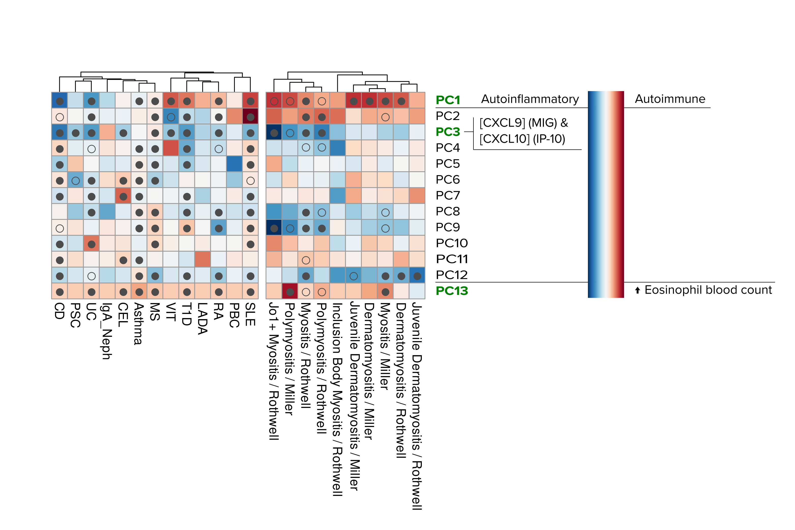

# Background
  
We projected ten myositis summary statistics datasets from Miller et al., 2015, and unpublished ones (Rothwell), that resulted from ImmunoChip + imputation onto the IMD basis. Both groups of datasets are within the MYOGEN consortium framework.
Most of these datasets (except for Inclusion-bofy myositis) were significant at FDR <1%, and some were significant at FDR 1% or 5% for some PCs, namely PC1-3, PC8-9 and PC12-13 (see heatmap below).

We now want to follow up a number of driver SNPs for our Myositis-relevant components in the IMD basis. To do so, we retrieved Open Targets Genetics annotations to relate driver SNPs and genes, for subsequential network and enrichment analysis.




First we load libraries and the list of SNPs.

```{r message=FALSE, warning=FALSE}
library(data.table)
library(reshape2)
library(readr)
library(seqminer)
library(magrittr)
library(ggplot2)
library(ggrepel)
library(cowplot)
library(gprofiler2)
# The following packages are Bioconductor's so they need to be installed differently
library(GenomicRanges)
library(biomaRt)
library(STRINGdb)
library(VennDiagram)
library(RColorBrewer)
library(pheatmap)

```


```{r}
# SNP manifest
manifest.translator <- fread("../data/Manifest_build_translator.tsv")
manifest.translator[,pid19:=paste(CHR19, BP19, sep = ":")][, pid38:=paste(CHR38, BP38, sep = ":")]
manifest.translator <- manifest.translator[,c(1,8:9)]
SNP.manifest <- merge(manifest.translator, copy(cupcake::SNP.manifest), by.x = "pid19", by.y = "pid")

# Annotations
otg <- readRDS("../data/imdbasis-driver-snps-otg-annotations.RDS")
otg <- merge(SNP.manifest[,.(pid38, SNPID, ref_a1, ref_a2)], otg, by.x="pid38", by.y="pid")
# Check concordance in alleles
all(otg$ref_a1 == otg$ref_allele)
all(otg$ref_a2 == otg$alt_allele) # FALSE, let's see
nrow(otg[otg$ref_a2 != otg$alt_allele]) # 152 instances of alt allele discordance. We'll weed them out

otg <- otg[ref_a2 == alt_allele]

# Remove redundant columns
otg[, c("source_list", "source_score_list", "wh.vep") := NULL]

# Add eQTL data
eqtl <- fread("../data/Causal_eQTLs_full_20210915.tsv") 
# Noticed a bug in the procesing of snp_study and study_tissue. Let's briefly fix it
eqtl[, snp_study:=gsub(pattern = "(_[A-Za-z0-9\\+ -]+)$", "", snp_study, perl = TRUE)][, study_tissue:=gsub(pattern = "(_[A-Za-z0-9\\+ -]+)$", "", study_tissue, perl = TRUE)][,study:=gsub(pattern = "(_[A-Za-z0-9\\+ -]+)$", "", study, perl = TRUE)][,quant_method:=gsub("([A-Za-z0-9_]+)_([a-z]+)", "\\2", study, perl = TRUE)][,study:=gsub(pattern = "(_[a-z]+)$", "", study, perl = TRUE)]


#prcols <- c("source_score_list", "source_list", "wh.vep", "vep_score", "eqtl_score", "pqtl_score", "tss_score") # Remove the columns to change and other columns we won't need.
#cols <- setdiff(names(otg), prcols)

#otg[, source_score_list:=sapply(source_score_list, as.list)]
#otg[, lapply(.SD, unlist), .SDcols = c("source_score_list", "source_list"), by = cols]


```

We'll start by investigating the PCs using enrichment/pathway analysis (gprofiler2).

## Enrichment analysis

We'll use gprofiler2 to see which biological pathways these proteins are involved in.

**gProfiler2** is a toolset to perform enrichment analysis and visualisation on list of genes. It contains Gene Ontology (GO or by branch GO:MF, GO:BP, GO:CC)
KEGG (KEGG), Reactome (REAC), WikiPathways (WP), TRANSFAC (TF), miRTarBase (MIRNA), Human Protein Atlas (HPA), CORUM (CORUM), and Human phenotype ontology (HP),  as data sources, so it's quite complete. g:Profiler is originally a webtool, but it also has an R package, so we'll use that. See [here](https://cran.r-project.org/web/packages/gprofiler2/vignettes/gprofiler2.html) for vignette and use examples.

gProfiler2 provides plenty of options, but we'll use the following for the first round:

* Unordered query. gProfiler2 accepts ordered lists of genes, in cases where an ordering makes sense (eg. differential expression analyses).
* Exclude IEA. IEA are automatic, not curated annotations, we'll exlude those.
* Threshold 0.01 and correction method FDR. 
* Focus on GeneOntology:Biological process (GO:BP)

We'll also include all genes identified as having eQTLs among our driver SNPs in selected blood cells (see `eQTL_followup_IMD_myositis.Rmd`), according to the eQTLcatalogue.

```{r echo=FALSE}
resgp <- readRDS("../data/enrichment_results_OTG_eQTL.RDS")
```


```{r eval=FALSE}

gpr1 <- list(gnames =unique(c(otg[PC1==TRUE & tss_score == 1]$gene_id, eqtl[rot1 !=0]$gene_id)), PC = "PC1")
gpr2 <- list(gnames =unique(c(otg[PC2==TRUE & tss_score == 1]$gene_id, eqtl[rot2 !=0]$gene_id)), PC = "PC2")
gpr3 <- list(gnames =unique(c(otg[PC3==TRUE & tss_score == 1]$gene_id, eqtl[rot3 !=0]$gene_id)), PC = "PC3")
gpr8 <- list(gnames =unique(c(otg[PC8==TRUE & tss_score == 1]$gene_id, eqtl[rot8 !=0]$gene_id)), PC = "PC8")
gpr9 <- list(gnames =unique(c(otg[PC9==TRUE & tss_score == 1]$gene_id, eqtl[rot9 !=0]$gene_id)), PC = "PC9")
gpr12 <- list(gnames =unique(c(otg[PC12==TRUE & tss_score == 1]$gene_id, eqtl[rot12 !=0]$gene_id)), PC = "PC12")
gpr13 <- list(gnames =unique(c(otg[PC13==TRUE & tss_score == 1]$gene_id, eqtl[rot13 !=0]$gene_id)), PC = "PC13")

# Create a gene name registry, just to extract the gene names later
# Note here that, while eQTL annotations include only 7 component annotations, OTG annotations include data for all 13 components
allgnames <- rbindlist(list(otg[, c("gene_id", "hgnc_symbol")], eqtl[, c("gene_id", "gene_name")]), use.names = FALSE) %>% unique() %>% .[complete.cases(.)] %>% .[hgnc_symbol == "", hgnc_symbol:=gene_id]

# Ensembl IDs are not very informative. Extract gene names
find.gene.names <- function(input){
  sapply(strsplit(input$intersection, split = ","), function(x) { unique(allgnames[gene_id %in% x]$hgnc_symbol)}) %>% sapply(. , paste, collapse= ", ")
}

## Create a function to run the enrichment analysis

run.enrichment <- function(genes){
  gnames=genes$gnames
  pc=genes$PC
  # Run gProfiler2
  gostpc <- gost(query = gnames, 
               organism = "hsapiens", ordered_query = FALSE, 
                multi_query = FALSE, significant = TRUE, exclude_iea = TRUE, 
                measure_underrepresentation = FALSE, evcodes = TRUE, 
                user_threshold = 0.01, correction_method = "fdr", 
           #     domain_scope = "custom", custom_bg = u, 
                numeric_ns = "", sources = "GO:BP", as_short_link = FALSE)
  resgpr <- as.data.table(gostpc$result)
  resgpr[, intersection_genes:= find.gene.names(resgpr)][, PC:=pc]
  resgpr
}

resgp <- lapply(list(gpr1, gpr2, gpr3, gpr8, gpr9, gpr12, gpr13), run.enrichment)
resgp <- rbindlist(resgp)
```


```{r eval=FALSE, echo=FALSE}
saveRDS(resgp, "../data/enrichment_results_OTG_eQTL.RDS")
```


```{r}
# How many pathways in total
length(unique(resgp$term_id)) # 704


# Check which ones are common to all 
compaths <- resgp[,.N, by=term_id][N == 7]$term_id
resgp[term_id %in% compaths, c("term_id", "term_name")] %>% unique() # 63 pathways are shared among all components

# Check unique pathways in each component
expath1  <- setdiff(unique(resgp[PC == "PC1"]$term_id),  unique(resgp[PC != "PC1"]$term_id))   # 16
expath2  <- setdiff(unique(resgp[PC == "PC2"]$term_id),  unique(resgp[PC != "PC2"]$term_id))   # 10
expath3  <- setdiff(unique(resgp[PC == "PC3"]$term_id),  unique(resgp[PC != "PC3"]$term_id))   # 17
expath8  <- setdiff(unique(resgp[PC == "PC8"]$term_id),  unique(resgp[PC != "PC8"]$term_id))   # 6
expath9  <- setdiff(unique(resgp[PC == "PC9"]$term_id),  unique(resgp[PC != "PC9"]$term_id))   # 2
expath12 <- setdiff(unique(resgp[PC == "PC12"]$term_id), unique(resgp[PC != "PC12"]$term_id))  # 41
expath13 <- setdiff(unique(resgp[PC == "PC13"]$term_id), unique(resgp[PC != "PC13"]$term_id))  # 88

```

Now we'll check these pathways, component by component

### PC1

```{r}
resgp[ term_id %in% expath1, c("term_id", "term_name", "intersection_genes", "p_value") ][order(p_value)]
```


Maybe interesting how common **negative** regulation pathways seem to be, probably associated with IL10.

```{r}
pc1exg <- resgp[ term_id %in% expath1 ]$intersection_genes %>% strsplit(split = ", ") %>% unlist() %>% unique() # Extract genes for network analysis
```


### PC2

```{r}
resgp[ term_id %in% expath2, c("term_id", "term_name", "intersection_genes", "p_value") ][order(p_value)]
```


Plenty of **negative** regulation, too. IL10 appears here, too, and also IL12, among others.


```{r}
pc2exg <- resgp[ term_id %in% expath2 ]$intersection_genes %>% strsplit(split = ", ") %>% unlist() %>% unique() # Extract genes for network analysis
```


### PC3

```{r}
resgp[ term_id %in% expath3, c("term_id", "term_name", "intersection_genes", "p_value") ][order(p_value)]
```


This PC shows some IL-15 and catecholamine pathways, as well as positive regulation of IL-8 production, among others.


```{r}
pc3exg <- resgp[ term_id %in% expath3 ]$intersection_genes %>% strsplit(split = ", ") %>% unlist() %>% unique() # Extract genes for network analysis
```


### PC8

```{r}
resgp[ term_id %in% expath8, c("term_id", "term_name", "intersection_genes", "p_value") ][order(p_value)]
```

Pathways here seem to revolve around IL12 and IL-2, with some NK cell activity pathways.


```{r}
pc8exg <- resgp[ term_id %in% expath8 ]$intersection_genes %>% strsplit(split = ", ") %>% unlist() %>% unique() # Extract genes for network analysis
```


### PC9

```{r}
resgp[ term_id %in% expath9, c("term_id", "term_name", "intersection_genes", "p_value") ][order(p_value)]
```


```{r}
pc9exg <- resgp[ term_id %in% expath9 ]$intersection_genes %>% strsplit(split = ", ") %>% unlist() %>% unique() # Extract genes for network analysis
```


### PC12

```{r}
resgp[ term_id %in% expath12, c("term_id", "term_name", "intersection_genes", "p_value") ][order(p_value)]
```

Lots of IL-6-related pathways for this component, as well as IL-12 and cell differentiation


```{r}
pc12exg <- resgp[ term_id %in% expath12 ]$intersection_genes %>% strsplit(split = ", ") %>% unlist() %>% unique() # Extract genes for network analysis
```


### PC13

```{r}
resgp[ term_id %in% expath13, c("term_id", "term_name", "intersection_genes", "p_value") ][order(p_value)]
```


```{r}
pc13exg <- resgp[ term_id %in% expath13 ]$intersection_genes %>% strsplit(split = ", ") %>% unlist() %>% unique() # Extract genes for network analysis
```


### The pathways in between (not common to all, not exclusive to one PC)

```{r fig.height=55, fig.width=16}
comandex <- c(compaths, expath1, expath2, expath3, expath8, expath9, expath12, expath13) 

bwp <- resgp[!term_id %in% comandex]
bwp[, neglogp:=-log(p_value)][, pw:=paste(term_id, term_name, sep="_")]
M.bwp <- acast(bwp[, c("pw", "PC", "neglogp")], pw ~ PC)

pal1 = rev(colorRampPalette(c("#0a1128","#001f54","#034078","#1282a2","#fefcfb"))(20) ) # Oxford blue & White
#pal1 <- colorRampPalette(c("red", "blue"))(100)
#plot(rep(1,50),col=pal1,pch=15,cex=5)

pheatmap(M.bwp, cluster_cols = TRUE, cluster_rows = FALSE, color = pal1)
#treeheight_col = 15, fontsize_row = 12, fontsize_col = 12,cellwidth = 15, cellheight = 15, fontsize_number = 14

```


## Network

We will explore the genes from exclusive pathways using network analysis


```{r}
string_db <- STRINGdb$new( version="11", species=9606, score_threshold=200, input_directory="")
# STRING requires a data.frame, let's comply
```

```{r echo=TRUE, eval=FALSE}
pcs <- c(1:3, 8:9, 12:13)
tt <- mget(paste0("pc",pcs, "exg"))
dd <- data.frame()
for(i in 1:7){
  ss <- data.frame(genes = tt[[i]], PC=paste0("PC", pcs[i]))
  dd <- rbind(dd, ss)
  rm(ss)
}
ds <- string_db$map(dd, "genes", takeFirst = FALSE) # Note: There are 3 STRING protein IDs for CCR6.
ds <- as.data.table(ds)
```

```{r echo=FALSE, eval=FALSE}
saveRDS(ds, "../data/exclusive_pathways_STRINGdb.RDS")
```
```{r echo=FALSE, eval=TRUE}
ds <- readRDS("../data/exclusive_pathways_STRINGdb.RDS")
```


### PC1 


```{r fig.height=15, fig.width=15}
string_db$plot_network(ds[PC=="PC1"]$STRING_id, required_score = 200)
```


<details><summary>GeneID list</summary>
<p>

```{r comment=NA}
cat(ds[PC=="PC1"]$STRING_id, sep = "\n")
```


</p>
</details>
<br>


### PC2 


```{r fig.height=15, fig.width=15}
string_db$plot_network(ds[PC=="PC2"]$STRING_id, required_score = 200)
```


<details><summary>GeneID list</summary>
<p>

```{r comment=NA}
cat(ds[PC=="PC2"]$STRING_id, sep = "\n")
```


</p>
</details>
<br>


### PC3 


```{r fig.height=15, fig.width=15}
string_db$plot_network(ds[PC=="PC3"]$STRING_id, required_score = 200)
```


<details><summary>GeneID list</summary>
<p>

```{r comment=NA}
cat(ds[PC=="PC3"]$STRING_id, sep = "\n")
```


</p>
</details>
<br>


### PC8 


```{r fig.height=15, fig.width=15}
string_db$plot_network(ds[PC=="PC8"]$STRING_id, required_score = 200)
```


<details><summary>GeneID list</summary>
<p>

```{r comment=NA}
cat(ds[PC=="PC8"]$STRING_id, sep = "\n")
```


</p>
</details>
<br>


### PC9


```{r fig.height=15, fig.width=15}
string_db$plot_network(ds[PC=="PC9"]$STRING_id, required_score = 200)
```


<details><summary>GeneID list</summary>
<p>

```{r comment=NA}
cat(ds[PC=="PC9"]$STRING_id, sep = "\n")
```


</p>
</details>
<br>


### PC12


```{r fig.height=15, fig.width=15}
string_db$plot_network(ds[PC=="PC12"]$STRING_id, required_score = 200)
```


<details><summary>GeneID list</summary>
<p>

```{r comment=NA}
cat(ds[PC=="PC12"]$STRING_id, sep = "\n")
```


</p>
</details>
<br>


### PC13


```{r fig.height=15, fig.width=15}
string_db$plot_network(ds[PC=="PC13"]$STRING_id, required_score = 200)
```


<details><summary>GeneID list</summary>
<p>

```{r comment=NA}
cat(ds[PC=="PC13"]$STRING_id, sep = "\n")
```


</p>
</details>
<br>


