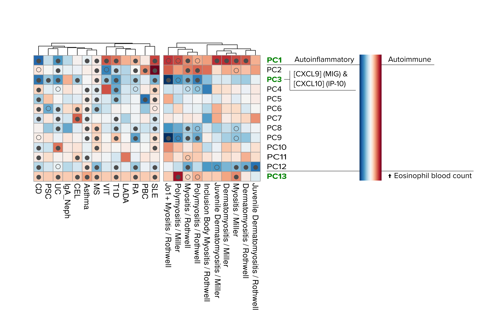

# Background
  
We projected ten myositis summary statistics datasets from Miller et al., 2015, and unpublished ones (Rothwell), that resulted from ImmunoChip + imputation onto the IMD basis. Both groups of datasets are within the MYOGEN consortium framework.
Most of these datasets (except for Inclusion-bofy myositis) were significant at FDR <1%, and some were significant at FDR 1% or 5% for some PCs, namely PC1-3, PC8-9 and PC12-13 (see heatmap below).

We now want to follow up a number of driver SNPs for our Myositis-relevant components in the IMD basis. To do so, we retrieved Open Targets Genetics annotations to relate driver SNPs and genes, for subsequential network and enrichment analysis.




First we load libraries and the list of SNPs.

```{r message=FALSE, warning=FALSE}
library(data.table)
library(reshape2)
library(magrittr)
library(ggplot2)
library(ggrepel)
library(cowplot)
library(gprofiler2)
library(RColorBrewer)
library(pheatmap)
library(igraph)
library(ggraph)
```


```{r}
# SNP manifest
manifest.translator <- fread("../data/Manifest_build_translator.tsv")
manifest.translator[,pid19:=paste(CHR19, BP19, sep = ":")][, pid38:=paste(CHR38, BP38, sep = ":")]
manifest.translator <- manifest.translator[,c(1,8:9)]
SNP.manifest <- merge(manifest.translator, copy(cupcake::SNP.manifest), by.x = "pid19", by.y = "pid")

# Annotations
otg <- readRDS("../data/imdbasis-driver-snps-otg-annotations.RDS")
otg <- merge(SNP.manifest[,.(pid38, SNPID, ref_a1, ref_a2)], otg, by.x="pid38", by.y="pid")
# Check concordance in alleles
all(otg$ref_a1 == otg$ref_allele)
all(otg$ref_a2 == otg$alt_allele) # FALSE, let's see
nrow(otg[otg$ref_a2 != otg$alt_allele]) # 152 instances of alt allele discordance. We'll weed them out

otg <- otg[ref_a2 == alt_allele]

# Remove redundant columns
otg[, c("source_list", "source_score_list", "wh.vep") := NULL]

# Include rotation values in otg
otg <- merge(otg, manifest.translator[, c("pid19", "pid38")], by = "pid38")

rotmat <- as.data.table(cupcake::rot.pca, keep.rownames = TRUE)
names(rotmat)[1] <- "pid19"
names(rotmat) <- gsub("PC", "rot", names(rotmat))

otg <- merge(otg, rotmat, by="pid19")

# Add eQTL data
eqtl <- fread("../data/Causal_eQTLs_full_20210915.tsv") 
# Noticed a bug in the procesing of snp_study and study_tissue. Let's briefly fix it
eqtl[, snp_study:=gsub(pattern = "(_[A-Za-z0-9\\+ -]+)$", "", snp_study, perl = TRUE)][, study_tissue:=gsub(pattern = "(_[A-Za-z0-9\\+ -]+)$", "", study_tissue, perl = TRUE)][,study:=gsub(pattern = "(_[A-Za-z0-9\\+ -]+)$", "", study, perl = TRUE)][,quant_method:=gsub("([A-Za-z0-9_]+)_([a-z]+)", "\\2", study, perl = TRUE)][,study:=gsub(pattern = "(_[a-z]+)$", "", study, perl = TRUE)]


#prcols <- c("source_score_list", "source_list", "wh.vep", "vep_score", "eqtl_score", "pqtl_score", "tss_score") # Remove the columns to change and other columns we won't need.
#cols <- setdiff(names(otg), prcols)

#otg[, source_score_list:=sapply(source_score_list, as.list)]
#otg[, lapply(.SD, unlist), .SDcols = c("source_score_list", "source_list"), by = cols]


```

We'll start by investigating the PCs using enrichment/pathway analysis (gprofiler2).

## Enrichment and network analysis

### Enrichment analysis

We'll use gprofiler2 to see which biological pathways these proteins are involved in.

**gProfiler2** is a toolset to perform enrichment analysis and visualisation on list of genes. It contains Gene Ontology (GO or by branch GO:MF, GO:BP, GO:CC)
KEGG (KEGG), Reactome (REAC), WikiPathways (WP), TRANSFAC (TF), miRTarBase (MIRNA), Human Protein Atlas (HPA), CORUM (CORUM), and Human phenotype ontology (HP),  as data sources, so it's quite complete. g:Profiler is originally a webtool, but it also has an R package, so we'll use that. See [here](https://cran.r-project.org/web/packages/gprofiler2/vignettes/gprofiler2.html) for vignette and use examples.

gProfiler2 provides plenty of options, but we'll use the following for the first round:

* Unordered query. gProfiler2 accepts ordered lists of genes, in cases where an ordering makes sense (eg. differential expression analyses).
* Exclude IEA. IEA are automatic, not curated annotations, we'll exlude those.
* Threshold 0.01 and correction method FDR. 
* Focus on GeneOntology:Biological process (GO:BP) and WikiPathways

We'll also include all genes identified as having eQTLs among our driver SNPs in selected blood cells (see `eQTL_followup_IMD_myositis.Rmd`), according to the eQTLcatalogue.

```{r echo=FALSE}
resgp <- readRDS("../data/enrichment_results_OTG_eQTL.RDS")
```


```{r}
# Set the relevant PCs
PCs <- c(1:3, 8:9, 12:13)
pcnames <- paste0("PC", PCs)

# This will subset OTG and eqtl SNPs relevant to each component and the genes associated with them. For OTG, we'll keep those with tss_score = 1 (ie. close genes)
gpi <- lapply(PCs, function(x){
  list(gnames =unique(c(otg[get(paste0("PC",x)) ==TRUE & tss_score == 1]$gene_id, eqtl[get(paste0("rot",x)) !=0]$gene_id)), PC = paste0("PC",x))
} )


# Create a gene name registry, just to extract the gene names later
# Note here that, while eQTL annotations include only 7 component annotations, OTG annotations include data for all 13 components
allgnames <- rbindlist(list(otg[, c("gene_id", "hgnc_symbol")], eqtl[, c("gene_id", "gene_name")]), use.names = FALSE) %>% unique() %>% .[complete.cases(.)] %>% .[hgnc_symbol == "", hgnc_symbol:=gene_id]

# Ensembl IDs are not very informative. Extract gene names
find.gene.names <- function(input){
  sapply(strsplit(input$intersection, split = ","), function(x) { unique(allgnames[gene_id %in% x]$hgnc_symbol)}) %>% sapply(. , paste, collapse= ", ")
}

## Create a function to run the enrichment analysis

run.enrichment <- function(genes){
  gnames=genes$gnames
  pc=genes$PC
  # Run gProfiler2
  gostpc <- gost(query = gnames, 
               organism = "hsapiens", ordered_query = FALSE, 
                multi_query = FALSE, significant = TRUE, exclude_iea = TRUE, 
                measure_underrepresentation = FALSE, evcodes = TRUE, 
                user_threshold = 0.01, correction_method = "fdr", 
           #     domain_scope = "custom", custom_bg = u, 
                numeric_ns = "", sources = c("GO:BP", "WP", "KEGG", "REAC"), as_short_link = FALSE)
  resgpr <- as.data.table(gostpc$result)
  resgpr[, intersection_genes:= find.gene.names(resgpr)][, PC:=pc]
  resgpr
}
```

```{r eval=FALSE}
resgp <- lapply(gpi, run.enrichment)
resgp <- rbindlist(resgp)
```


```{r eval=FALSE, echo=FALSE}
saveRDS(resgp, "../data/enrichment_results_OTG_eQTL_GOBP.WP.KEGG.REAC.RDS")
```


```{r}
# How many pathways in total
length(unique(resgp$term_id)) # 791


# Check which ones are common to all 
compaths <- resgp[,.N, by=term_id][N == 7]$term_id
resgp[term_id %in% compaths, c("term_id", "term_name")] %>% unique() # 70 pathways are shared among all components

# Check unique pathways in each component
expath <- lapply(PCs, function(x){
  pc <- paste0("PC", x)
  setdiff(unique(resgp[PC == pc]$term_id),  unique(resgp[PC != pc]$term_id))
  
} )
names(expath) <- pcnames

```


Before checking each component, let's extract a small summary of the results so far:

```{r}

pc.summary <- data.table(
                PC           = pcnames,
                driver.SNPs  = colSums(rotmat[, .SD, .SDcols=paste0("rot", PCs)] !=0),
                driver.annot = sapply(PCs, function(x) { length(unique(c(otg[get(paste0("PC", x))==TRUE & tss_score == 1]$SNPID,   eqtl[get(paste0("rot", x)) !=0]$SNPID.basis)))}),
                genes.annot  = sapply(PCs, function(x) { length(unique(c(otg[get(paste0("PC", x))==TRUE & tss_score == 1]$gene_id, eqtl[get(paste0("rot", x)) !=0]$gene_id)))}),
                excl.pathways = sapply(PCs, function(x) { length(setdiff(unique(resgp[PC == paste0("PC", x)]$term_id), unique(resgp[PC != paste0("PC", x)]$term_id)))}),
                genes.excl   = sapply(PCs, function(x) {length(resgp[ term_id %in% expath[[paste0("PC", x)]] ]$intersection_genes %>% strsplit(split = ", ") %>% unlist() %>% unique())})
)
pc.summary

```


```{r}
rexcl <- resgp[ term_id %in% unlist(expath)]
```


```{r eval=FALSE}
fwrite(rexcl, "../tables/Table_exclusive_pathways.tsv", sep="\t")
```


#### The pathways in between (not common to all, not exclusive to one PC)

Let's also take a look at those that are shared, but not common to all PCs.


```{r fig.height=60, fig.width=20}
comandex <- c(compaths, unique(rexcl$termid)) # 63 exclusive or common-to-all

bwp <- resgp[!term_id %in% comandex]
bwp[, neglogp:=-log(p_value)][, pw:=paste(term_id, term_name, sep="_")]
M.bwp <- acast(bwp[, c("pw", "PC", "neglogp")], pw ~ PC)

pal1 = rev(colorRampPalette(c("#0a1128","#001f54","#034078","#1282a2","#fefcfb"))(20) ) # Oxford blue & White
#pal1 <- colorRampPalette(c("red", "blue"))(100)
#plot(rep(1,50),col=pal1,pch=15,cex=5)

phwp <- pheatmap(M.bwp, cluster_cols = TRUE, cluster_rows = FALSE, color = pal1)
#treeheight_col = 15, fontsize_row = 12, fontsize_col = 12,cellwidth = 15, cellheight = 15, fontsize_number = 14
phwp
```


```{r eval=FALSE}
save_pheatmap_png <- function(x, filename, width=1200, height=1000, res = 150) {
  png(filename, width = width, height = height, res = res)
  grid::grid.newpage()
  grid::grid.draw(x$gtable)
  dev.off()
}

save_pheatmap_png(phwp, filename = "../figures/202201_Jan22/Common_Pathway_Heatmap.png", width = 2000, height = 9000)
```

It looks like most pathways are widely shared, except for PC8 and PC1, which seem to have fewer pathways. 

What if we want to go a bit futher? Let's explore which pathways are shared by 6, 5 and 2 or 3 to better assess the degree of sharing across components.


```{r fig.show='hide'}
coms <- resgp[,.N, by=term_id]

comlist <- lapply(2:7, function(x){ # We exclude exclusive pathways because the clustering will fail otherwise
  resgp[term_id %in% coms[N == x]$term_id , c("term_id", "term_name", "PC", "p_value")] %>% unique()
  })

comhmp1 <- lapply(comlist[1:3], function(x){ # Clustering does not work for the shared by two to four
  bwp <- copy(x)
  bwp[, neglogp:=-log(p_value)][, pw:=paste(term_id, term_name, sep="_")]
  M.bwp <- acast(bwp[, c("pw", "PC", "neglogp")], pw ~ PC)
  phwp <- pheatmap(M.bwp, cluster_cols = FALSE, cluster_rows = FALSE, color = pal1)
#treeheight_col = 15, fontsize_row = 12, fontsize_col = 12,cellwidth = 15, cellheight = 15, fontsize_number = 14
 phwp
})

comhmp2 <- lapply(comlist[4:6], function(x){ # Clustering does not work for the shared by two and three
  bwp <- copy(x)
  bwp[, neglogp:=-log(p_value)][, pw:=paste(term_id, term_name, sep="_")]
  M.bwp <- acast(bwp[, c("pw", "PC", "neglogp")], pw ~ PC)
  phwp <- pheatmap(M.bwp, cluster_cols = TRUE, cluster_rows = FALSE, color = pal1)
#treeheight_col = 15, fontsize_row = 12, fontsize_col = 12,cellwidth = 15, cellheight = 15, fontsize_number = 14
})

comhmp <- c(comhmp1, comhmp2)
names(comhmp) <- paste0("sharedby", 2:7)

```


```{r fig.height=20, fig.width=16}
comhmp$sharedby2

```


```{r fig.height=16, fig.width=20}
comhmp$sharedby3

```

```{r fig.height=16, fig.width=16}
comhmp$sharedby4

```

```{r fig.height=10, fig.width=8}
comhmp$sharedby5

```

```{r fig.height=10, fig.width=8}
comhmp$sharedby6

```

```{r fig.height=10, fig.width=8}
comhmp$sharedby7

```


### Networks

We will explore the genes from exclusive pathways using network analysis at STRING. To do so, we'll generate list of genes associated with PC-exclusive pathways to be used as an input for STRING webtool. Then we'll download the results and do some network visualisation.

Let's also save the gene names for manual input into the STRING website.

```{r echo=TRUE, eval=FALSE}
gexcl <- sapply(PCs, function(x){ rexcl[ PC == paste0("PC", x) ]$intersection %>% strsplit(split = ",") %>% unlist() %>% unique()})
names(gexcl) <- pcnames

sapply(PCs, function(x){ fwrite(list(gexcl[[paste0("PC",x)]]), file = paste0("../data/Networks/PC",x, "_EnsemblIDs.tsv"), col.names = FALSE)})
```

Now we'll create network visualisations for each PC. Import data and create networks.


```{r}
nwks <- lapply(PCs, function(x){
  nod <- fread(paste0("../data/Networks/PC",x,"_nodes_2201.tsv"))
  edg <- fread(paste0("../data/Networks/PC",x,"_edges_2201.tsv"))
  net <- graph_from_data_frame(d=edg, vertices = nod, directed = F)
})
names(nwks) <- pcnames

# A small function to remove isolates from networks. Useful when there are many isolates
rm.isolates <- function(nw){
  tre <- names(degree(nw)[degree(nw) == 0])
  nett <- nw
  nett <- delete_vertices(nett, tre)
  nett
}
```


Now we'll check these pathways, component by component

### PC1

```{r}
rexcl[ PC == "PC1", c("term_id", "term_name", "intersection_genes", "p_value") ][order(p_value)]
```


This component is characterised by dividing auto-inflammatory and autoimmune diseases. When looking at its exclusive pathways, they seem to be characterised mainly by processes of regulation of different elements of the immune system.

The most significant pathway is the rather general "activation of protein kinase activity", but if we look beyond that, we see these genes are involved in positive regulation of NK cells, Th17 cells, and smooth muscle cell proliferation, and negative regulation of B cell activation. Not sure if informative.

This network show anti-inflammatory IL10 as central, as well as our old friend PTPN22, and other classic immune mediators, like JAK2.

Interestingly, we see that genes belonging to some pathways (eg. activation of protein kinase activity) aren’t all directly connected in the network, which suggests that they’re connected through other genes not captured by our driver SNPs but also that there are some connections in the network,  independent of the significant pathways retrieved (eg. TH and IL10 are connected, but they don’t belong to any of the identified pathways). Other pathways are fully connected in the network (eg. DRD4, TH and PARK7 in “dopamine metabolic progress”). I wonder how dopamine is involved in IMD. The associated driver SNP is rs2246614, which is also associated with many other genes. 


```{r fig.width=10, fig.height=10}
ggraph(nwks[["PC1"]], layout="lgl") +
  geom_edge_link(aes(alpha = combined_score), edge_colour = "black")+
  geom_node_point(color="black", size=10) +
  geom_node_label(aes(label = name), size=3, color="black", repel=T, force =15) +
  scale_edge_width(range = c(0.2,3))+
  #scale_size(range = c(1,6))+
  theme_void()+
  theme(legend.position = "none")

```


### PC2

```{r}
rexcl[ PC == "PC2" , c("term_id", "term_name", "intersection_genes", "p_value") ][order(p_value)]
```


PC2 was significant for PM and one general myositis. All myositis sat on the positive side, together with basis' SLE.

In this case, TLR signalling pathways seem to be overrepresented, as well as negative regulation of several processes, like signalling, cell communication, and interferon-alpha production.

The enrichment analysis results point at an involvement of TLRs and their regulation in the signal captured by PC2. This is pointed out by significant pathways appearing from different sources: KEGG, GO, and Wikipathways.  

In PC2, we can highlight SLE and PBC on one side and vitiligo and T1D on the other. There are a few papers about the role of TLRs in SLE ([Cellar & Fairhurst, 2014](https://www.frontiersin.org/articles/10.3389/fphar.2014.00265/full); [Gao et al., 2017](https://www.frontiersin.org/articles/10.3389/fphys.2017.00508/full)), in PBC ([Mao et al., 2005](https://aasldpubs.onlinelibrary.wiley.com/doi/10.1002/hep.20859); [Takii et al., 2005](https://www.nature.com/articles/3700285); [Yang & Seki, 2012](https://www.frontiersin.org/articles/10.3389/fphys.2012.00138/full); [Yu et al., 2019](https://pubmed.ncbi.nlm.nih.gov/31115023/) — the latter, in mice), in vitiligo ([Karaca et al., 2013](https://pubmed.ncbi.nlm.nih.gov/22429552/); [Yu et al., 2021](https://pubmed.ncbi.nlm.nih.gov/32945011/)), and in T1D ([Gülden & Wen, 2014](https://www.frontiersin.org/articles/10.3389/fimmu.2014.00119/full)). Perhaps interestingly, TLRs have also been associated with asthma pathology, but asthma is flat for PC2.

There are some genes in the pathways and in the network that are directly related to TLR, like ***TICAM1*** (aka TRIF, an adapter used by TLR3 and TLR4 (through TICAM2) to mediate NF-kappa-B and interferon-regulatory factor (IRF) activation, and to induce apoptosis, [Oshiumi et al., 2003](https://www.nature.com/articles/ni886)),  ***SLC15A4*** (mediates  TLR7- and TLR9-dependent production of cytokines including type I  interferons (IFN-I) and IL-6, [Kobayashi et al., 2021](https://pubmed.ncbi.nlm.nih.gov/33560415/)), ***TNFAIP3*** (aka A20, a negative regulator of TLR signalling, [Hung et al., 2017](https://core.ac.uk/download/pdf/82244934.pdf); [Liew et al., 2005](https://www.nature.com/articles/nri1630.pdf)) and ***IRF7*** (induction of IFN-alpha/beta genes via the virus-activated, MyD88-independent pathway and the TLR-activated, MyD88-dependent pathway, [Honda et al., 2005](https://pubmed.ncbi.nlm.nih.gov/15800576/); [Ning et al., 2011](https://www.nature.com/articles/gene201121)).
Many of these genes have also been associated with IMD pathology.


```{r fig.width=10, fig.height=10}
ggraph(nwks[["PC2"]], layout = "fr") +
  geom_edge_link(aes(alpha = combined_score), edge_colour = "black")+
  geom_node_point(color="black", size=7) +
  geom_node_label(aes(label = name), size=3, color="black", repel=T) +
  scale_edge_width(range = c(0.2,3))+
  #scale_size(range = c(1,6))+
  theme_void()+
  theme(legend.position = "none")

```


### PC3

```{r}
rexcl[ PC == "PC3" , c("term_id", "term_name", "intersection_genes", "p_value") ][order(p_value)]
```

PC3 was significant for Rothwell’s PM, anti-Jo1+ and general myositis. All myositis fall on the negative side, with CD and most IMDs (with the exception of MS).

We see many shared genes with PC2, like PARK7, IL10, PTPN22, DRD4, TH, IRF7, and others. However, we see a different pattern in the pathways, which seem to be related to IL-8 and IL-15, as well as fibroblast growth factor and catecholamines.

**IL-8** (aka CXCL8) is a chemokine produced by macrophages and other cell types such as epithelial cells, airway smooth muscle cells and endothelial cells. IL-8 induces **chemotaxis** in target cells, primarily **neutrophils** but also other granulocytes, and stimulates phagocytosis once these cells have arrived at the infection site. IL-8 is also known to be a potent promoter of **angiogenesis**. Its two receptors (CXCR1 and CXCR2) are also present in the pathways and network, but associated with different pathways.

**IL-15** is involved in natural killer (NK) cell differentiation, T-cell functions, and the host response to intracellular pathogens. ****Abnormalities of IL-15 were also reported in other inflammatory autoimmune disorders including ulcerative colitis, Crohn’s disease, type C chronic liver disease, sarcoidosis, multiple sclerosis, type 1 diabetes and especially alopecia areata and celiac disease ([Waldmann, 2017](https://www.sciencedirect.com/science/article/pii/B978012809324503265X)). IL-15 binds to the IL-15-specific high-affinity binding protein IL-15Rα and signals through a β chain and a γ chain signalling complex, leading to the recruitment of Janus kinase (JAK) JAK1 by the β chain and activation of JAK3 that is constitutively associated with the γ chain. Activated JAK1 and JAK3 then phosphorylate signal transducer and activator of transcription (STAT) proteins STAT3 and STAT5 respectively, to mediate IL-15 effects in T lymphocytes. 

We find many genes involved in IL-15 signalling, like ***JAK2*** (shared with many other cytokine signaling cascades), ***STAT3***, and ***IL2RB*** (part of the receptor complex), ***GRB2*** (an intermediary in IL-15 cascade).


```{r fig.width=10, fig.height=10}
ggraph(nwks[["PC3"]], layout = "fr") +
  geom_edge_link(aes(alpha = combined_score), edge_colour = "black")+
  geom_node_point(color="black", size=7) +
  geom_node_label(aes(label = name), size=3, color="black", repel=T) +
  scale_edge_width(range = c(0.2,3))+
  #scale_size(range = c(1,6))+
  theme_void()+
  theme(legend.position = "none")

```


### PC8


```{r}
rexcl[ PC == "PC8" , c("term_id", "term_name", "intersection_genes", "p_value") ][order(p_value)]
```


PC8 splits MS and asthma from the rest of basis IMDs. Only general myositis (Rothwell’s) is significant at FDR 1% for this component, on the opposite side from MS and asthma, and together with the other IMDs.

This PC seems to capture an IL-2 and NK cell signal, as we find two subunits of the IL-2 receptor (IL2RA and IL2RB). IL2RA on its own constitutes a low-affinity receptor, since it lacks the signalling domain but together with IL2RB  and IL2RG constitute a high-affinity receptor.

**IL-2** has shared functions (and receptor) with IL-15, as mentioned for PC3. IL-2 has a role in T cell proliferation and boosts the cytolytic activity of NK cells and lymphokine-activated killer cells. IL-2 is essential for T helper 9 (TH9) cell generation and Treg cell differentiation, and it can also prime cells for TH1 cell differentiation and TH2 cell differentiation, but IL-2 conversely inhibits the differentiation of TH17 cells and T follicular helper (TFH) cells. Thus, IL-2 is a pivotal cytokine that has key roles in influencing immune cell differentiation and hence the types of cell that are dominantly present in settings of infection, autoimmune disease and cancer. Moreover, IL-2 can also have a crucial role during the process of activation-induced cell death (AICD), in which potentially deleterious autoreactive cells can be eliminated.

IL-2 is produced primarily by CD4+ T cells. 

By limiting the availability of IL-2, Treg cells were also shown to negatively regulate the activity of NK cells in the pancreas. Indeed, depletion of Treg cells led to increased IL-2-induced transcripts in pancreatic NK cells, and high doses of IL-2 could overcome Treg cell-mediated suppression of NK cell function, indicating a balance between NK cells and Treg cell activity ( [Spolski et al., 2018](https://www.nature.com/articles/s41577-018-0046-y)).

More references on NK cells and IL-2 (and other cytokines): [Wu et al., 2017](https://www.frontiersin.org/articles/10.3389/fimmu.2017.00930/full#:~:text=Interleukin%2D2%20is%20an%20immune,vitro%20(142%2C%20147).).

**IL-12** (in its two components, IL12A and IL12B) also show in the pathways. IL-12 mediates enhancement of the cytotoxic activity of NK cells and CD8+ cytotoxic T lymphocytes. There also seems to be a link between IL-2 and the signal transduction of IL-12 in NK cells. IL-2 stimulates the expression of two IL-12 receptors, IL-12R-β1 and IL-12R-β2, maintaining the expression of a critical protein involved in IL-12 signalling in NK cells. Enhanced functional response is demonstrated by IFN-γ production and killing of target cells (Wikipedia and  [Wu et al., 2017](https://www.frontiersin.org/articles/10.3389/fimmu.2017.00930/full#:~:text=Interleukin%2D2%20is%20an%20immune,vitro%20(142%2C%20147).)).


```{r fig.width=8, fig.height=8}
ggraph(nwks[["PC8"]], layout = "fr") +
  geom_edge_link(aes(alpha = combined_score), edge_colour = "black")+
  geom_node_point(color="black", size=7) +
  geom_node_label(aes(label = name), size=3, color="black", repel=T) +
  scale_edge_width(range = c(0.2,3))+
  #scale_size(range = c(1,6))+
  theme_void()+
  theme(legend.position = "none")

```


### PC9

```{r}
rexcl[ PC == "PC9" , c("term_id", "term_name", "intersection_genes", "p_value") ][order(p_value)]
```

We got two exclusive significant pathways only, and a few genes (most of them shared with previous PCs, like IL-10 and BLK). PC9 has 240 driver SNPs, close to half the total driver SNPs in the IMD basis, and almost all of them are shared with other PCs. This can explain the pattern observed here: Signal captured by PC9, represented by driver-SNP association with genes via eQTL or proximity, is mostly shared with other components, so the exclusive-pathway approach does not provide much useful information. Thinking of alternatives!


```{r fig.width=6, fig.height=6}

ggraph(nwks[["PC9"]], layout = "fr") +
  geom_edge_link(aes(alpha = combined_score), edge_colour = "black")+
  geom_node_point(color="black", size=7) +
  geom_node_label(aes(label = name), size=3, color="black", repel=T) +
  scale_edge_width(range = c(0.2,3))+
  #scale_size(range = c(1,6))+
  theme_void()+
  theme(legend.position = "none")

```


### PC12

```{r}
rexcl[ PC == "PC12" , c("term_id", "term_name", "intersection_genes", "p_value") ][order(p_value)]
```


PC12 splits asthma from most other IMDs in the basis, toppled by RA and MS (negative side). All myositis fall on the negative side, being JDM and DM (Rothwell) significant at FDR 1%. Thus, this component seems to capture some biological signal that is specific to DM/JDM, rather than other myositis subtypes.

PC12 has 266 associated driver SNPs, which results in a large number of associated genes and pathways. Interestingly, there's a large number of exclusive pathways associated with this PC. Unfortunately the network doesn't seem to be very informative.


```{r fig.width=20, fig.height=20}
net12.d <- rm.isolates(nwks[["PC12"]]) # Here I removed the isolates for improved viz

ggraph(net12.d, layout = "auto") +
  geom_edge_link(aes(alpha = combined_score), edge_colour = "black")+
  geom_node_point(color="black", size=7) +
  geom_node_label(aes(label = name), size=3, color="black", repel=T) +
  scale_edge_width(range = c(0.2,3))+
  #scale_size(range = c(1,6))+
  theme_void()+
  theme(legend.position = "none")

```


### PC13

```{r}
rexcl[ PC == "PC13" , c("term_id", "term_name", "intersection_genes", "p_value") ][order(p_value)]
```

PC13 has been associated with eosinophil levels, and most IMD fall to that (positive) side of the axis. The largest projection among myositis is Miller's PM. 

Once again, PC13 has many driver SNPs, which leads to many annotated genes and pathways, many of them exclusive, so interpretation remains difficult.


```{r fig.width=20, fig.height=20}
ggraph(nwks[["PC13"]], layout = "auto") +
  geom_edge_link(aes(alpha = combined_score), edge_colour = "black")+
  geom_node_point(color="black", size=7) +
  geom_node_label(aes(label = name), size=3, color="black", repel=T) +
  scale_edge_width(range = c(0.2,3))+
  #scale_size(range = c(1,6))+
  theme_void()+
  theme(legend.position = "none")

```


## BONUS: Enrichment analysis (C7 gene set)

We'll try now using a different approach, using the C7 gene set.

Gene sets in this collection represent cell states and perturbations within the immune system. It consists of two sub-collections:
* ImmuneSigDB, which was preiviously the complete C7 and represents a broad curation effort of signatures of immune perturbations and states.
* VAX, a targeted subcollection that focuses specifically on curation of published studies of human responses to various vaccines.

ImmuneSigDB is composed of gene sets that represent a broad curation effort of cell types, states, and perturbations within the immune system. The signatures were generated by manual curation of published studies in human and mouse immunology.

We first captured relevant microarray datasets published in the immunology literature that have raw data deposited to Gene Expression Omnibus (GEO). For each published study, the relevant comparisons were identified (e.g. WT vs. KO; pre- vs. post-treatment etc.) and brief, biologically meaningful descriptions were created. All data was processed and normalized the same way to identify the gene sets, which correspond to the top or bottom genes (FDR < 0.02 or maximum of 200 genes) ranked by mutual information for each assigned comparison.

For more information about the collection, see [Godec et al., 2016](http://www.cell.com/immunity/abstract/S1074-7613(15)00532-4).

The procedure is kind of similar to what we did previously, we just need to upload the C7 GMT dataset downloaded from [GSEA-MSIGDB](http://www.gsea-msigdb.org/gsea/msigdb/download_file.jsp?filePath=/msigdb/release/7.4/c7.all.v7.4.symbols.gmt) to gprofiler server.


```{r eval=FALSE}
upload_GMT_file(gmtfile = "../data/c7.all.v7.4.symbols.gmt")
```
The resulting code for this run was "gp__XmTT_YiDz_EeM", which we'll use in the following analysis.

```{r echo=FALSE}
resgp.C7 <- readRDS("../data/enrichment_results_OTG_eQTL_C7.RDS")
```


```{r eval=FALSE}

c7.gpr1 <- list(gnames =unique(c(otg[PC1==TRUE & tss_score == 1]$hgnc_symbol, eqtl[rot1 !=0]$gene_name)), PC = "PC1")
c7.gpr2 <- list(gnames =unique(c(otg[PC2==TRUE & tss_score == 1]$hgnc_symbol, eqtl[rot2 !=0]$gene_name)), PC = "PC2")
c7.gpr3 <- list(gnames =unique(c(otg[PC3==TRUE & tss_score == 1]$hgnc_symbol, eqtl[rot3 !=0]$gene_name)), PC = "PC3")
c7.gpr8 <- list(gnames =unique(c(otg[PC8==TRUE & tss_score == 1]$hgnc_symbol, eqtl[rot8 !=0]$gene_name)), PC = "PC8")
c7.gpr9 <- list(gnames =unique(c(otg[PC9==TRUE & tss_score == 1]$hgnc_symbol, eqtl[rot9 !=0]$gene_name)), PC = "PC9")
c7.gpr12 <- list(gnames =unique(c(otg[PC12==TRUE & tss_score == 1]$hgnc_symbol, eqtl[rot12 !=0]$gene_name)), PC = "PC12")
c7.gpr13 <- list(gnames =unique(c(otg[PC13==TRUE & tss_score == 1]$hgnc_symbol, eqtl[rot13 !=0]$gene_name)), PC = "PC13")

## Create a function to run the enrichment analysis

run.enrichment.C7 <- function(genes){
  gnames=genes$gnames
  pc=genes$PC
  # Run gProfiler2
  gostpc <- gost(query = gnames, 
               organism = "gp__XmTT_YiDz_EeM", ordered_query = FALSE, 
                multi_query = FALSE, exclude_iea = TRUE, 
                measure_underrepresentation = FALSE, evcodes = TRUE, 
                user_threshold = 0.01, correction_method = "fdr", 
           #     domain_scope = "custom", custom_bg = u, 
                numeric_ns = "", as_short_link = FALSE)
  resgpr <- as.data.table(gostpc$result)
  resgpr[, intersection_genes:= find.gene.names(resgpr)][, PC:=pc]
  resgpr
}

resgp.C7 <- lapply(list(c7.gpr1, c7.gpr2, c7.gpr3, c7.gpr8, c7.gpr9, c7.gpr12, c7.gpr13), run.enrichment.C7)
resgp.C7 <- rbindlist(resgp.C7)

```

```{r eval=FALSE, echo=FALSE}
saveRDS(resgp.C7, "../data/enrichment_results_OTG_eQTL_C7.RDS")
```

```{r}
# How many pathways in total
length(unique(resgp.C7$term_id)) # 275 unique pathways


# Check which ones are common to all 
compaths.C7 <- resgp.C7[,.N, by=term_id][N == 7]$term_id # No pathways common to all components


# Let's add to the summary
excpath.C7 <- function(){
  x <- rep(NA,7)
  for(i in 1:length(x)){ x[i] <- length(setdiff(unique(resgp.C7[PC == paste0("PC", PCs[i])]$term_id), unique(resgp.C7[PC != paste0("PC", PCs[i])]$term_id))) }
  x
}

pc.summary[, exclusive.pathways.C7 := excpath.C7()]
pc.summary
```


Now we'll check these pathways, component by component

```{r}
# Check unique pathways in each component
c7.expath1  <- setdiff(unique(resgp.C7[PC == "PC1"]$term_id),  unique(resgp.C7[PC != "PC1"]$term_id))   # 2
c7.expath2  <- setdiff(unique(resgp.C7[PC == "PC2"]$term_id),  unique(resgp.C7[PC != "PC2"]$term_id))   # 7
c7.expath3  <- setdiff(unique(resgp.C7[PC == "PC3"]$term_id),  unique(resgp.C7[PC != "PC3"]$term_id))   # 11
c7.expath8  <- setdiff(unique(resgp.C7[PC == "PC8"]$term_id),  unique(resgp.C7[PC != "PC8"]$term_id))   # 0
c7.expath9  <- setdiff(unique(resgp.C7[PC == "PC9"]$term_id),  unique(resgp.C7[PC != "PC9"]$term_id))   # 6
c7.expath12 <- setdiff(unique(resgp.C7[PC == "PC12"]$term_id), unique(resgp.C7[PC != "PC12"]$term_id))  # 44
c7.expath13 <- setdiff(unique(resgp.C7[PC == "PC13"]$term_id), unique(resgp.C7[PC != "PC13"]$term_id))  # 51
```


### PC1

```{r}
resgp.C7[ term_id %in% c7.expath1, c("term_id", "intersection", "p_value", "term_name") ][order(p_value)]
```

```{r}
c7.pc1exg <- resgp.C7[ term_id %in% c7.expath1 ]$intersection %>% paste(., collapse = ",") %>%  strsplit(split = ",") %>% unlist() %>% unique() # Extract genes for network analysis
```


### PC2

```{r}
resgp.C7[ term_id %in% c7.expath2, c("term_id", "intersection", "p_value", "term_name") ][order(p_value)]
```

```{r}
c7.pc2exg <- resgp.C7[ term_id %in% c7.expath2 ]$intersection %>% paste(., collapse = ",") %>%  strsplit(split = ",") %>% unlist() %>% unique() # Extract genes for network analysis
```

### PC3

```{r}
resgp.C7[ term_id %in% c7.expath3, c("term_id", "intersection", "p_value", "term_name") ][order(p_value)]
```

```{r}
c7.pc3exg <- resgp.C7[ term_id %in% c7.expath3 ]$intersection %>% paste(., collapse = ",") %>%  strsplit(split = ",") %>% unlist() %>% unique() # Extract genes for network analysis
```


### PC8

No unique pathways for PC8.


### PC9


```{r}
resgp.C7[ term_id %in% c7.expath9, c("term_id", "intersection", "p_value", "term_name") ][order(p_value)]
```

```{r}
c7.pc9exg <- resgp.C7[ term_id %in% c7.expath9 ]$intersection %>% paste(., collapse = ",") %>%  strsplit(split = ",") %>% unlist() %>% unique() # Extract genes for network analysis
```

### PC12

```{r}
resgp.C7[ term_id %in% c7.expath12, c("term_id", "intersection", "p_value", "term_name") ][order(p_value)]
```

```{r}
c7.pc12exg <- resgp.C7[ term_id %in% c7.expath12 ]$intersection %>% paste(., collapse = ",") %>%  strsplit(split = ",") %>% unlist() %>% unique() # Extract genes for network analysis
```


### PC13

```{r}
resgp.C7[ term_id %in% c7.expath13, c("term_id", "intersection", "p_value", "term_name") ][order(p_value)]
```

```{r}
c7.pc13exg <- resgp.C7[ term_id %in% c7.expath13 ]$intersection %>% paste(., collapse = ",") %>%  strsplit(split = ",") %>% unlist() %>% unique() # Extract genes for network analysis
```


